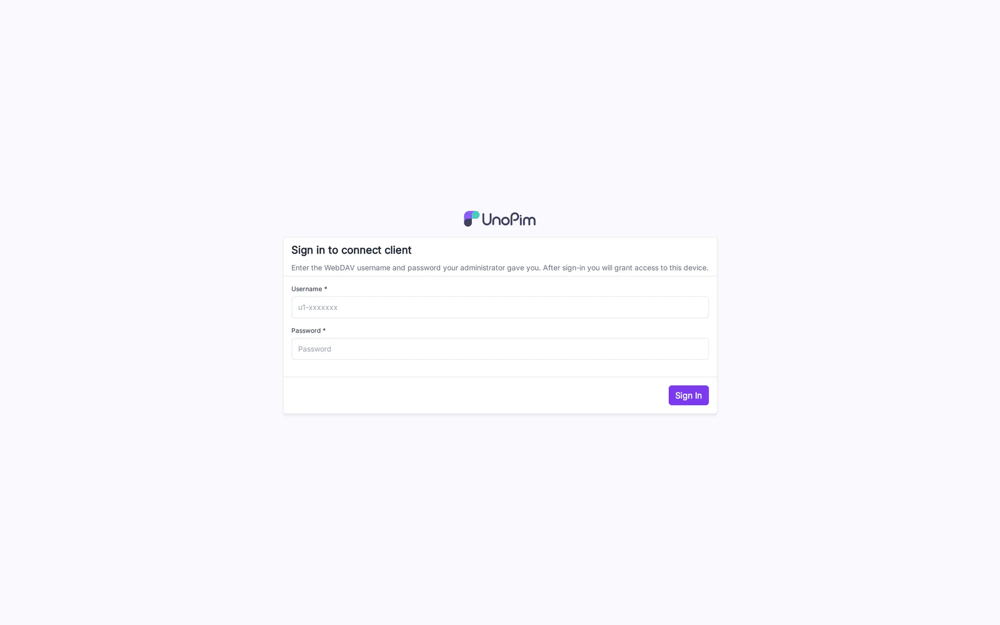
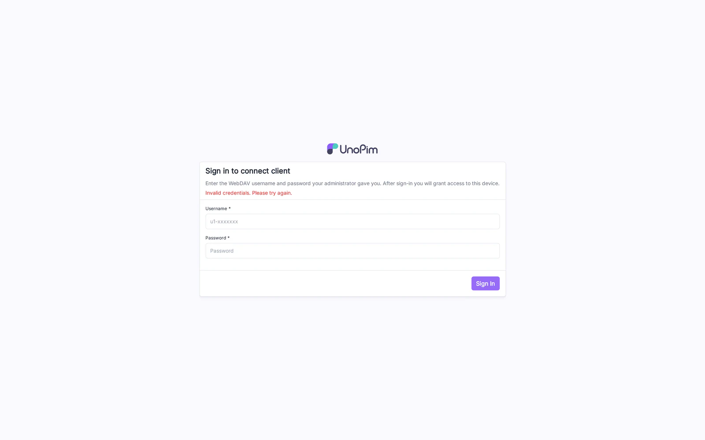

# Nextcloud Clients

The DAM NextCloud module ships a Nextcloud-compatible surface so that the official Nextcloud apps — Desktop, iOS, Android — connect with no modification.

## Connection URL

Use the UnoPim base URL (e.g., `https://pim.example.com`) as the server URL in any Nextcloud client. The client appends `/remote.php/dav/files/<username>/` automatically.

## Login-flow-v2 (recommended)

The Nextcloud clients ask the server for a login-flow URL, open it in the user's browser, and poll until the user grants the app. UnoPim implements the same dance — no manual URL or password typing in the client.

### Step 1 — Login

The browser opens UnoPim's login page. The user signs in with their UnoPim admin credentials.

### Step 2 — Grant access

After signing in, UnoPim shows the app name and asks for confirmation. Click **Grant access**. The desktop / mobile client receives an app-password and starts syncing.

## Per-client setup

### Nextcloud Desktop (Windows / macOS / Linux)

1. **File → New account…**
2. Server address: your UnoPim base URL.
3. Click **Login on Server**, follow the login-flow above.
4. Pick the local folder; tick **Sync everything from the server**.
5. The folder begins syncing the directory bound to the credential's Sync Profile.

### Nextcloud iOS / Android

1. Open the app, **Add account**.
2. Enter the UnoPim base URL — or scan the QR code from the credential's Edit page in UnoPim.
3. Sign in via the in-app browser; complete the grant.
4. (Optional) Auto-upload of camera photos: Settings → Auto upload → pick the synced DAM folder.

## Tips

- If a client refuses to connect with `400 Bad Request` on the first request, double-check that nginx forwards `PROPFIND` (see [Installation](./installation#_4-nginx-pass-webdav-verbs-through)).
- The login-flow QR code on the **Credentials** edit page is the fastest way to onboard mobile users — no typing.
- To revoke access immediately, disable the credential in UnoPim. The Nextcloud client will get `401` on its next sync tick and stop pulling.
