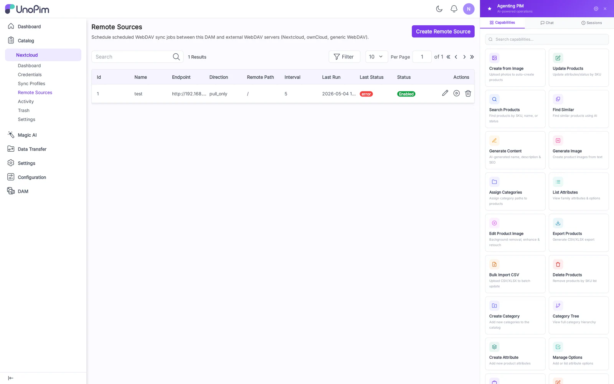
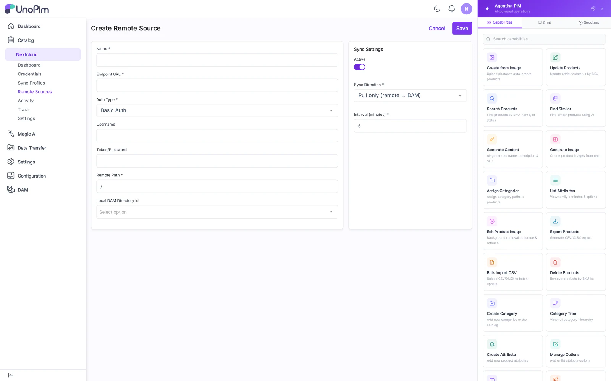
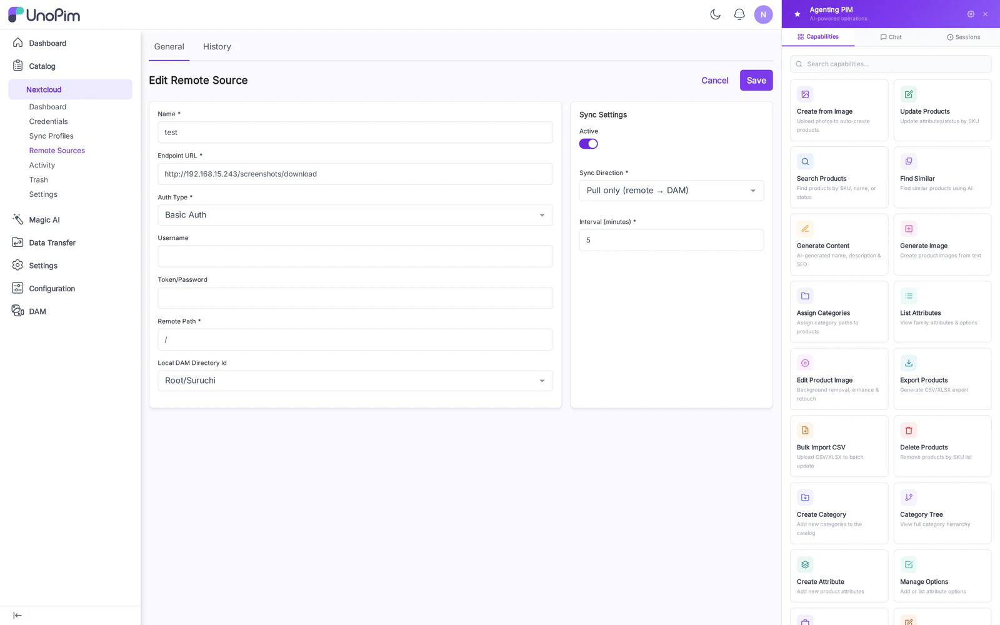

# Remote Sources

A **Remote Source** is an external WebDAV server (a Nextcloud, an ownCloud, a Synology, or any RFC-4918-compliant endpoint) that UnoPim polls to mirror its contents into the DAM. Use it when content lives somewhere else and you want the DAM to follow.

## List

Columns: Label, URL, Last Poll, Last Result (✓ / ✗), Schedule, Actions (Edit, Test, Run, Delete).

## Create

Fields:

- **Label** — display name.
- **URL** — full WebDAV URL including `/remote.php/dav/files/<user>/...` for Nextcloud, or the plain mount URL for other servers.
- **Username** & **Password** — Basic Auth credentials on the remote.
- **Target Directory** — DAM directory where mirrored files land.
- **Schedule** — interval in minutes (e.g., `360` = every 6 hours).
- **Direction** — Pull only (default) / Two-way (for clearly-bidirectional mirrors).

## Test connection

The Test button issues a single `PROPFIND` against the URL and returns:

- ✓ **Connected** with the listed root entries, or
- ✗ **Failed** with the HTTP status and error body. Common failures: `401` (bad creds), `404` (path typo), `405` (verb blocked by remote nginx).

## How to use

1. Add the source: URL, credentials, target directory, schedule.
2. Click **Test** — must succeed before saving makes sense.
3. Click **Run now** to do an immediate one-shot poll.
4. Review **Activity** to confirm files arrived.
5. Wait for the cron tick to pick up the schedule going forward.

## Tips

- Start with **Pull only** and a narrow target directory. Switch to two-way only after you understand the remote's deletion semantics.
- If the remote rate-limits you, a 6-hourly schedule is safer than continuous polling.
