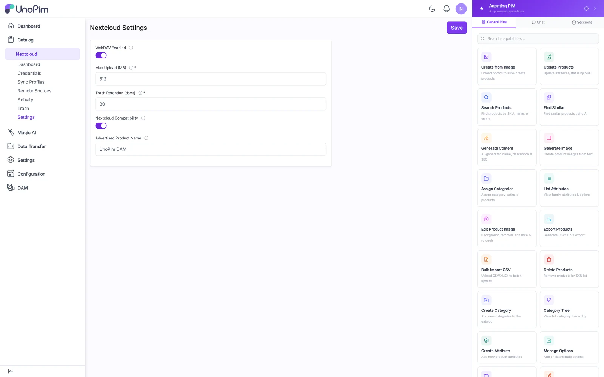

# Settings

Module-level settings that apply across all credentials, profiles, and remote sources.

## Fields

- **Base path** — URL prefix for the plain WebDAV mount. Default `/webdav/dam`. Changes require an nginx reload.
- **Lock TTL (seconds)** — how long a `LOCK` is held by a client before it auto-expires. Default `300`. Lower if clients leave stale locks; raise if your network is slow.
- **Trash retention (days)** — automatic purge horizon. Default `30`.
- **Enable Nextcloud login-flow-v2** — toggle the `/index.php/login/v2` endpoints. Disable if you only use plain WebDAV clients.
- **Login-flow session TTL (seconds)** — how long an unredeemed flow token stays valid. Default `1200`.
- **Allowed origins** — CORS origins that may hit `status.php` and `ocs/*` (Nextcloud apps don't need this; web clients do).

## How to use

1. Open **Nextcloud → Settings**.
2. Adjust values; the form validates ranges (Lock TTL ≥ 30, Retention ≥ 1).
3. Save. Changes that affect routing (Base path, NC login-flow toggle) need `php artisan route:clear` and an nginx reload to take effect.

## Tips

- If you serve the admin behind a different domain than the WebDAV mount, configure both **Base path** *and* the nginx `server_name` accordingly — the QR code embeds the public URL the credential page knows about.
