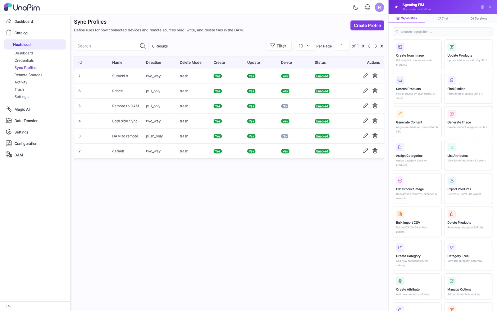
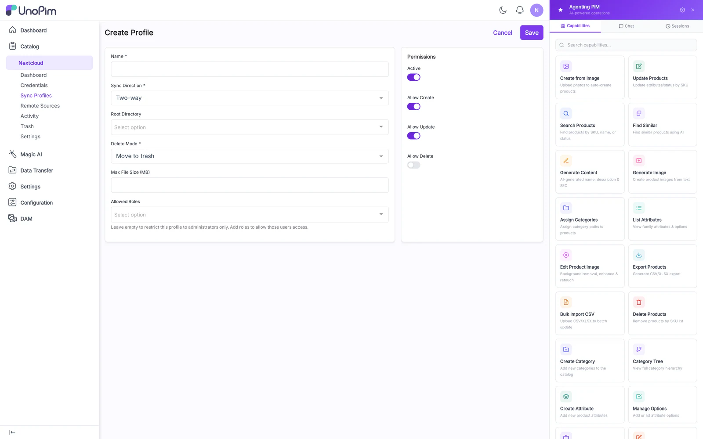

# Sync Profiles

A **Sync Profile** is the binding between a Credential and a DAM directory. It decides what the WebDAV user sees as their root folder, and in which direction files flow.

## List

Columns:

- **Label**
- **Credential** — owning user.
- **Directory** — DAM directory this profile exposes.
- **Direction** — Two-way / Push only / Pull only.
- **Enabled** — toggle without deleting.
- **Last Sync** — timestamp of the most recent event.
- **Actions** — Edit, Delete.

## Create

Fields:

- **Label** — display name.
- **Credential** — pick from existing credentials.
- **Directory** — searchable picker over the DAM tree.
- **Direction** — see below.
- **Conflict policy** — Overwrite remote / Overwrite local / Keep both (rename loser with `.conflict-<timestamp>` suffix).
- **Enabled** — defaults on.

### Direction

| Mode | Behavior |
|---|---|
| Two-way | Default. Changes from either side propagate. |
| Push only | Client → DAM. Files added/changed locally land in DAM; deletes from DAM do not propagate to the client. |
| Pull only | DAM → Client. Read-only mount; client cannot create/modify/delete. |

## How to use

1. Create a Credential first.
2. Click **Add Sync Profile**.
3. Pick the Credential, choose a Directory in the picker, set Direction.
4. Save. The mount becomes immediately accessible to that credential's clients.

## Tips

- One profile per credential — the WebDAV root for that user is the profile's Directory.
- Switch a noisy profile to **Pull only** during cleanup work to prevent accidental overwrites from client caches.
