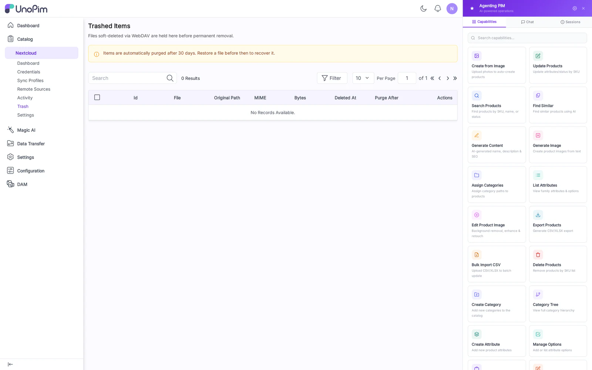

# Trash

When a client deletes a file inside a mounted folder, the DAM does **not** hard-delete. The asset moves to Trash and is retained for `trash_retention_days` (default 30) before automatic purge.

## Columns

- **Asset** — file name + thumbnail.
- **Original Path** — directory it was deleted from.
- **Deleted By** — credential / remote-source that triggered the delete.
- **Deleted At** — timestamp.
- **Purges In** — days remaining before automatic hard-delete.
- **Actions** — Restore, Delete forever.

## How to use

1. Open **Nextcloud → Trash**.
2. Find the asset (filter by date or by Deleted By).
3. Click **Restore** — the asset returns to its original directory and reappears on every connected client on the next sync tick.
4. Or click **Delete forever** to immediately purge.

## Tips

- The retention window is set in `config/dam_webdav.php` (`trash_retention_days`). Increase it for compliance, decrease it for storage pressure.
- **Restoring during a conflict** — if a file with the same name has reappeared in the original directory while the asset was in trash, the restore is renamed with a `.restored-<timestamp>` suffix to avoid clobber.
