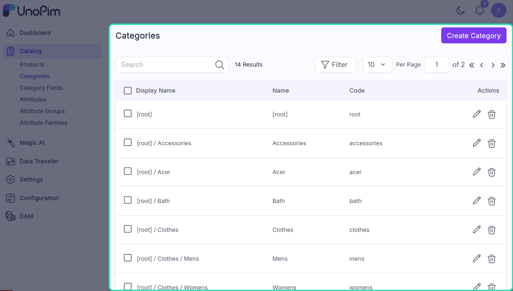
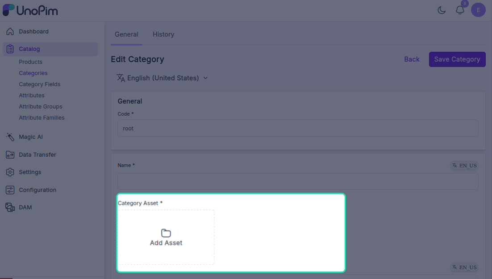
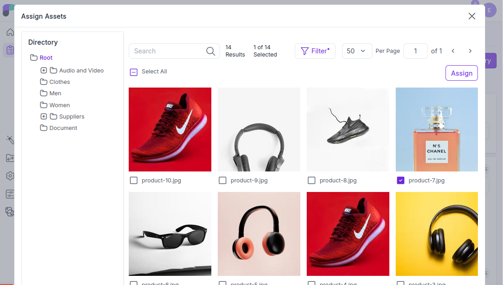
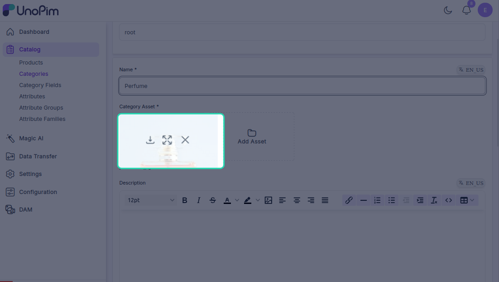
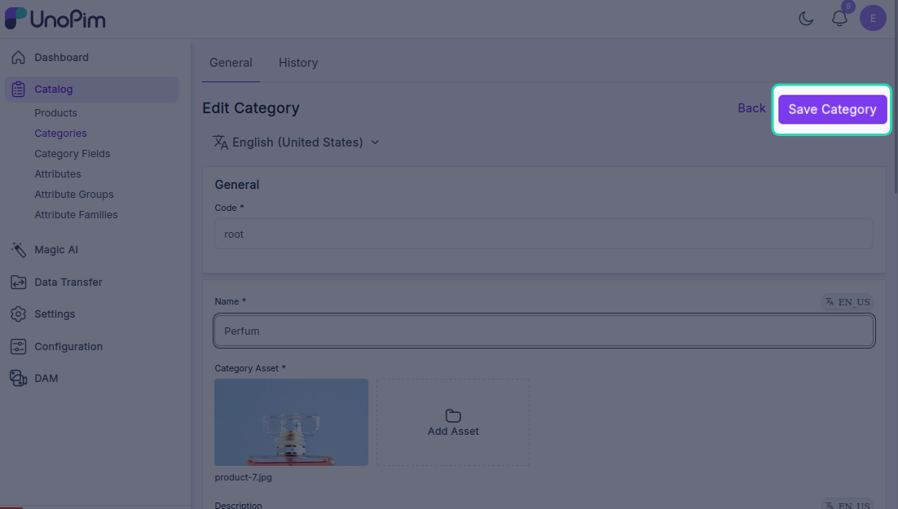
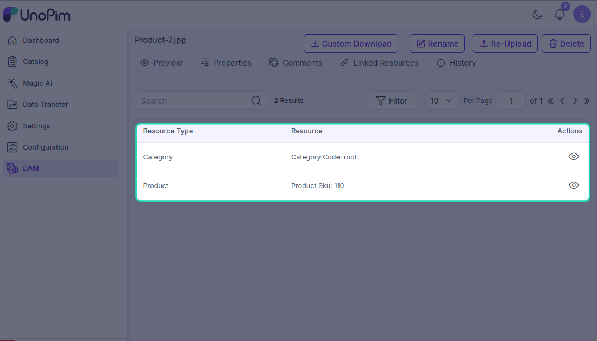

# Adding Assets to a Category

Just like products, you can attach digital assets directly to your categories in UnoPim. This is useful for keeping category-level visuals — like banner images or icons — organised and exportable alongside your catalog structure.

---

## Step 1 — Open the Category

Navigate to the category you want to add assets to. In the category edit screen, scroll down to the **Category Asset Media** field.

---

## Step 2 — Add Assets

Click the **Add Assets** button. The asset picker will open, showing all the assets available across your directories.

You can:

- Click **All** to select every available asset
- Click individual assets to select specific ones

Once you've made your selection, click **Assign**. All selected assets will be linked to the category.

---

## Step 3 — Manage Assigned Assets

Hover over any assigned asset thumbnail to see three options:

| Option | What it does |
|---|---|
| **Preview** | Opens a full preview of the asset |
| **Download** | Downloads the asset to your device |
| **Remove** | Unlinks the asset from the category |

---

## Step 4 — Save the Category

Click **Save** once you're done. The assets are now attached to the category and will be included when you export it.

---

> **Note:** Once an asset is assigned to a product or category, it will appear in the **Linked Resources** tab of that asset — giving you a clear view of everywhere the asset is being used across your catalog.

