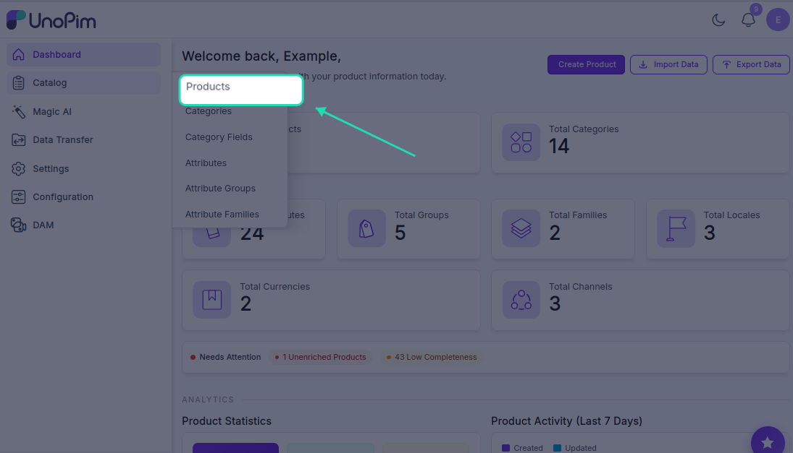
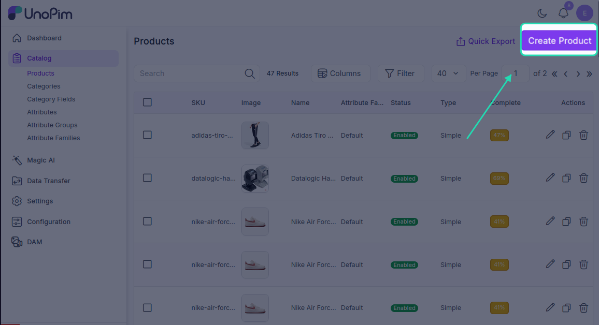
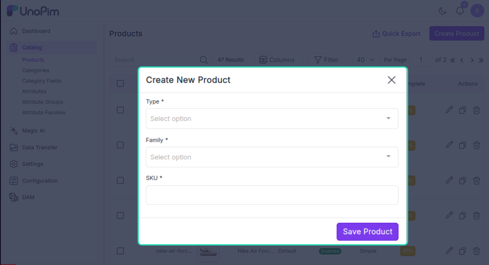
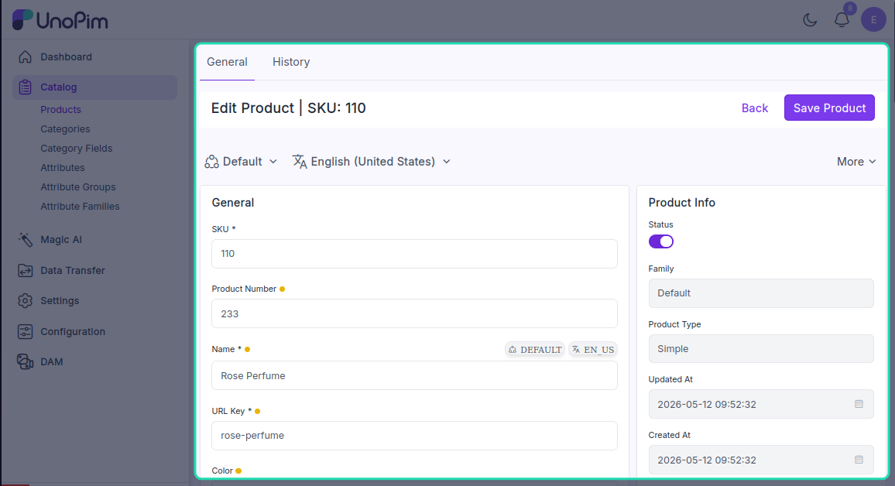
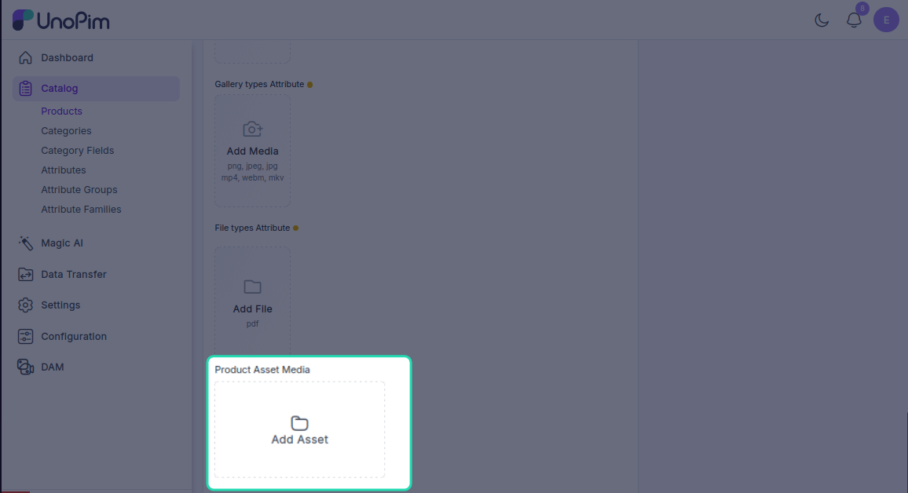
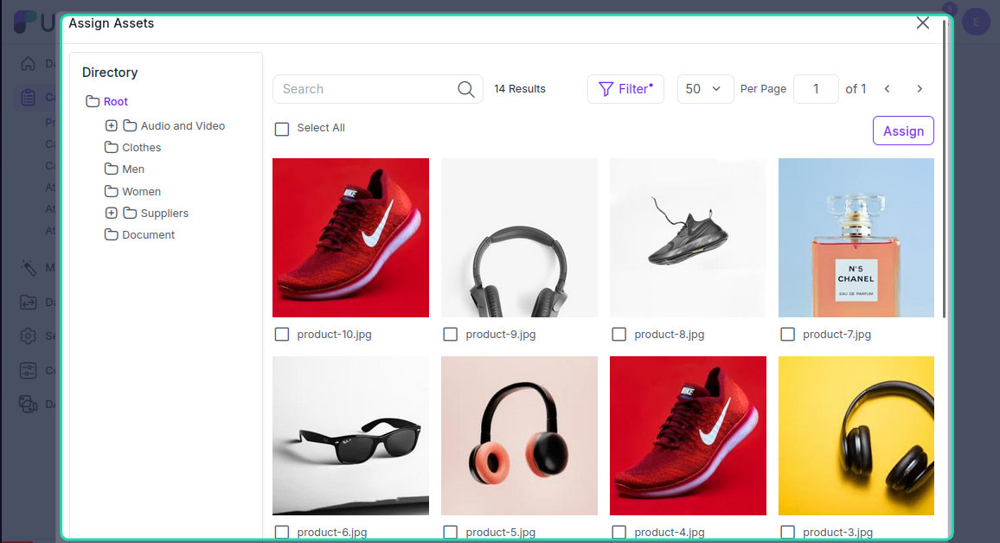
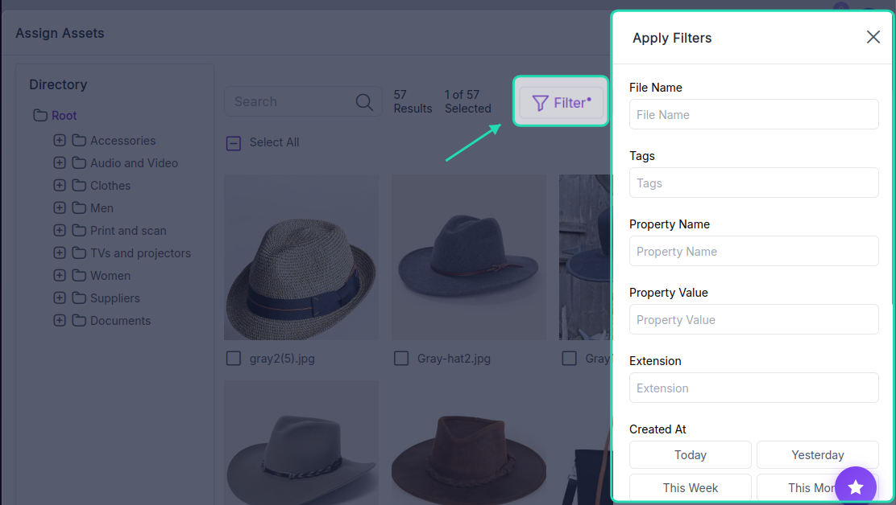
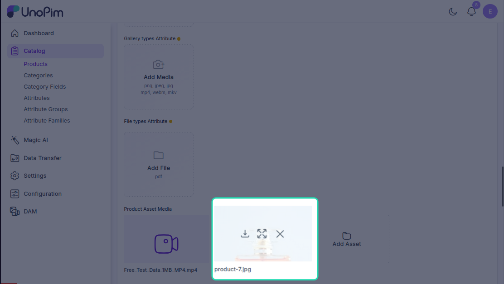
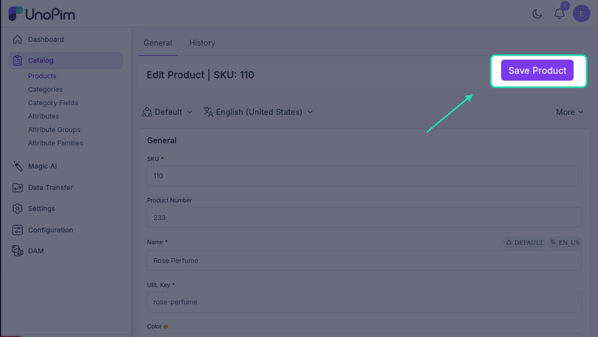

# Adding Assets to Products

You can attach digital assets — like images, videos, or documents — directly to your products in UnoPim. Here's how to create a product and link assets to it.

---

## Step 1 — Open the Products Section

Go to **Catalog → Products** from the left sidebar. This page shows all your existing products, where you can view, edit, copy, or delete them.

---

## Step 2 — Create a New Product

Click the **Create Product** button and fill in the following:

- **Product Type** — choose **Simple** for a standard product or **Configurable** for a product with variants like size or colour
- **Family** — select the attribute family this product belongs to
- **SKU** — enter a unique identifier for the product

Click **Save**. The product will now appear in the products list.

---

## Step 3 — Add Product Details

Open the newly created product and fill in the relevant information:

- Name
- Category
- ERP Name
- Price
- Any other fields required by the product family

---

## Step 4 — Assign Assets to the Product

Scroll down to the **Media Attribute Group** section. Here you'll find the **Add Assets** button — click it to open the asset picker.

The asset picker shows all the assets you've uploaded across your directories. You can:

- Click **All** to select every available asset
- Click individual assets to select them one by one

### Filtering Assets

If you have a large library, use the filters to find what you need quickly:

| Filter | What it does |
|---|---|
|**File Name** | Search by the original file name of the asset |
| **Tag** | Filter by keywords or categories attached to the asset |
| **Extension** | Filter by file type — e.g., `.jpg`, `.mp4`, `.pdf` |
| **Created Date** | Filter by when the asset was uploaded |
|**Updated Date** | Filter by the last time the asset was modified |
| **Property Name** | Filter by a metadata attribute like resolution or duration |
| **Property Value** | Filter by a specific attribute value — e.g., `High Resolution` |
| **Asset Name** | Search by the asset's name or title |

You can also browse assets by directory if you want to pull from a specific folder.

Once you've selected the assets you want, click **Assign**. All selected assets will be linked to the product.

---

## Step 5 — Manage Assigned Assets

Once assets are assigned, hover over any asset thumbnail to see three options:

| Option | What it does |
|---|---|
| **Preview** | Opens a full preview of the asset |
| **Download** | Downloads the asset to your device |
| **Remove** | Unlinks the asset from the product |

---

## Step 6 — Save the Product

Click **Save** to finalise the product with its assigned assets. Once saved, the assets will be included when you export the product to Shopify or any other connected platform.

