# Managing Directories and Assets in UnoPim DAM

After installing UnoPim, you'll notice a **DAM (Digital Asset Management) icon** in the left sidebar. Clicking it opens the media library — a central place where you can organise all your digital assets into folders, upload files, and manage everything from one screen.

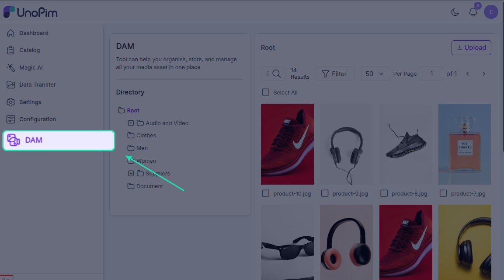

---

## Working with Directories

Directories are simply folders that help you keep your assets organised. You can create as many as you need, nest them inside each other, and manage them with a right-click.

### Right-Click Menu Options

Right-click on the **root directory** or any folder you've created to see the following options:

| Option | What it does |
|---|---|
| **Upload Files** | Upload one or multiple files directly into the selected folder |
| **Add Directory** | Create a new subfolder inside the current directory |
| **Rename** | Change the name of a folder to keep things identifiable |
| **Delete** | Permanently remove a folder from the system — use with care |
| **Copy Directory Structure** | Copies the folder structure (without the files) — useful when you want to recreate the same layout elsewhere |
| **Download Zip** | Downloads all contents of the folder as a ZIP file — handy for backups or bulk transfers |

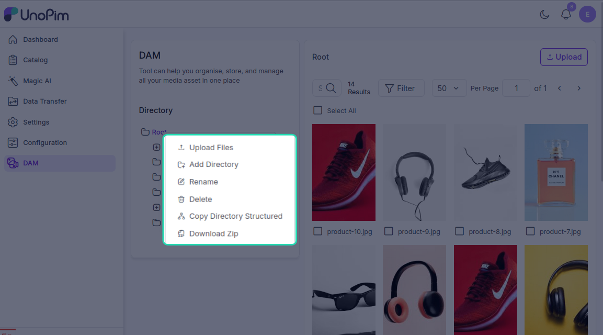

---

### Creating a New Directory

1. Right-click on the directory where you want to add a subfolder.
2. Click **Add Directory**.

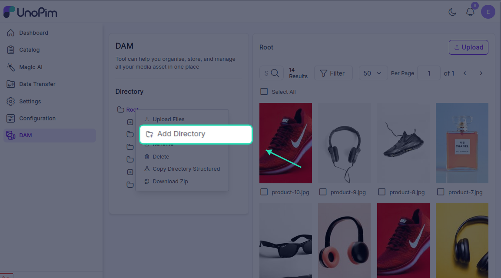

3. Enter a name for the new folder.

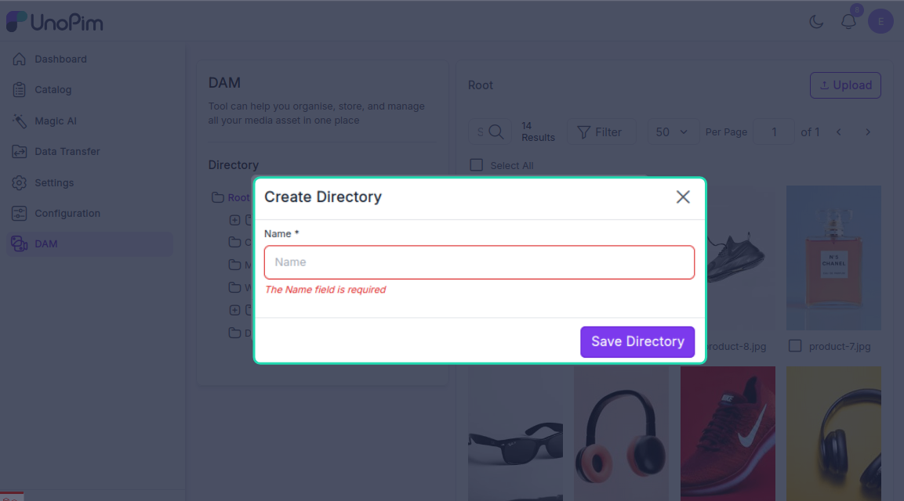

4. Click **Save Directory**.

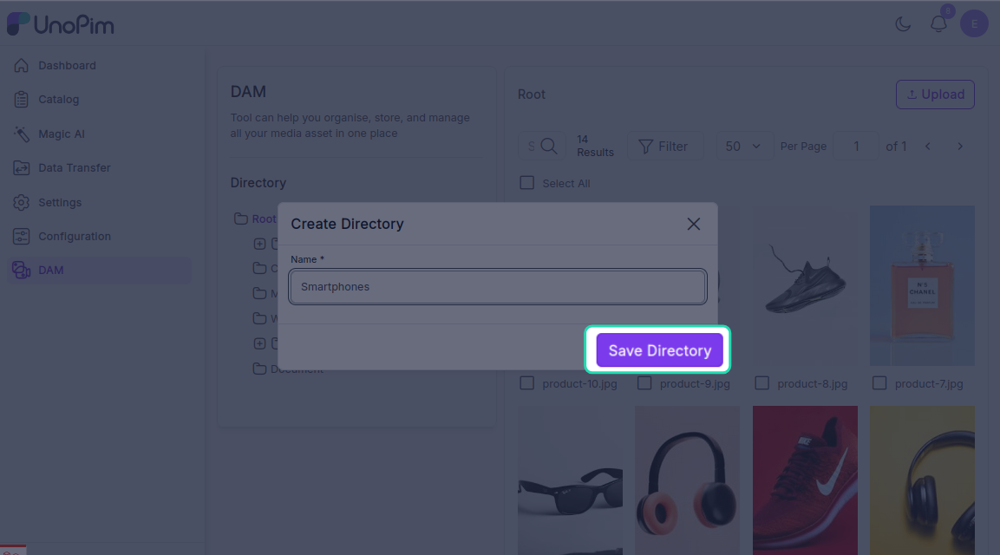

The new subfolder will appear immediately inside the selected directory.

---

## Uploading and Managing Assets

Once your folders are set up, you can start adding assets.

### Uploading Files

Click the **Upload** button to add files to the current directory. You can upload multiple files at once. Supported asset types include images, videos, documents, and audio files.

### Editing or Deleting an Asset

Each asset has an **Edit** and a **Delete** button:

- **Edit** — opens the asset editor where you can make changes
- **Delete** — permanently removes the asset from the directory

---

## Asset Edit Options

When you click **Edit** on an asset, you'll see the following sections:

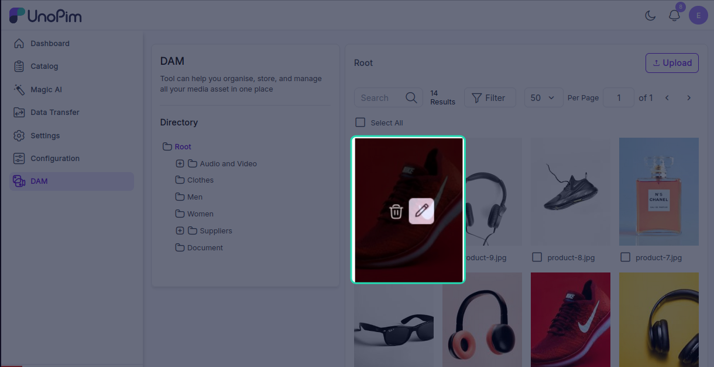

### Preview
View the asset and inspect its embedded metadata — including meta information, the directory path it lives in, and any tags attached to it.

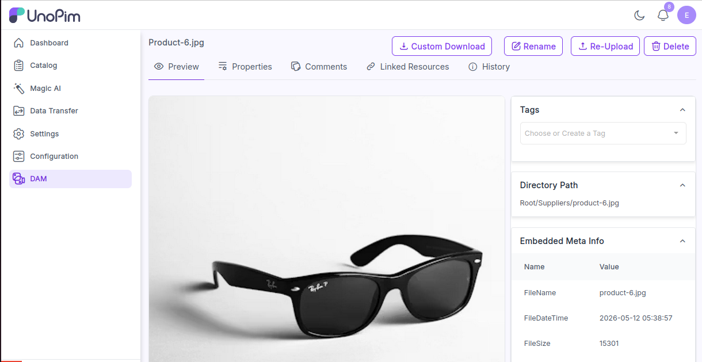

### Re-upload
Replace the current file with a newer version while keeping the same asset record in UnoPim.

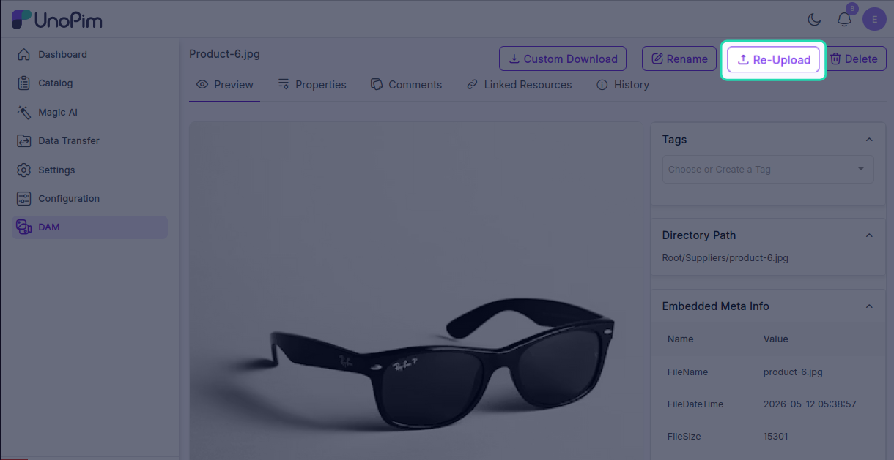

### Rename
Change the name of the asset to keep your library organised and searchable.

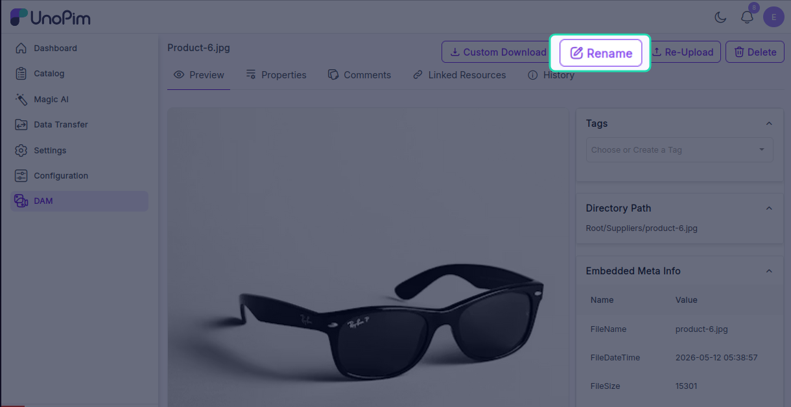

### Delete
Remove the asset from the directory permanently.

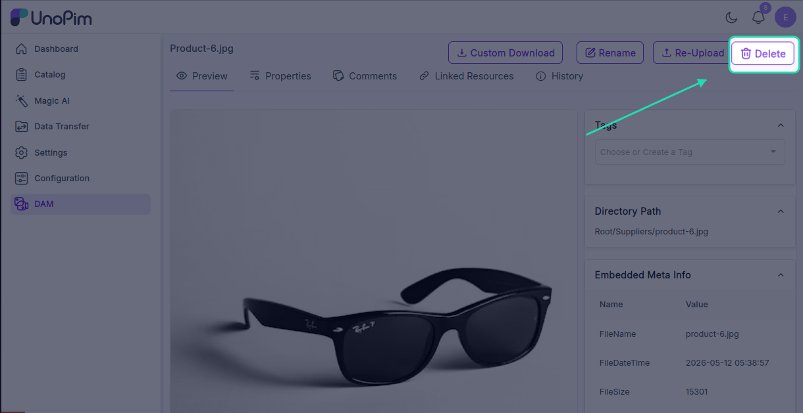

---

## Custom Download

Click **Custom Download** on any image to download it in a specific format or size. Available format options include:

- JPG
- PNG
- WebP
- JPEG

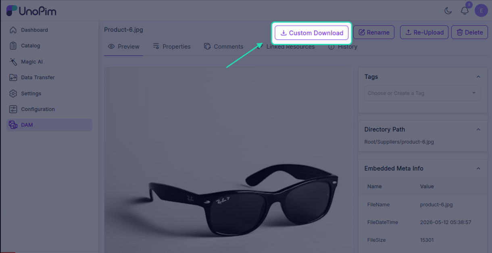

You can also set custom dimensions before downloading — useful when you need a specific image size for a particular use case.

---

## Properties

Properties let you attach structured metadata to an asset — things like a label, type, language, or value.

To create a property:

1. Open the asset and go to the **Properties** section.

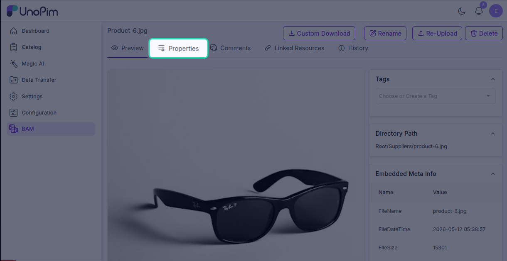

2. Click **Create Property**.

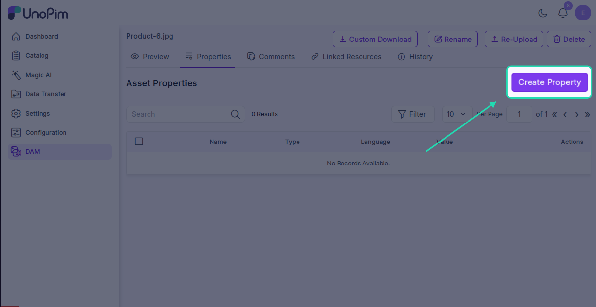

2. Fill in the **Name**, **Type**, **Language**, and **Value** fields.

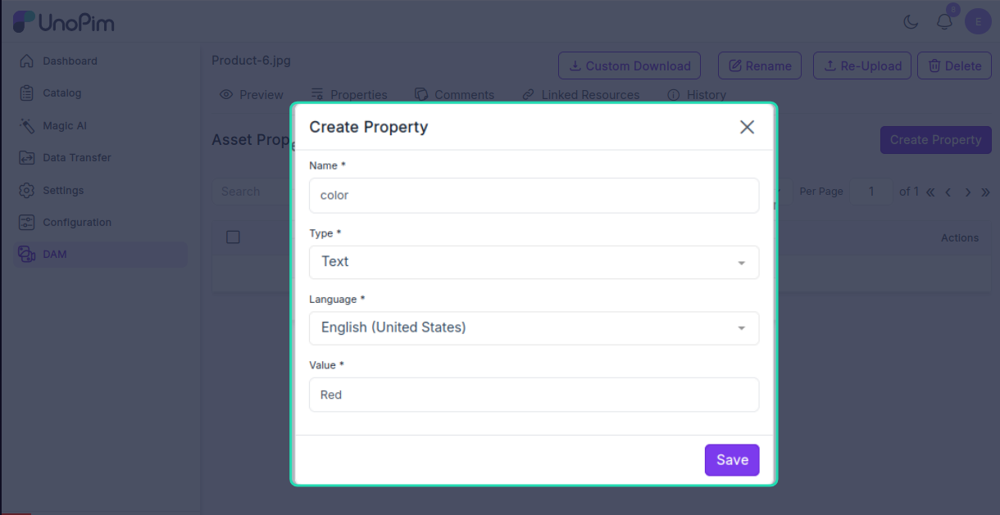

3. Click **Save**.

To find a specific property, click the **Filter** button and filter by:

- **Name** — search by the property name
- **Language** — show properties in a specific language
- **Value** — filter by a particular value

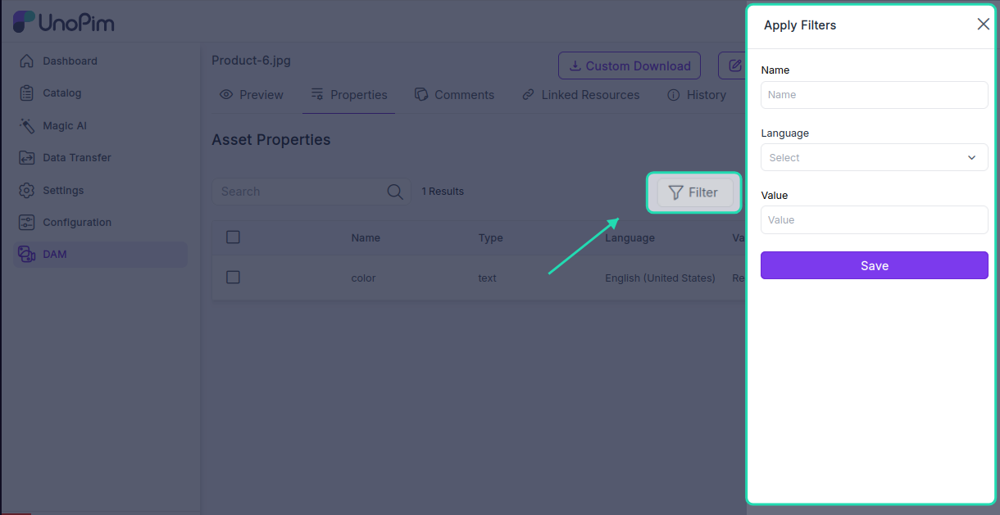

---

## Comments

The **Comments** section lets you and your team leave notes directly on an asset. This is useful for giving feedback, flagging issues, or communicating changes without leaving the platform.

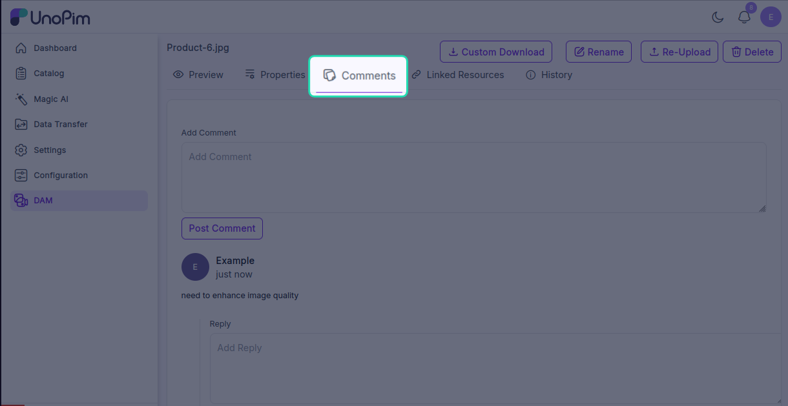

---

## Linked Resources

The **Linked Resources** tab shows all the products and categories that this asset has been assigned to. Two resource types are available:

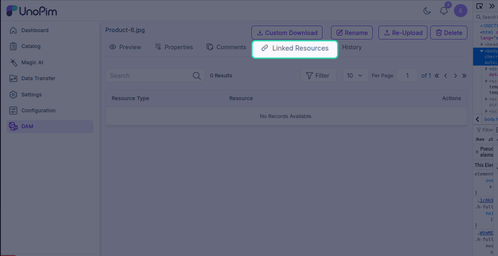

- **Product** — products linked to this asset
- **Category** — categories linked to this asset

Use the **Filter** button to narrow down the list by product or category.

---

## History

The **History** tab shows a full log of every change made to the asset — who changed it, what was changed, and when. This is useful for tracking edits and keeping an audit trail across your team.

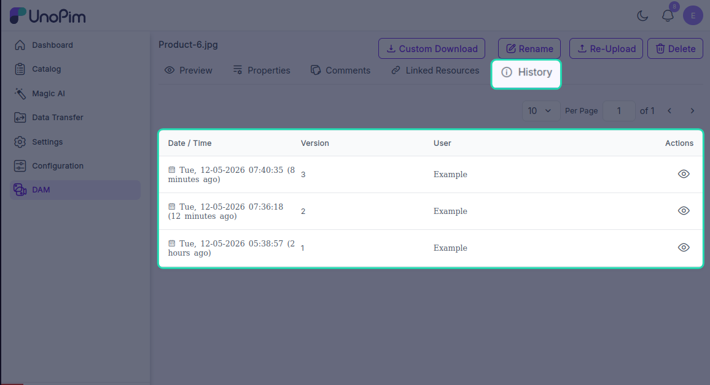