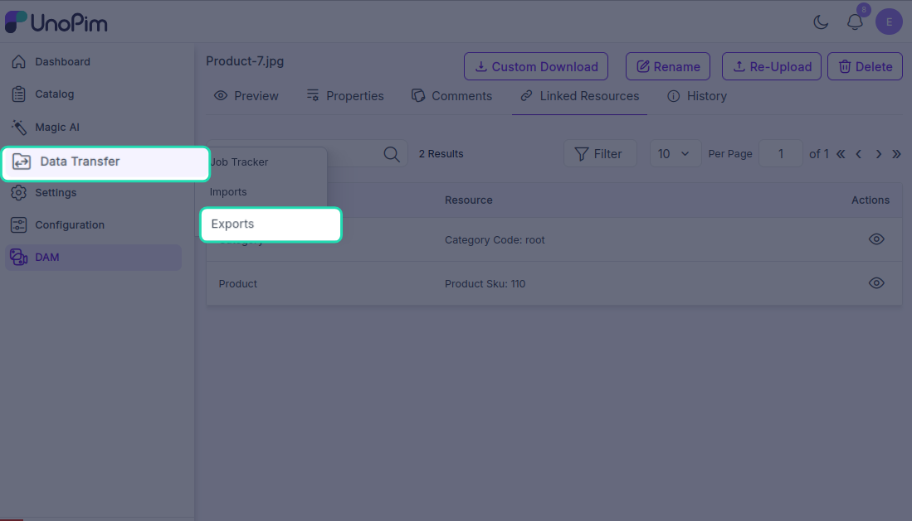
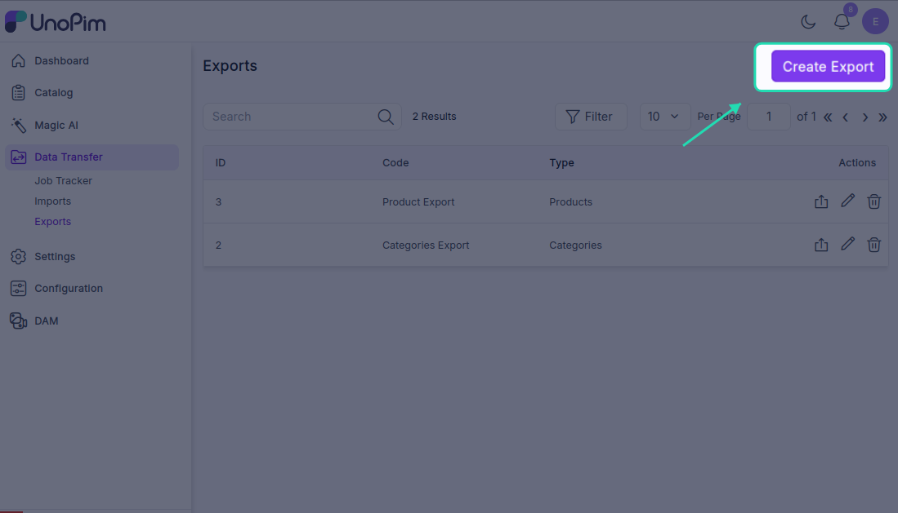
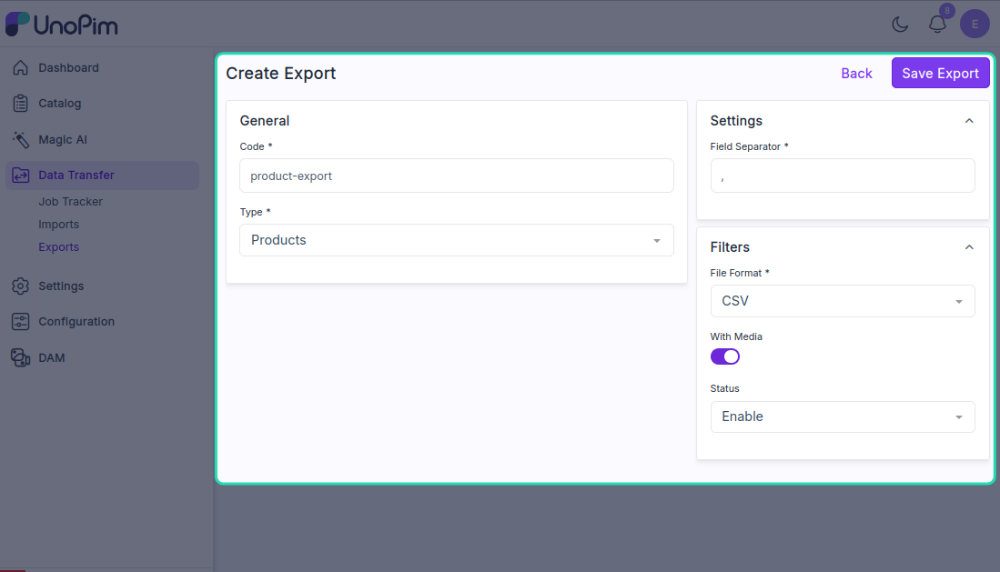
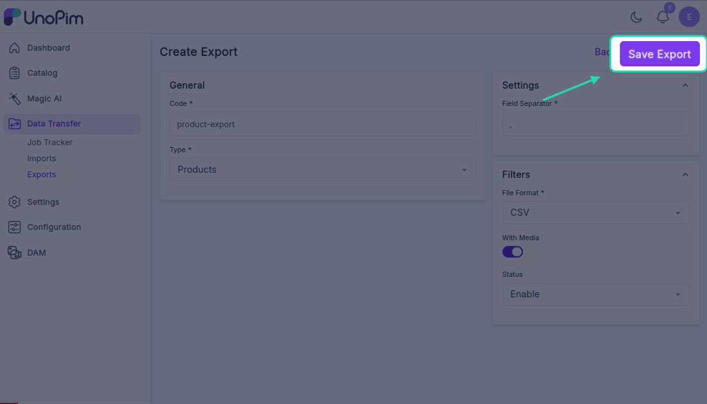
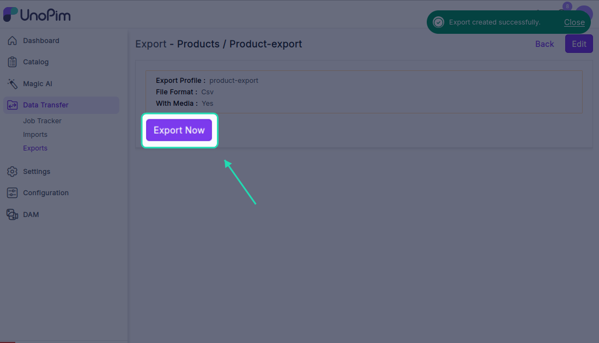
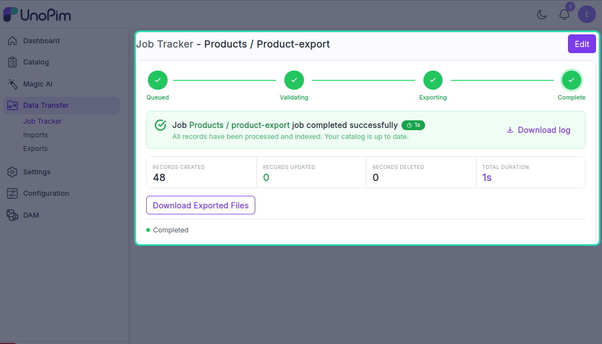
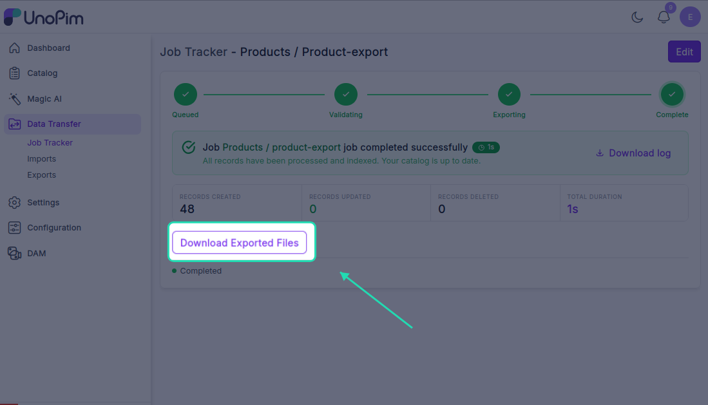
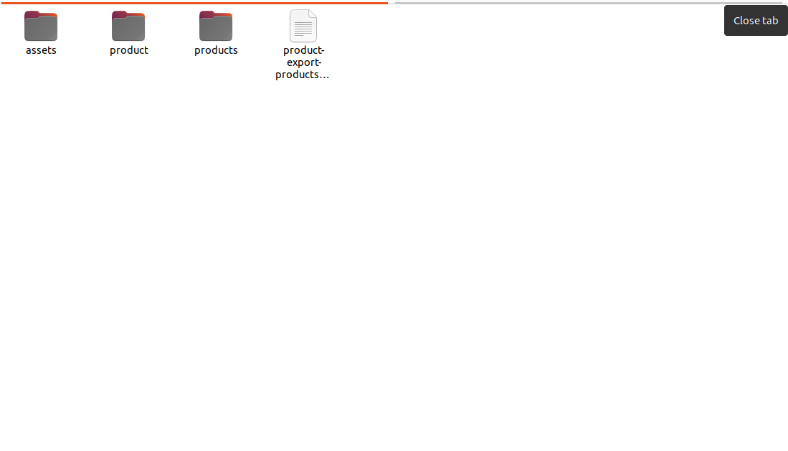
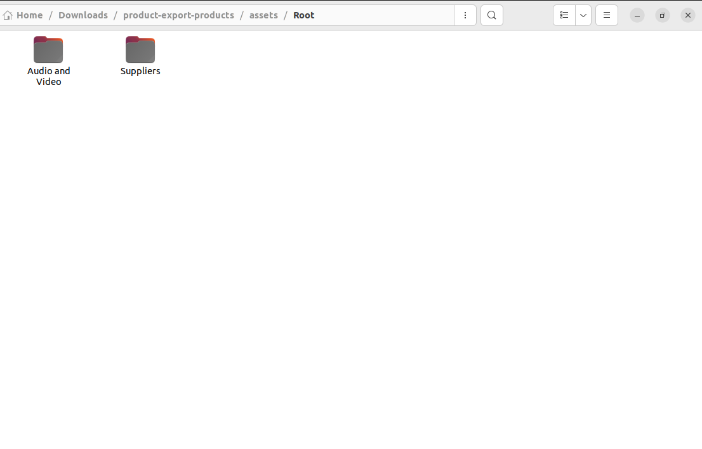

# Exporting Assets with Products and Categories

UnoPim lets you export your digital assets — images, videos, documents — together with your product and category data in a single export job. This means when you download the export file, everything comes bundled together and nothing gets left behind.

---

## Step 1 — Go to Exports

From the left sidebar, navigate to **Data Transfer → Exports**. This page lists all your existing export profiles. You can view, edit, or re-run any of them from here.

To create a new one, click the **Create Export** button in the top-right corner.

---

## Step 2 — Fill in the Export Profile Details

On the Create Export screen, fill in the required fields:

- **Code** — a unique identifier for this export profile (e.g., `dam-product-export`)
- **Type** — select the appropriate export type for products or categories with assets
- **File Format** — choose your preferred output format
- **Channel, Locale, and Currency** — select the relevant settings for your export

Once all the details are filled in, click **Save Export** to create the profile.

---

## Step 3 — Run the Export

After saving, click **Export Now** to start the export job. You'll be able to see the job running in real time.

When the status changes to **Completed**, the export is done and your file is ready to download.

---

## Step 4 — Download the Export File

Click the **Download Exported File** button to save the file to your device. The download will be a **ZIP file** containing two folders:

| Folder | Contents |
|---|---|
| **product** | All exported product or category data |
| **asset** | All the digital assets assigned to those products or categories |

---

## Step 5 — Verify the Exported Assets

Once you've extracted the ZIP, open the **asset** folder and confirm that:

- All assigned assets are present
- File names match what was set in UnoPim
- Image types and file formats are correct

This gives you full confidence that the export captured everything accurately before you use it elsewhere.

---

> **Tip:** If an asset is missing from the export, go back and check that it was properly assigned to the product or category in UnoPim and that the export profile includes media in its settings.

