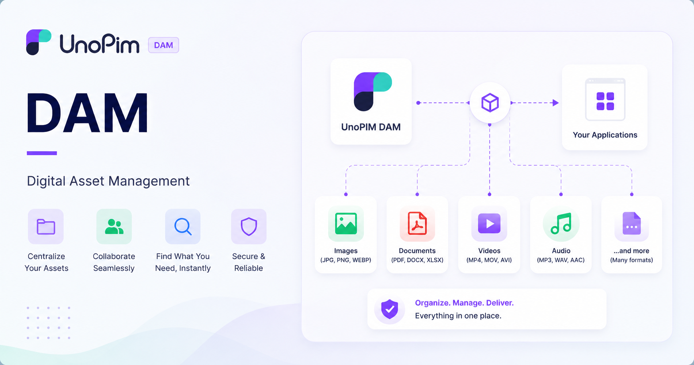

# UnoPim DAM 

Store Link: [View on Webkul Store](https://store.webkul.com/unopim-digital-asset-management.html)

UnoPim DAM is a powerful, open-source digital asset management solution designed to help organizations store, organize, and manage their digital assets efficiently. Whether you are managing images, PDFs, documents, videos, audio files, or other media types, UnoPim DAM provides a comprehensive platform to streamline your workflow.

If your DAM installation also uses the **UnoPim AWS Integration**, you can migrate locally stored DAM files to Amazon S3 by following [DAM Asset Migration to AWS S3](./dam-asset-migration-to-aws-s3.md).

  

### Why Choose UnoPim DAM?

- **Free and open-source software** – No licensing costs
- **Support for multiple file types and formats** – Manage diverse digital assets
- **Enhanced team collaboration capabilities** – Work together seamlessly
- **Flexible directory and categorization options** – Organize assets your way
- **Robust asset organization and search tools** – Find what you need instantly

### Supported File Types

UnoPim DAM supports a wide range of digital asset formats, including:

- **Images:** JPG, PNG, WEBP, JPEG.
- **Documents:** PDF and other document formats like CSV, XLSX, DOCX etc.
- **Video files:** All common video formats.
- **Audio files:** All common audio formats.
- **And much more** – Extensible to support additional formats.

## Requirements

- **UnoPim**: v2.0.0
