# UnoPIM DAM Configuration Guide

Setting Up User Permissions and Asset Attributes

---

## Set User Permissions

User permissions control what actions each user can perform within UnoPIM DAM.

### Steps to Configure User Permissions

1. Navigate to **Settings** → **Roles**

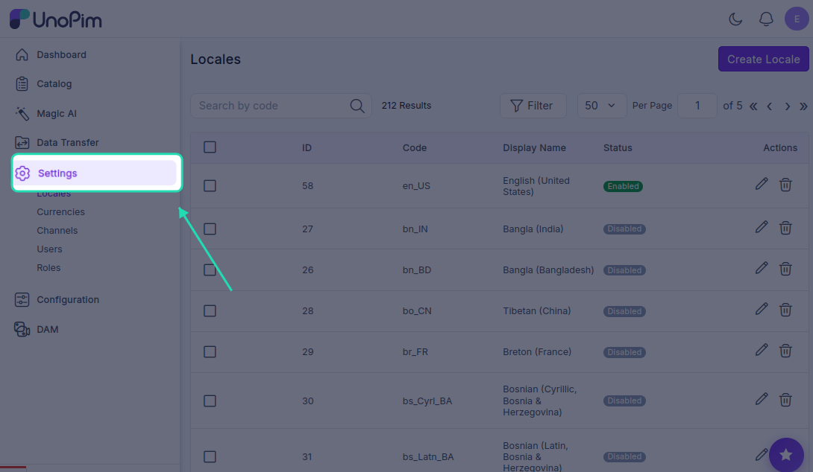

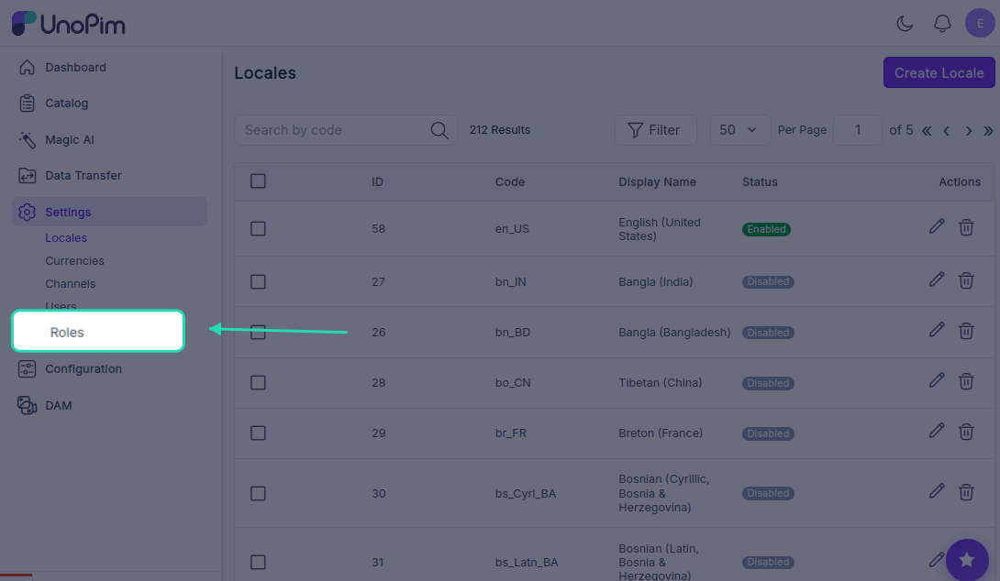

2. Click **Create Role** to add a new role.

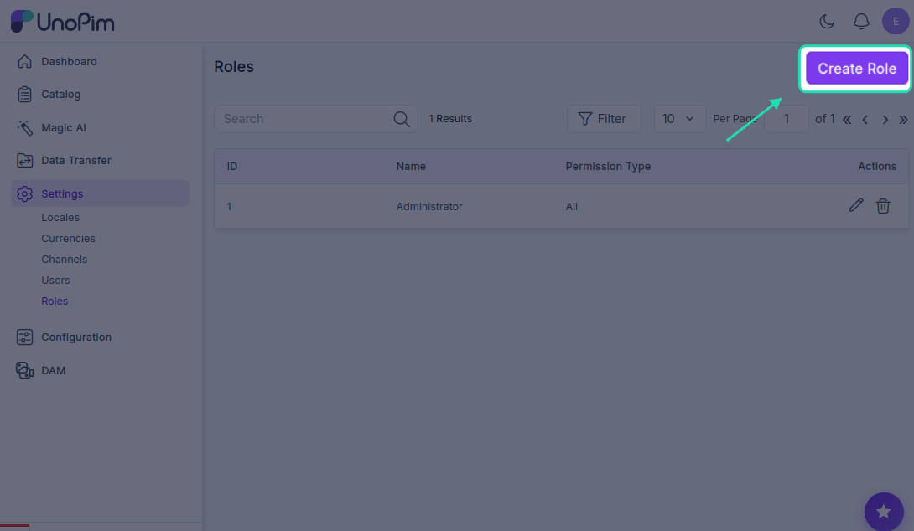

2. Find and enable **DAM** in the permissions list & Set the permission level to **Custom**

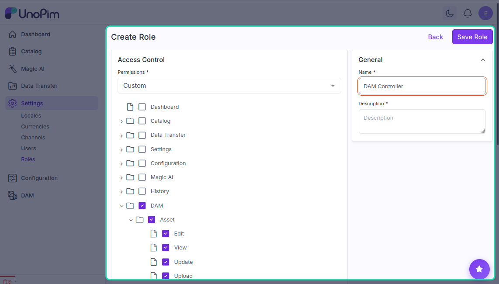

4. Select the specific DAM actions you want to allow for that user

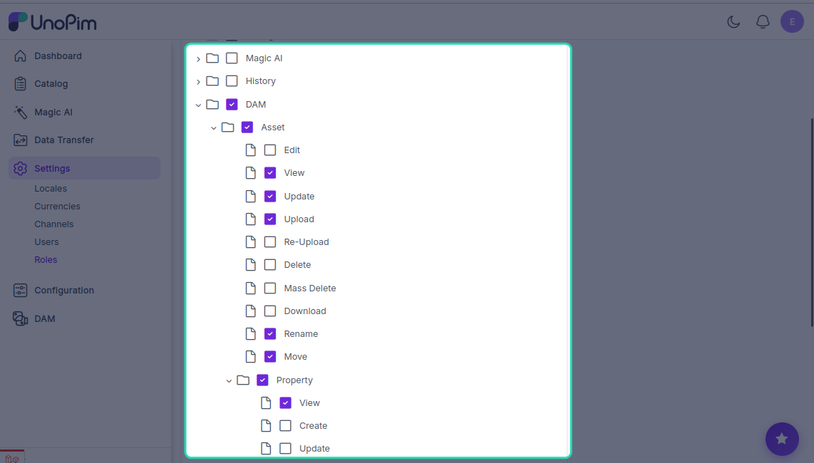

5. Save the changes to apply the new permissions

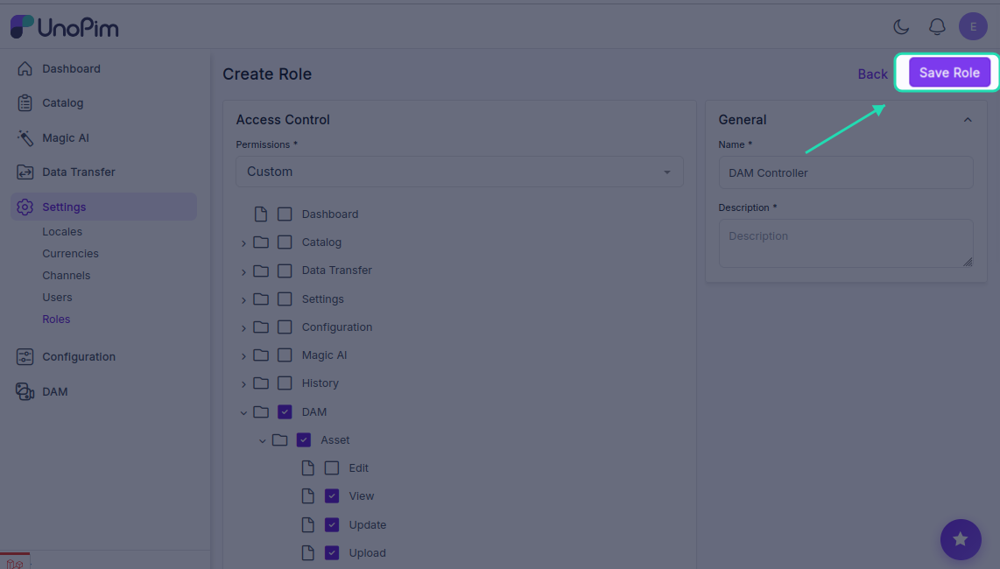

**Tip:** Create different roles for different user types (e.g., Admin, Editor, Viewer) to manage access control effectively.

---

## Create Product Asset Attribute

Product asset attributes allow you to attach digital assets to your products.

### Steps to Create a Product Asset Attribute

1. Navigate to **Catalog** → **Attributes**

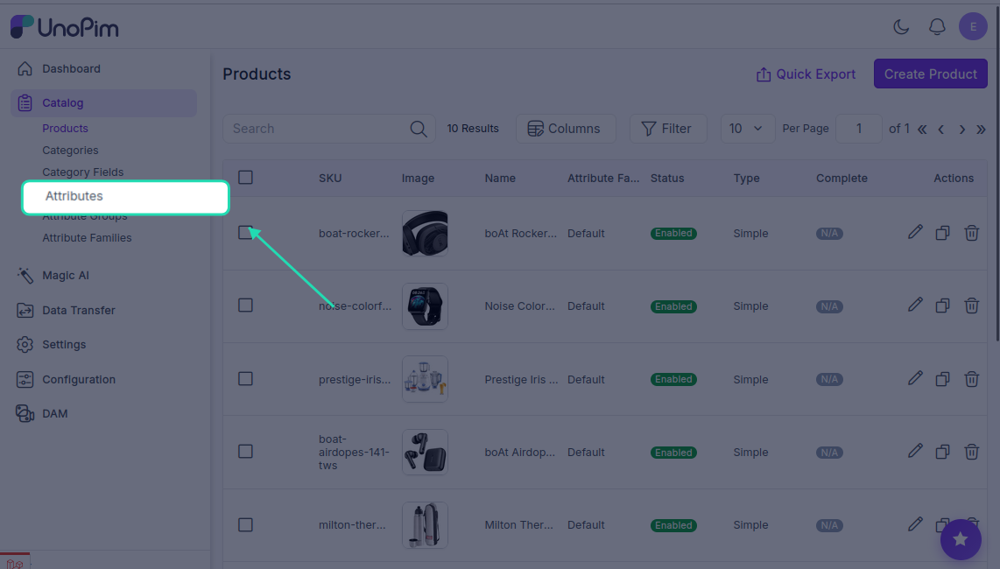

   This displays a list of all existing attributes in the system.

2. Click **Create Attribute**

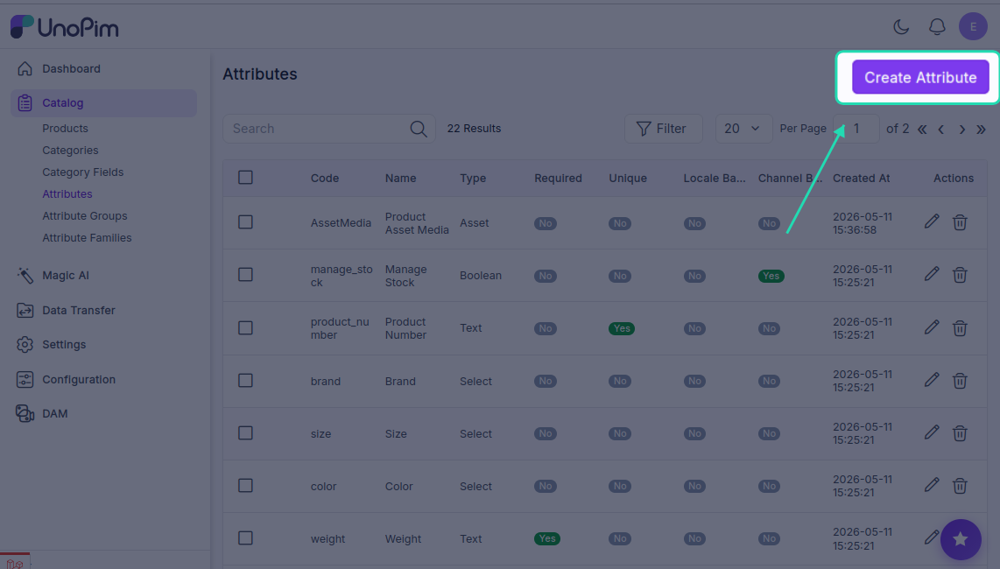

3. Configure the attribute details:
   - Set **Attribute Type** to **Asset**
   - Add all required attribute information
   - Provide a descriptive name and code

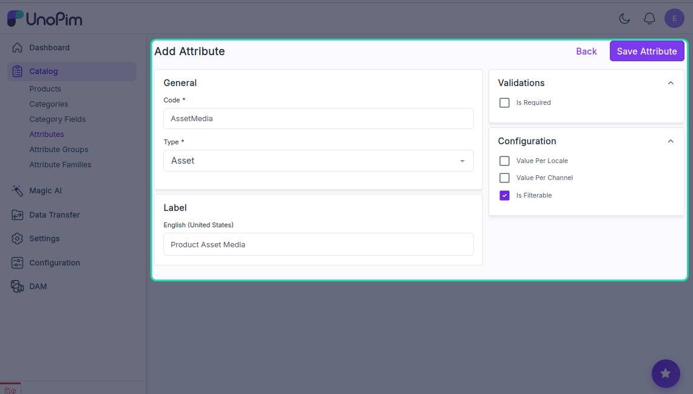

4. Select the **Product Family** where you want to add the asset attribute

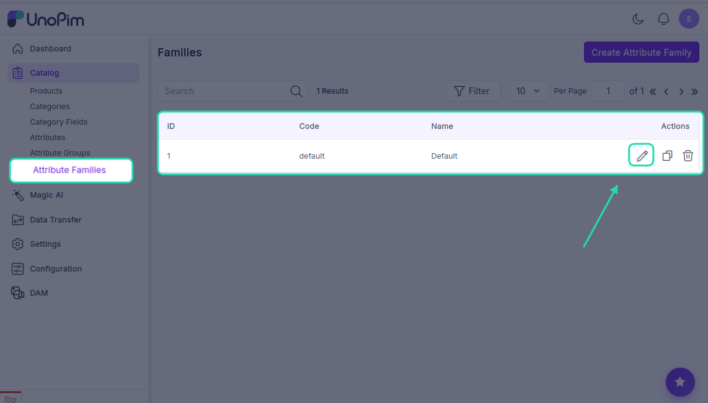

5. Assign the asset attribute to the selected product family

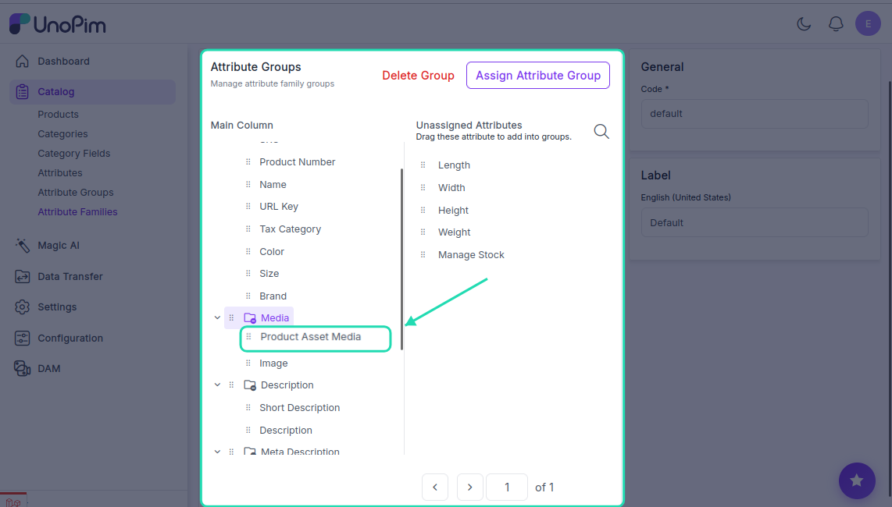

6. Save the attribute configuration

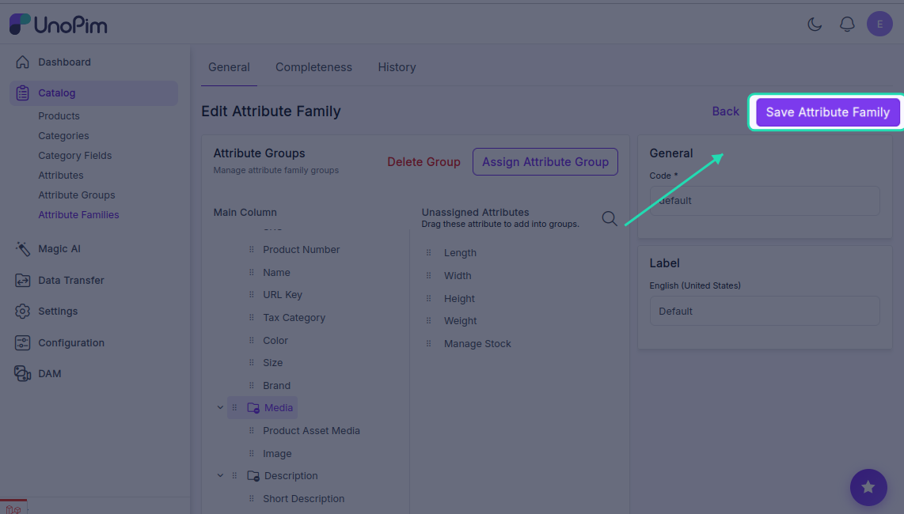

**Once created:** The asset attribute will be available when creating or editing products in that product family.

---

## Create Category Asset Field

Category asset fields allow you to attach digital assets to your product categories.

### Steps to Create a Category Asset Field

1. Navigate to **Catalog** → **Category Fields**

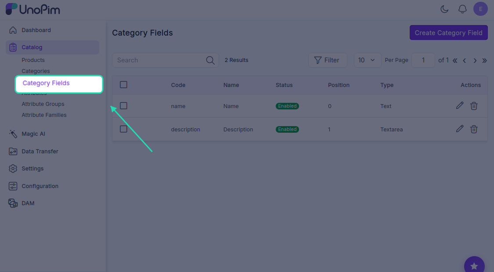

   This displays a list of existing category fields.

2. Click **Create Category field** to add a new category field

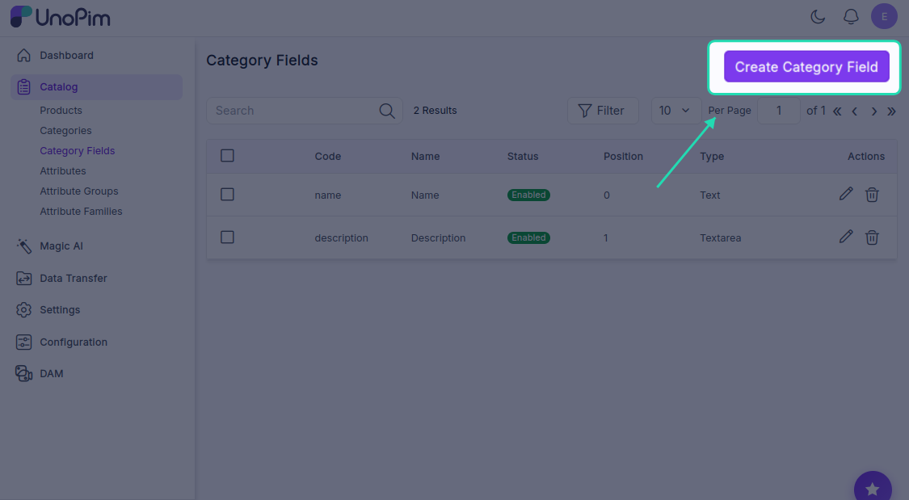

3. Configure the category details:
   - Set **Field Type** to **Asset**
   - Add all required field information
   - Provide a descriptive name and code

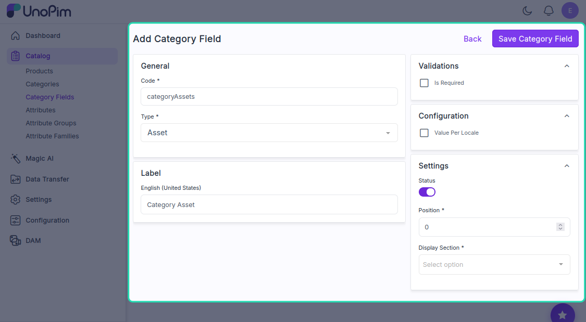

4. Save the category configuration

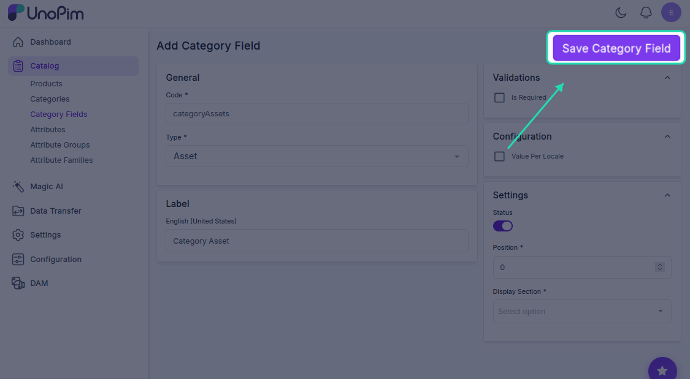

5. When creating categories, you will now find the new category asset field available for use

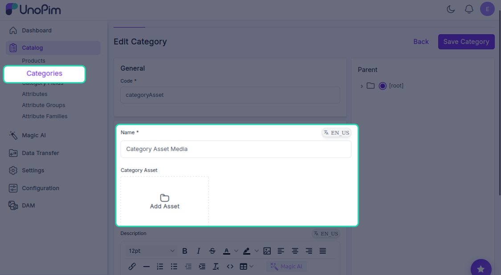

**Once created:** You can use the category asset field to attach digital assets directly to your product categories.

---

**Your UnoPIM DAM configuration is now complete with user permissions and asset management fields.**