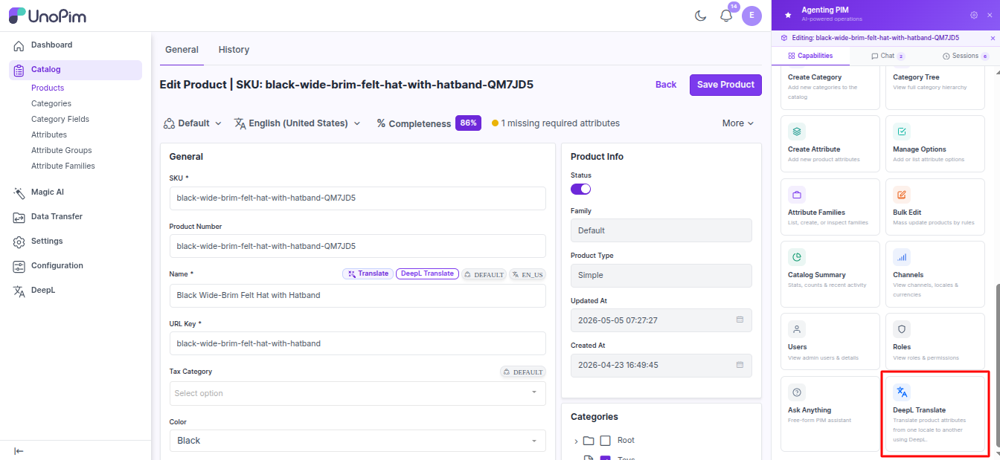

# Use it from the AI agent

If your UnoPim has the **AI Agent** extension installed, you can ask the agent to translate products in chat.

> **Before you start.** AI Agent installed, a [DeepL key](./credentials), **AI Translate** ticked on every field (see [Mark fields](./attribute-setup)), and your role needs **translate** permission.

## How to use it

1. Open the AI chat.
2. Click the **Capabilities** tab.
3. Click the **DeepL Translate** tile.
4. The chat opens with a starter prompt — replace `:sku` with a real SKU and send.

Example:

> *Translate product `WIDGET-001` from `en_US` into `fr_FR` and `de_DE` using DeepL.*

## What you can ask for

The agent can:

- Translate one product by SKU or by ID.
- Pick which fields to translate (or every text field by default).
- **Preview only** — return a preview without saving.

The agent never overwrites text that's already there — it only fills empty translations.

## If the agent says *No translatable source content found*

Either the source language has no text on the product, or the field list you picked has nothing on this product.
