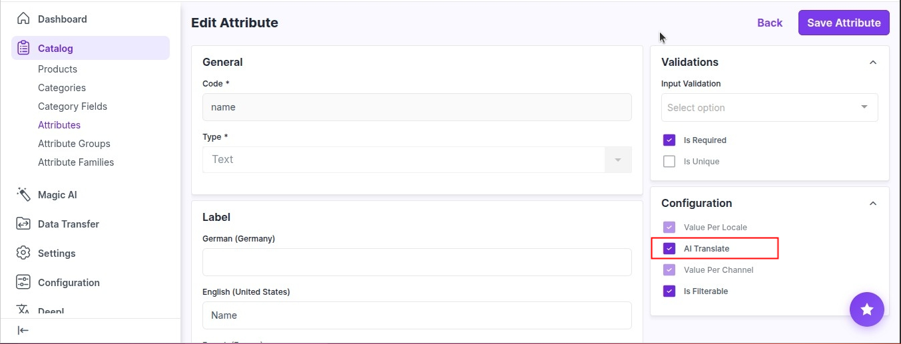

# Mark which fields are translatable

DeepL Translate only shows up on fields you tick as translatable. This keeps fields like SKU, price, or status out of the way even though they're stored as text.

**Open it from:** *Catalog → Attributes → (open the attribute) → Configuration*

## Steps

1. Open the attribute (e.g. **Name**, **Description**).
2. Find the **Configuration** panel on the right.
3. Tick **AI Translate**.
4. Click **Save Attribute**.

That's it. The DeepL button now appears on this field everywhere — product edit, bulk translate, the wizard.

## Which fields to tick

Tick fields that hold customer-facing text:

- Name
- Description
- Short description
- Meta title, meta description, meta keywords
- Any tagline or marketing copy

**Don't tick** fields like SKU, price, weight, image URLs, status, or dates — those shouldn't be translated.

## Notes

- Only **Text** and **Textarea** fields can be translated. Selects, numbers, dates, files etc. are never translated, even if you tick the box.
- The field also needs **Value Per Locale** turned on, so it can store a different value per language.
- Untick the box later to hide the field from DeepL again.
