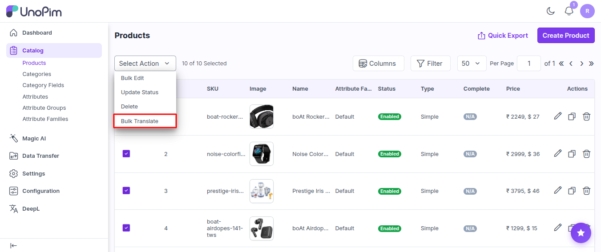
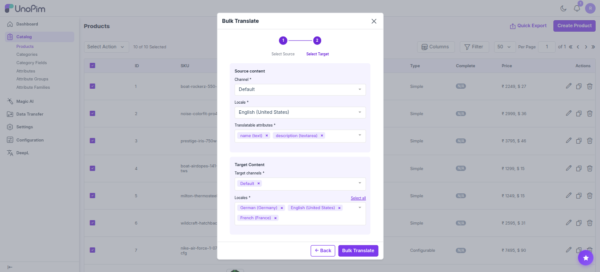

# Translate many products

Translate many products at once from the products list.

> **Before you start.** Add a [DeepL key](./credentials), tick **AI Translate** on every field you want translated (see [Mark fields](./attribute-setup)), and your role needs **bulk translate** permission.

## Steps

1. Open **Catalog → Products**.
2. Tick the products you want to translate.
3. Click **Selected actions → Bulk Translate**.

A wizard opens.

### Step 1 — Source + fields

Pick:

- **Channel** — where the original text lives.
- **Locale** — what language to translate from.
- **Translatable attributes** — pick the fields to translate (e.g. *name*, *description*, *short_description*).

Click **Next →**.

### Step 2 — Target

Pick:

- **Target channels** — one or more.
- **Locales** — one or more. **Select all** picks every available language.

Click **Bulk Translate**.

You'll see *X product(s) queued for DeepL translation.*

## Watch the progress

Open **Settings → Data Transfer → Tracker**. The job appears with a progress counter. See [Watch progress](./tracker) for details.
