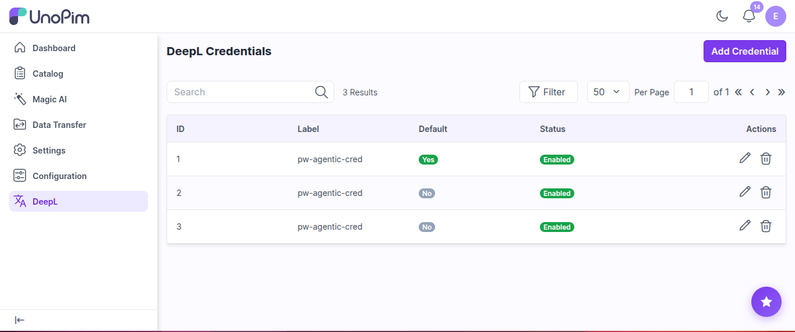
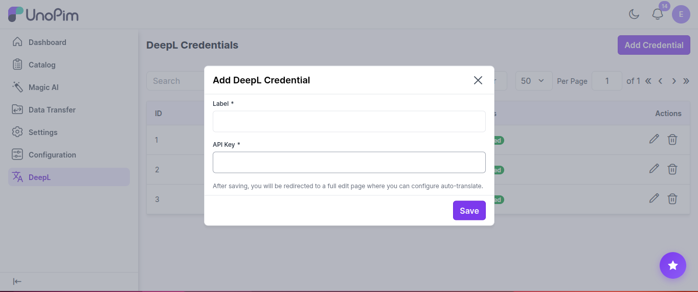
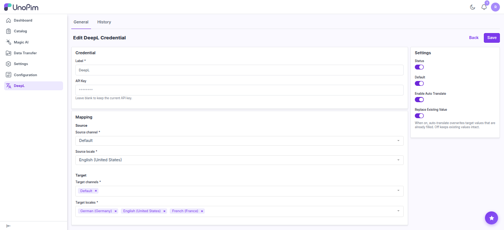

# Add your DeepL key

This is where you store your DeepL API key. Add at least one key before you can translate anything.

**Open it from:** *DeepL → Credentials*

---

## The credentials page

Each row in the list shows one key:

- **Label** — the name you gave it.
- **Default** — whether this is the key used for automatic translation.
- **Status** — on or off.

You can search by label, sort columns, or click **Filter** to narrow the list. The pencil icon edits a row, the trash icon deletes it.

---

## Add a key

Click **+ Add Credential** in the top-right corner.

Fill in:

- **Label** — any name you want, e.g. *Production*.
- **API Key** — paste your DeepL key.

Click **Save**.

> The extension checks the key with DeepL before saving. If the key is wrong you'll see an error and nothing is stored.

After saving, you land on the edit page where you can switch on auto-translate.

---

## Edit a key

Click the pencil icon on any row.

You'll see three panels.

### Credential

- **Label** — change the name.
- **API Key** — leave blank to keep your current key. Type a new one to replace it.

### Settings (right side)

| Switch | What it does |
|--|--|
| **Status** | Turn the key on or off. Off keys are ignored everywhere. |
| **Default** | Only one key can be the default. The default key is used for automatic translation. |
| **Enable Auto Translate** | Turn on automatic translation after import / save. |
| **Replace Existing Value** | If on, automatic translation overwrites values that are already filled. If off, only empty values are filled. |

### Mapping (only on the default key, when auto-translate is on)

Tell the extension which language to translate **from** and **into**:

- **Source channel** + **Source locale** — where the original text lives.
- **Target channels** + **Target locales** — where translations should be saved.

Click **Save** when done.

---

## Test the key

The edit page has a **Test Connection** button. Click it any time to check the key still works and see how much of your DeepL quota you've used.

---

## Delete a key

Click the trash icon on a row and confirm.

> You can't delete the only working default key. Mark another key as default first.

---

## See change history

The edit page has a **History** tab that lists every change made to this key — label edits, status flips, mapping changes. Your API key itself is never shown there.
