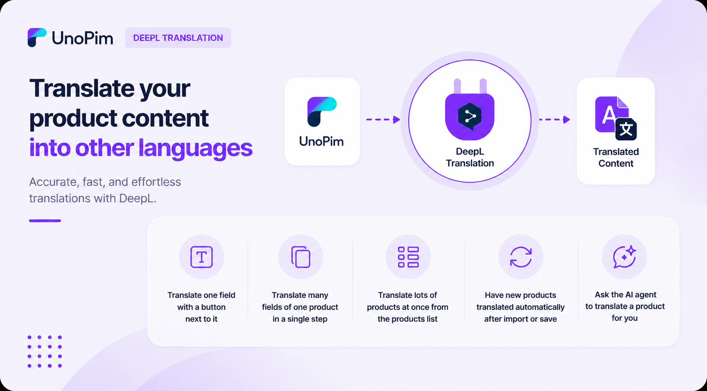

# DeepL Translation

Translate your product content into other languages with one click.
 

  

  

## What you can do

- Translate **one field** with a button next to it.
- Translate **many fields of one product** in a single step.
- Translate **lots of products at once** from the products list.
- Have new products **translated automatically** after import or save.
- Ask the **AI agent** to translate a product for you.

## Requirements

| Requirement | Details |
|---|---|
| **UnoPim** | 2.0.0 or higher |
| **PHP** | 8.2 or higher |
| **DeepL API** | Active DeepL API key (Free or Pro) |  

## Before you start

You need:

1. A working UnoPim installation.
2. A DeepL API key — get one from [deepl.com/pro-api](https://www.deepl.com/pro-api). Free or Pro both work.
3. The DeepL Translation extension installed — see [Installation](./installation).
