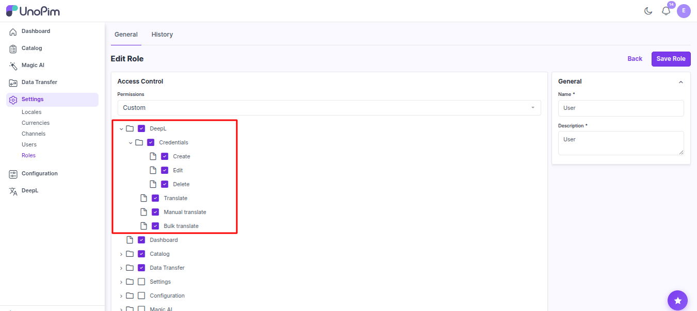

# Installation

This page is for installing the extension. Once it's installed, see [Add your DeepL key](./credentials) to start using it.

## You need

- UnoPim version 2.0, 
- A [DeepL API](https://support.deepl.com/hc/en-us/articles/360020695820-API-key-for-DeepL-API) key (Free or Pro).

## Steps

### 1. Drop the package in place

Place the unzipped extension at:

```
packages/Webkul/DeepLTranslation/
```

### 2. Add it to composer.json

In your project's root `composer.json`:

```json
"autoload": {
    "psr-4": {
        "Webkul\\DeepLTranslation\\": "packages/Webkul/DeepLTranslation/src"
    }
}
```

### 3. Register the provider

In `bootstrap/providers.php`:

```php
Webkul\DeepLTranslation\Providers\DeepLTranslationServiceProvider::class,
```

### 4. Install the DeepL SDK

```bash
composer require deeplcom/deepl-php:^1.18
```

### 5. Run the install command

```bash
composer dump-autoload
php artisan deepl:install
```

### 6. Keep a queue worker running

```bash
php artisan queue:work
```

In production use Supervisor / systemd / Horizon.

### 7. Give your role permission

Open **Settings → Roles**, edit the role, and tick the DeepL permissions you want them to have:

- **Manage credentials** — add / edit / delete DeepL keys.
- **Translate fields** — use the per-field button and the product wizard.
- **Bulk translate** — translate many products at once.



Without these the menu and buttons stay hidden.

## Check it worked

1. **Menu shows up.** Open the admin panel — a **DeepL** menu appears in the sidebar.
2. **Add a key works.** Open **DeepL → Credentials → Add Credential** and save your key. If the key is wrong, you see a clear error.
3. **Per-field button shows up.** Open any product. A **DeepL Translate** button appears next to translatable fields.
4. **Bulk action shows up.** Open **Catalog → Products**, tick a row, and **Bulk Translate** appears in the actions menu.

If any of these don't work, see [Troubleshooting](./troubleshooting).
