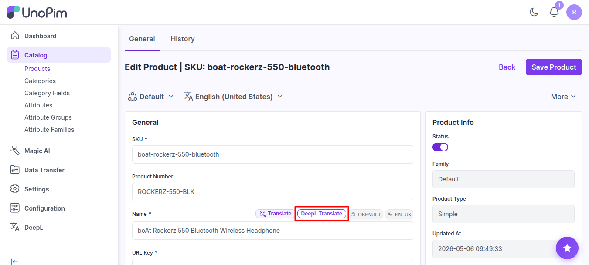
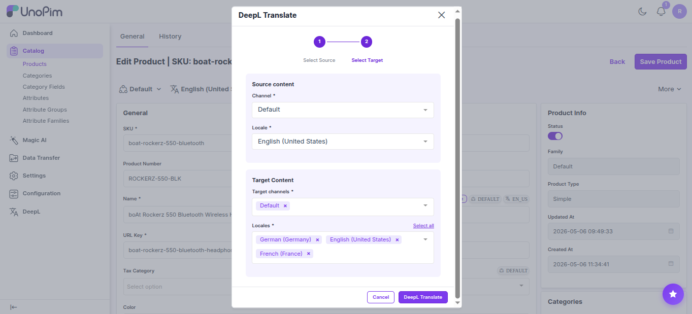
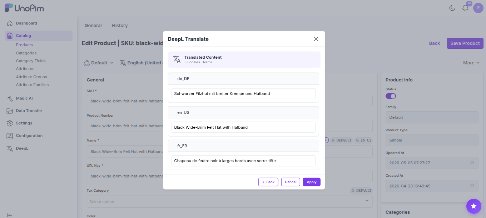

# Translate one field

The fastest way to translate a single field on a product.

> **Before you start.** Add a [DeepL key](./credentials) and tick **AI Translate** on the field (see [Mark fields](./attribute-setup)).

## Steps

1. Open the product.
2. Find the field you want to translate.
3. Click **DeepL Translate** next to the field.

A short wizard opens.

### Step 1 — Source

Pick:

- **Source channel**
- **Source locale**

These are pre-filled with the page you're already on.

Click **Next →**.

### Step 2 — Target

Pick:

- **Target channels** — one or more.
- **Target locales** — one or more. **Select all** picks every available language.

Click **DeepL Translate**.

### Step 3 — Preview & save

Each target language shows the translated text in a box you can edit. Tweak anything you like.

- **← Back** — go back a step.
- **Cancel** — discard.
- **Apply** — save into the product.

You'll see *Translation saved.*

## If the button isn't showing

Walk through the list — the first reason is the most common:

1. Is **AI Translate** ticked on the field? See [Mark fields](./attribute-setup).
2. Is the field a **Text** or **Textarea**?
3. Does your role have DeepL translate permission?
4. Is at least one DeepL key turned **on** in [Credentials](./credentials)?
