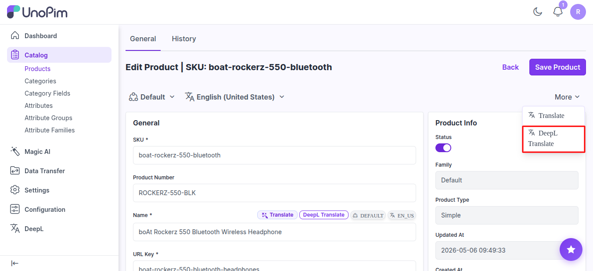
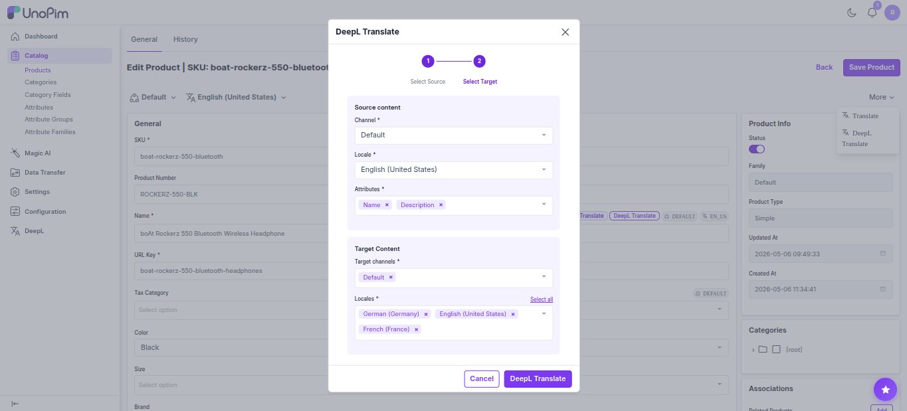
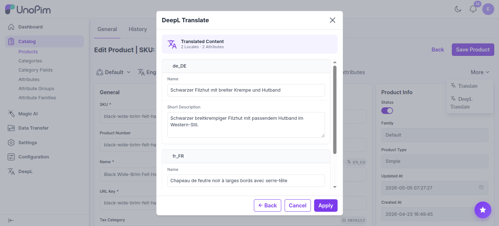

# Translate one product

Translate **many fields** of one product in a single step.

> **Before you start.** Add a [DeepL key](./credentials) and tick **AI Translate** on every field you want translated (see [Mark fields](./attribute-setup)).

## Steps

1. Open the product.
2. Top-right corner — click **More ▾**.
3. Click **DeepL Translate**.

A wizard opens.

### Step 1 — Source + fields

Pick:

- **Source channel**
- **Source locale**
- **Attributes** — every translatable field is pre-ticked. Untick anything you don't want.

Click **Next →**.

### Step 2 — Target

Pick:

- **Target channels** — one or more.
- **Target locales** — **Select all** picks every available language.

Click **DeepL Translate**.

### Step 3 — Preview & save

Translations are grouped by language. Each language shows every selected field in an editable box. Edit anything you like.

- **← Back**
- **Cancel**
- **Apply** — saves and runs each target channel as a background job. Watch them in [Watch progress](./tracker).

## Heads-up

If the same channel + language appears in both source and target, that pair is skipped — you never translate a language to itself.
