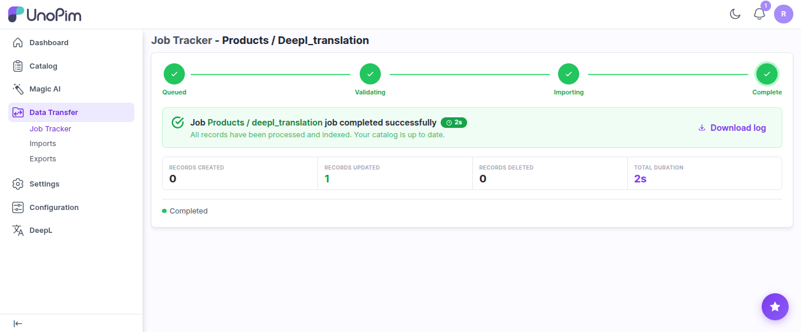

# Watch progress

Background translation jobs show up in **Settings → Data Transfer → Tracker**.

Each row shows:

- Status — queued / running / done / failed.
- A progress counter (e.g. *3 of 10 products updated*).
- A short summary when it finishes.

## What creates a row

| Translation flow | Rows it creates |
|--|--|
| [Translate many products](./bulk-translate) | One row for the whole run. |
| [Translate one product](./product-wizard) | One row per target channel. |
| [After import](./auto-translate) | One row per imported product. |
| [AI agent](./agentic-pim) | One row per source field. |

## Notifications

You'll see two kinds of message in the admin:

- ✅ *DeepL translation completed* — *X product(s) updated.*
- ❌ *DeepL translation failed* — with the error message.

## When jobs are stuck on *queued*

The background worker isn't running. Ask your developer to start it (`php artisan queue:work`) or to check Supervisor / Horizon in production. Without it, no translation job ever runs.
