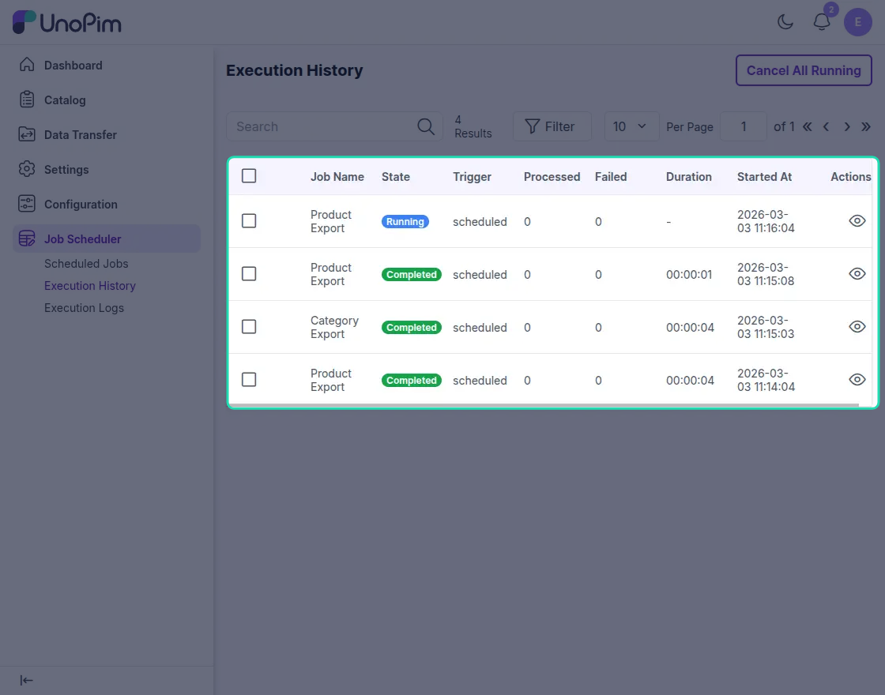
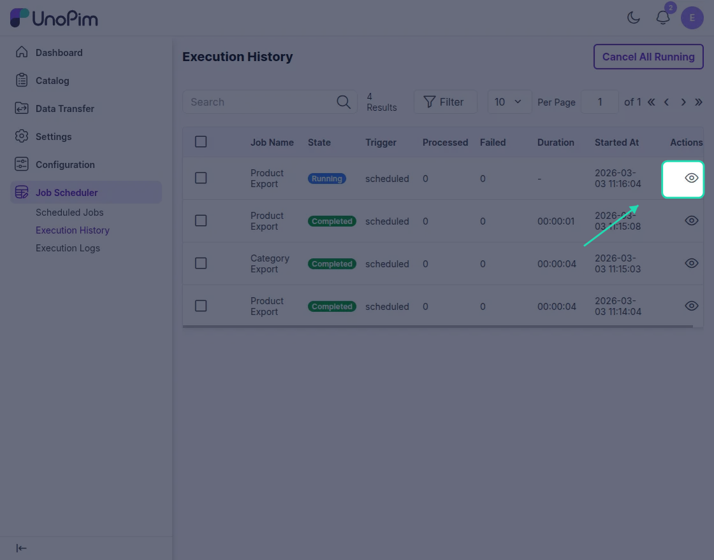
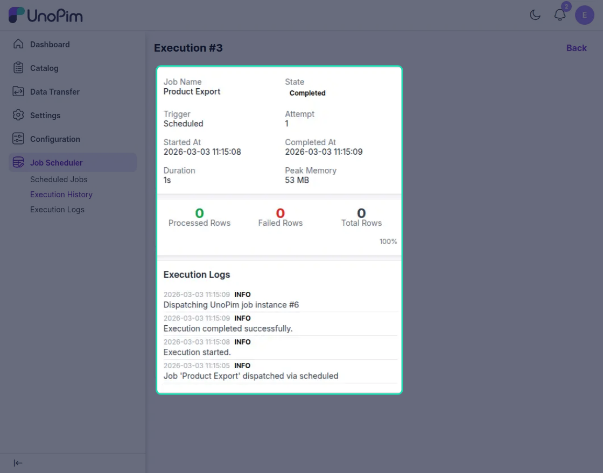
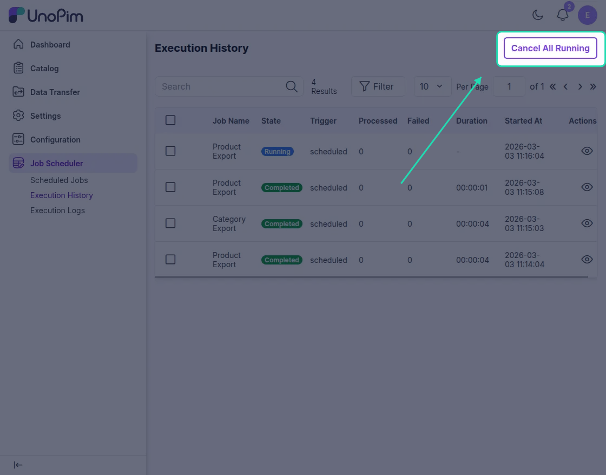

# Execution History

The **Execution History** section shows all scheduled jobs that have run in the system. It helps administrators track job activity, review execution results, and quickly identify failed or long-running jobs.

Open **Job Scheduler** from the UnoPim sidebar and click **Execution History** to view the list of executed jobs.

## What You Can See in Execution History

Each row in the grid represents one job execution. The following details are available:

| Column | Description |
|---|---|
| **Job Name** | Displays the name of the scheduled job, such as `Product Export` or `Category Export`. |
| **State** | Shows the current job status, such as **Running**, **Completed**, or **Failed**. |
| **Trigger** | Indicates how the job was started, such as a scheduled run. |
| **Processed** | Shows how many records were processed during the execution. |
| **Failed** | Shows how many records failed during processing. |
| **Duration** | Displays how long the job took to complete. |
| **Started At** | Shows the date and time when the job started. |

## View Job Execution Details

To inspect a specific job run:

1. Go to **Job Scheduler > Execution History**.
2. Find the job execution you want to review.
3. Click the **View** icon under the **Actions** column.

This opens the **Job Execution History Details** page, where you can review more information about that particular execution.

## Cancel Running Jobs

If one or more jobs are still in progress, you can stop them directly from the execution details page.

1. Open the required job execution from **Execution History**.
2. Click **Cancel All Running**.

Use this action when a job is stuck, taking too long, or needs to be stopped before completion.

> **Note:** Only jobs that are currently in the **Running** state can be cancelled.
