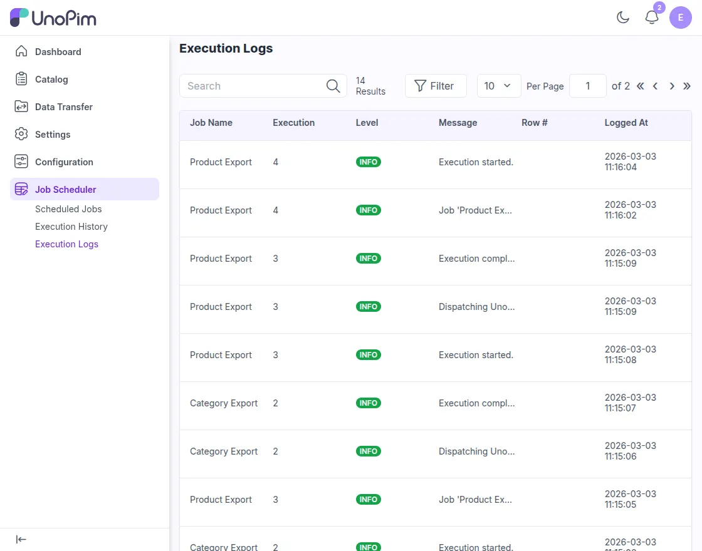

# Execution Logs

The **Execution Logs** section shows detailed log messages for each job execution. It helps administrators understand what happened during a job run, review execution steps, and quickly identify any issues.

Open **Job Scheduler** from the UnoPim sidebar and click **Execution Logs** to view the available log entries.

## What You Can See in Execution Logs

Each row in the log grid represents a recorded event from a job execution. The following details are available:

| Column | Description |
|---|---|
| **Job Name** | Shows the name of the job, such as `Product Export` or `Category Export`. |
| **Execution** | Displays the execution ID of the job run. Each execution has its own unique number. |
| **Level** | Shows the log level, such as **INFO**, which indicates the type of log entry. |
| **Message** | Displays the log message that explains what happened during the execution, such as when the job started or completed. |
| **Row #** | Shows the row number related to the log message, if the log is tied to a specific record. |
| **Logged At** | Displays the date and time when the log entry was created. |

## Why Use Execution Logs

You can use this section to:

- Track job activity step by step
- Review what happened during a specific execution
- Identify errors or failed records during processing
- Check whether a job started, completed, or stopped unexpectedly

Execution logs are especially useful when a scheduled import or export does not behave as expected and you need more detail than the execution summary screen provides.
