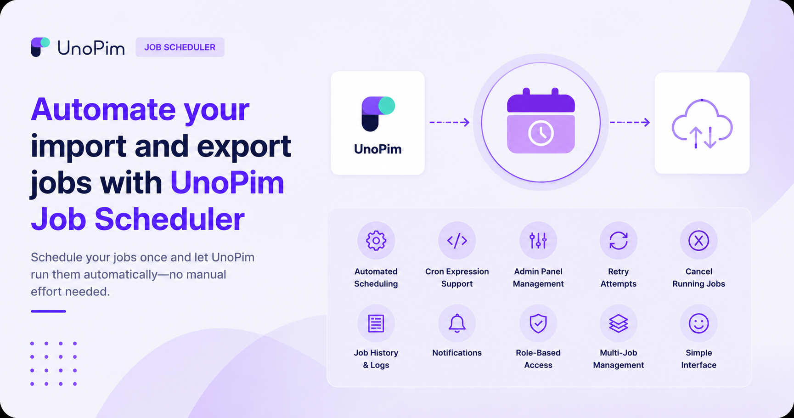

# UnoPim Job Scheduler

Store Link: [View on Webkul Store](https://store.webkul.com/unopim-job-scheduler.html)

The **UnoPim Job Scheduler** lets you automate your import and export jobs so they run on their own - no need to manually trigger them every time. Set a schedule once and the system handles the rest.

 

  

  

Whether you need products exported to your store every morning, categories synced weekly, or a custom task running at a specific time, the Job Scheduler gives you full control from a simple admin panel inside UnoPim.

---

## What Can It Do?

Instead of logging in and running export or import jobs by hand, you define when they should run - daily, weekly, monthly, or at a custom time using a cron expression - and the scheduler fires them automatically at the right moment.

---

## Features

| Feature | Description |
|---|---|
| **Automated Scheduling** | Run import and export jobs automatically based on a configured schedule |
| **Cron Expression Support** | Create custom schedules using standard cron syntax for precise timing control |
| **Admin Panel Management** | Create, edit, and manage all scheduled jobs directly from the UnoPim admin panel |
| **Retry Attempts** | Set how many times a job should retry automatically if it fails |
| **Cancel Running Jobs** | Stop all active jobs instantly when needed |
| **Job History & Logs** | View a full history of past job executions and download logs for each run |
| **Notifications** | Get notified when a job completes successfully or fails |
| **Role-Based Access** | Control who can create or manage scheduled jobs using UnoPim's permission system |
| **Multi-Job Management** | Manage multiple scheduled jobs from one centralised place |
| **Simple Interface** | Easy to set up and use - no technical expertise required for common schedules |

---

## When Should You Use It?

The Job Scheduler is ideal when:

- You need to **export products to your store automatically** at a set time each day.
- You want to **import updated data from an external platform** on a regular schedule without manual effort.
- Your team handles **large catalogs** and running jobs manually is time-consuming.
- You want **peace of mind** that syncs are happening in the background even when no one is logged in.

---

## Requirements

| Requirement | Version |
|---|---|
| **PHP** | ^8.3 |
| **UnoPim** | 2.0.1 or newer |
| **webkul/data-transfer** | Bundled with UnoPim core |
| **Queue Driver** | Any (database, redis, sqs, etc.) |

---

