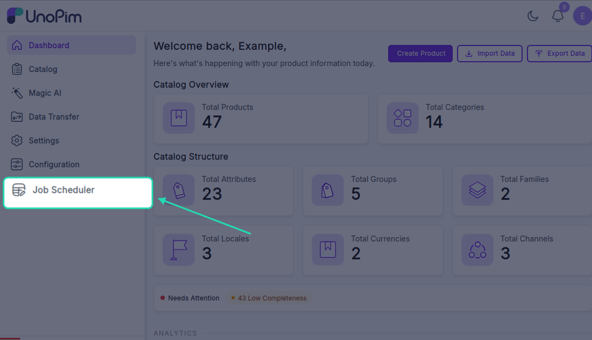

# Installation

Follow the steps below to install the UnoPim Job Scheduler. You'll need terminal access to your server before getting started.

---

## Step 1 — Add the Package

Place the package at the following location in your UnoPim project:

```
packages/Webkul/JobScheduler/
```

Then open your root `composer.json` and add the PSR-4 autoload entry under `autoload > psr-4`:

```json
{
    "autoload": {
        "psr-4": {
            "Webkul\\JobScheduler\\": "packages/Webkul/JobScheduler/src"
        }
    }
}
```

---

## Step 2 — Register the Service Provider

Open `bootstrap/providers.php` and append `JobSchedulerServiceProvider` to the providers array:

```php
<?php

use Webkul\JobScheduler\Providers\JobSchedulerServiceProvider;
// ... other use statements

return [
    // ... other providers
    Webkul\AiAgent\Providers\AiAgentServiceProvider::class,
    JobSchedulerServiceProvider::class,
];
```

---

## Step 3 — Register the Concord Module Provider

UnoPim uses Concord for model discovery. Open `config/concord.php` and add the Job Scheduler module provider to the `modules` array:

```php
return [
    'convention' => CoreConvention::class,

    'modules' => [
        // ... other modules
        Webkul\AiAgent\Providers\ModuleServiceProvider::class,
        Webkul\JobScheduler\Providers\ModuleServiceProvider::class,
    ],
];
```

---

## Step 4 — Dump Autoload and Run the Installer

Run the following two commands in order:

```bash
composer dump-autoload
php artisan job-scheduler:install
```

The installer runs the 4 required database migrations — `destinations`, `jobs`, `executions`, and `logs`.

**Alternatively**, run the migrations manually:

```bash
php artisan migrate --path=packages/Webkul/JobScheduler/Database/Migration --force
```

> **Note:** Tables are created using your configured `DB_PREFIX`. For example, if your prefix is `job_`, the jobs table will be named `job_job_scheduler_jobs`.

---

## Step 5 — Set Up the Cron Entry

The scheduler needs a single crontab entry on your server. Laravel's built-in task scheduler handles all the job timing logic from there — you don't need a separate cron entry for each job.

Open your crontab:

```bash
crontab -e
```

Add the following line, replacing `/path/to/your/unopim` with your actual project path:

```bash
* * * * * cd /path/to/your/unopim && php artisan schedule:run >> /dev/null 2>&1
```

This runs every minute and lets Laravel check which scheduled jobs are due to execute.

---

## Step 6 — Start the Queue Worker

Scheduled jobs are dispatched to the `job-scheduler` queue. A queue worker must be running for them to execute.

**For local development or testing:**

```bash
php artisan queue:work --queue=job-scheduler
```

**For production — use Supervisor:**

In production, use **Supervisor** to keep the worker running reliably. If it crashes or the server restarts, Supervisor will bring it back automatically.

Create a Supervisor config file (e.g., `/etc/supervisor/conf.d/job-scheduler-worker.conf`) with the following contents:

```ini
[program:job-scheduler-worker]
process_name=%(program_name)s_%(process_num)02d
command=php /path/to/your/unopim/artisan queue:work --queue=job-scheduler --sleep=3 --tries=3 --max-time=3600
autostart=true
autorestart=true
stopasgroup=true
killasgroup=true
numprocs=2
redirect_stderr=true
stdout_logfile=/path/to/your/unopim/storage/logs/job-scheduler-worker.log
```

Key settings explained:

| Setting | What it does |
|---|---|
| `numprocs=2` | Runs two worker processes in parallel |
| `--tries=3` | Retries each failed job up to 3 times |
| `--max-time=3600` | Restarts workers after 1 hour to prevent memory leaks |
| `autostart / autorestart` | Supervisor starts and restarts the worker automatically |
| `stdout_logfile` | Worker logs are saved to your UnoPim storage/logs folder |

After creating the config file, activate it with:

```bash
sudo supervisorctl reread
sudo supervisorctl update
sudo supervisorctl start job-scheduler-worker:*
```

---

## Verify the Installation

Once all steps are complete, log in to your UnoPim dashboard. You should see the **Job Scheduler** option in the left sidebar — confirming the extension is installed and ready to use.



