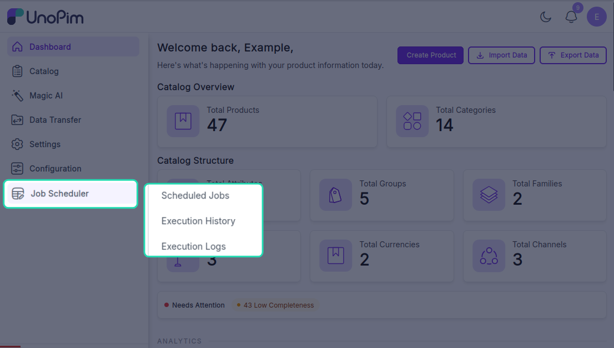
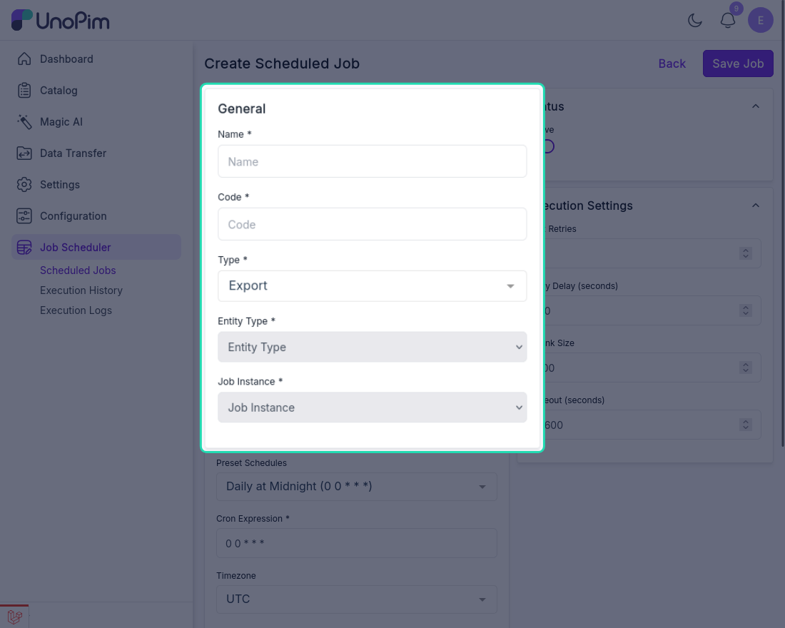
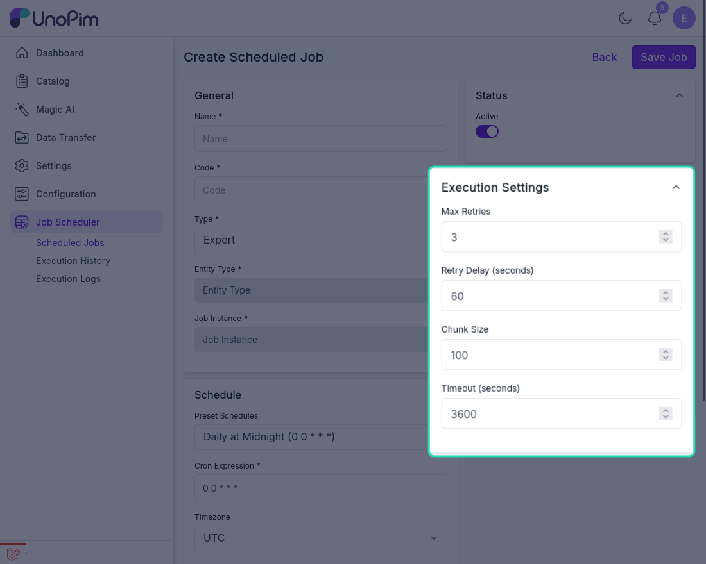
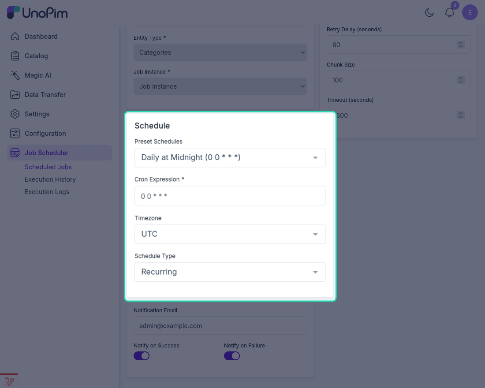
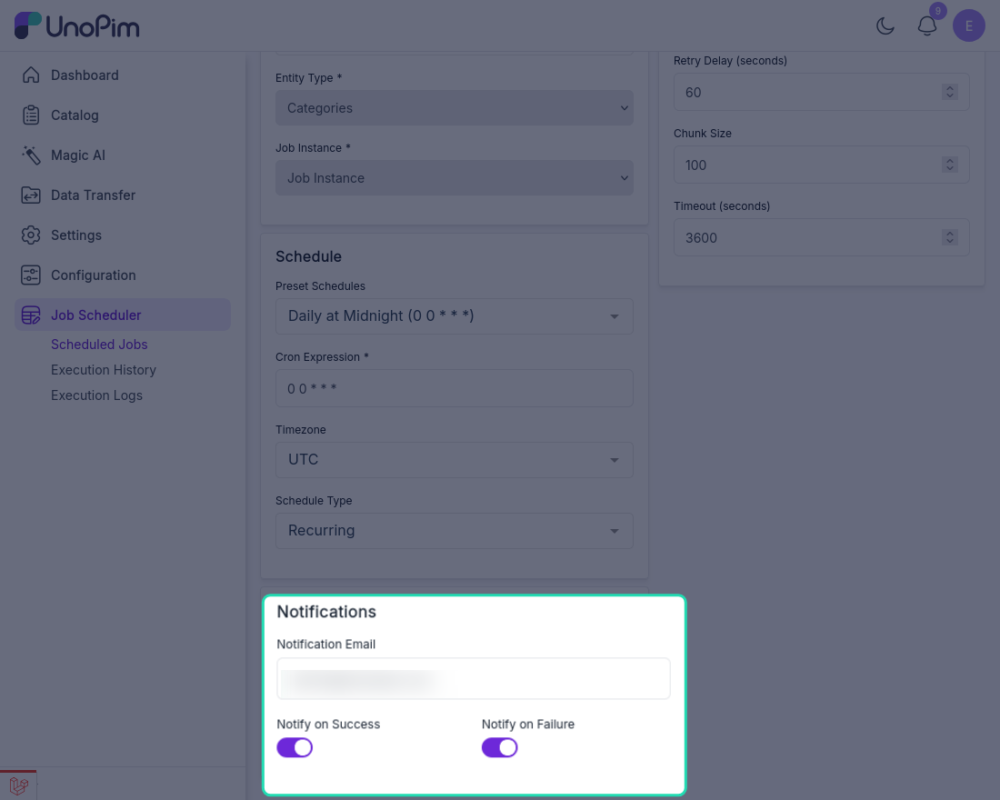

# Creating a Scheduled Job

Once the Job Scheduler is installed, you'll find the **Job Scheduler** option in the left sidebar of your UnoPim dashboard. Click on it to expand the menu — you'll see three sub-sections:

- **Scheduled Jobs** — view and manage all your scheduled jobs
- **Execution History** — see a record of past job runs
- **Execution Logs** — view detailed logs for each execution

Go to the **Scheduled Jobs** section and click **Create Scheduled Job** to set up a new automated job.

---

## General Settings

Fill in the following fields to define the job:

| Field | What to enter |
|---|---|
| **Name** | A descriptive name for the job (e.g., `Daily Category Export`) |
| **Code** | Auto-generated from the name — e.g., `daily_category_export`. You can change it if needed. |
| **Type** | Select whether this is an **Import** or **Export** job |
| **Entity Type** | Choose the data type the job will work with — e.g., **Products** or **Categories** |
| **Job Instance** | Select the existing import or export job you want to schedule |
| **Status** | Set to **Active** to enable the job, or disable it to pause scheduling without deleting it |

> **Important:** The **Job Instance** list only shows jobs that already exist in UnoPim. Before scheduling a job here, make sure you've already created it under **Data Transfer → Imports** or **Data Transfer → Exports**. If you don't see the job in the list, create it there first and then come back.

---

## Execution Settings

These optional settings control how the job behaves when it runs:

| Setting | What it does |
|---|---|
| **Retry Attempts** | How many times the job should automatically retry if it fails |
| **Retry Delay** | How long to wait (in seconds) before retrying after a failure |
| **Chunk Size** | How many records to process in each batch — useful for large datasets |
| **Timeout** | Maximum time (in seconds) the job is allowed to run before it's stopped |

---

## Schedule Settings

Define when and how often the job should run.

### Preset Schedules

Choose from a list of common schedule options:

| Preset | Cron Expression |
|---|---|
| Every Minute | `* * * * *` |
| Every 5 Minutes | `*/5 * * * *` |
| Every 15 Minutes | `*/15 * * * *` |
| Every 30 Minutes | `*/30 * * * *` |
| Hourly | `0 * * * *` |
| Daily at Midnight | `0 0 * * *` |
| Daily at 6 AM | `0 6 * * *` |
| Weekly on Monday | `0 0 * * 1` |
| Monthly | `0 0 1 * *` |
| **Custom** | Enter your own cron expression |

### Cron Expression

This field fills in automatically based on the preset you select. If you choose **Custom**, type your own cron expression directly into this field.

### Timezone

Select the timezone the schedule should follow. This ensures the job runs at the correct local time — especially important if your server and your team are in different time zones.

### Schedule Type

| Type | What it means |
|---|---|
| **Recurring** | The job runs repeatedly on the defined schedule — every day, every hour, etc. |
| **One-time** | The job runs once at the scheduled time and does not repeat |

---

## Notification Settings

Set up email alerts so you always know when a job succeeds or fails.

| Setting | What it does |
|---|---|
| **Notification Email** | The email address where notifications will be sent |
| **Notify on Success** | Sends an email when the job completes successfully |
| **Notify on Failure** | Sends an email if the job fails so you can act quickly |

---

## Save the Job

Once all settings are configured, click **Save Job**. The scheduler will now run the job automatically at the defined time without any manual action.

You can view, edit, pause, or delete the job at any time from the **Scheduled Jobs** list.