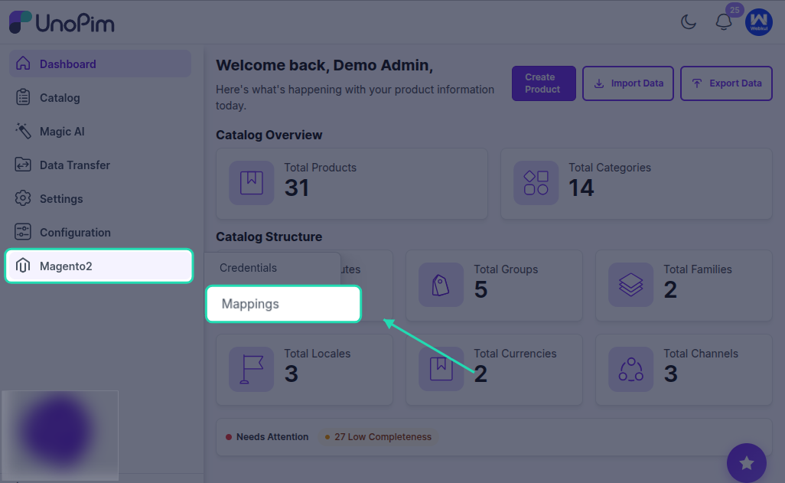
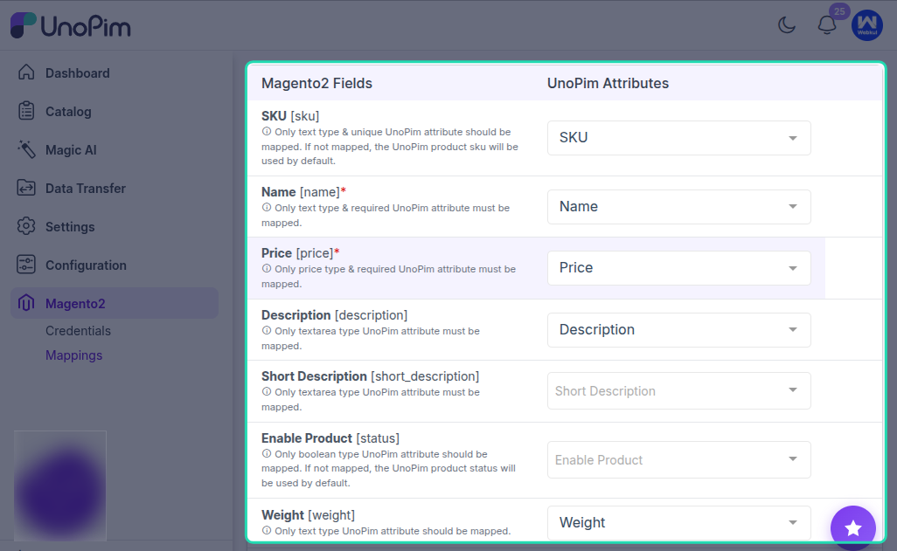
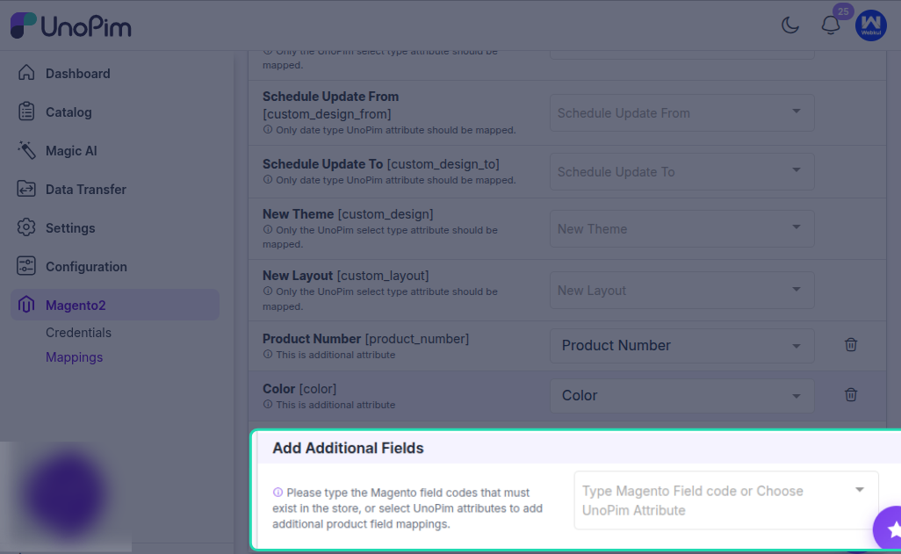

# Attribute Mapping

Attribute mapping lets you connect Magento 2 product fields with the correct UnoPim product attributes. This ensures that product data is exported from UnoPim into the expected Magento fields during synchronization.

## Why Attribute Mapping Is Important

Magento expects product information in specific fields such as `name`, `price`, `description`, and `sku`. In UnoPim, these values may exist under different attributes depending on how your product data is structured.

With attribute mapping, you can decide which UnoPim attribute should be used for each Magento product field. This helps keep exported product data accurate and consistent.

## How the Mapping Screen Works

In the **Attribute Mapping** tab:

- The **left side** shows the Magento 2 product fields.
- The **right side** shows the available UnoPim attributes.

To complete the setup, select the UnoPim attribute that matches each Magento field you want to export.

## Default Magento Fields Available for Mapping

By default, the following Magento 2 product fields can be mapped with UnoPim attributes:

- **Enable Product `[status]`**: Controls whether the product is enabled or disabled in Magento.
- **SKU `[sku]`**: Unique product identifier.
- **Name `[name]`**: Product name shown on the storefront.
- **Price `[price]`**: Standard selling price of the product.
- **Description `[description]`**: Full product description.
- **Short Description `[short_description]`**: Short summary displayed on the product page.
- **Weight `[weight]`**: Product weight used for shipping and logistics.
- **Product Has Weight `[product_has_weight]`**: Defines whether the product should be treated as a physical product with weight.
- **Tax Class `[tax_class_id]`**: Tax class assigned to the product.
- **Visibility `[visibility]`**: Controls where the product appears in Magento.
- **Quantity `[qty]`**: Available stock quantity.
- **Stock Status `[is_in_stock]`**: Indicates whether the product is in stock.
- **URL Key `[url_key]`**: SEO-friendly product URL key.
- **Meta Title `[meta_title]`**: SEO meta title for the product page.
- **Meta Keyword `[meta_keyword]`**: SEO keywords for the product.
- **Meta Description `[meta_description]`**: SEO meta description for the product page.
- **Cost `[cost]`**: Internal product cost.
- **Special Price `[special_price]`**: Promotional price.
- **Special Price From `[special_from_date]`**: Start date for the special price.
- **Special Price To `[special_to_date]`**: End date for the special price.
- **Set Product as New From `[news_from_date]`**: Start date for the “new product” label.
- **Set Product as New To `[news_to_date]`**: End date for the “new product” label.
- **Country of Manufacture `[country_of_manufacture]`**: Product manufacturing country.
- **Websites `[product_websites]`**: Magento websites where the product should be assigned.
- **Layout `[page_layout]`**: Page layout used for the product page.
- **Display Product Options In `[options_container]`**: Defines where product options are displayed.
- **Schedule Update From `[custom_design_from]`**: Start date for a custom design update.
- **Schedule Update To `[custom_design_to]`**: End date for a custom design update.
- **New Theme `[custom_design]`**: Custom theme applied to the product page.
- **New Layout `[custom_layout]`**: Custom layout update for the product page.

## Additional Field Mappings

This section allows you to map custom Magento product fields with UnoPim attributes.

If you want to export more product information than the default Magento fields, you can add extra Magento field codes and connect them to the appropriate UnoPim attributes. This is useful when your Magento store already has custom product attributes that should receive data from UnoPim during export.

### Variant-Specific Attribute Mapping

Additional field mappings are also important for configurable or variant products.

If you need to export variant-specific values such as **color** or **size**, select the corresponding UnoPim attributes or enter the Magento field codes that already exist in your Magento store. This ensures that each variant carries the correct attribute values when the product is exported.

For example:

- Map **Color** to the UnoPim color attribute.
- Map **Size** to the UnoPim size attribute.

This setup helps Magento identify and store the correct variation data for each child product.

## Best Practice

Review each field carefully before saving the mapping. Important fields such as `sku`, `name`, `price`, `status`, and `visibility` should always be mapped correctly to avoid incomplete or incorrect exports.

If a Magento field should always use the same value, make sure the connected UnoPim attribute consistently stores that value for all products being exported.

## Result

Once the mapping is configured, UnoPim uses these assignments while exporting products to Magento 2. This helps make sure that the right product data is sent to the right Magento fields.
