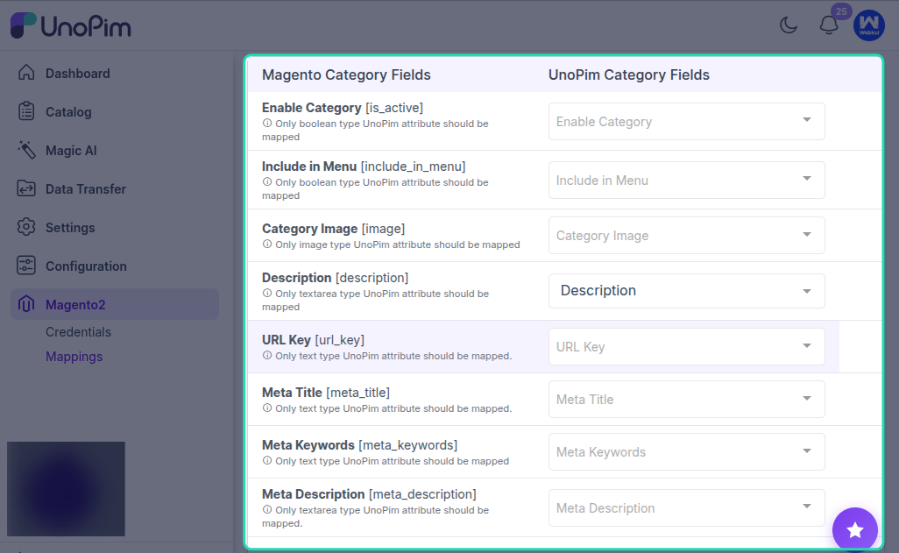

# Category Mapping

The **Category Mapping** page allows you to manually map UnoPim category fields with Magento 2 category fields so the correct values are exported during category synchronization.

This is useful when you want more control over how category data is transferred from UnoPim to Magento.

## How Category Mapping Works

On the **Category Mapping** page, you can connect UnoPim category attributes to the corresponding Magento category fields.

This helps ensure that category information is exported into the right Magento fields based on your store requirements.

## Default Magento Behavior

If no category mapping is configured, UnoPim follows Magento’s default behavior.

In that case, Magento categories are created using only the basic category information:

- **Name**
- **URL Key**
- **Enabled Status**

This default behavior is enough for basic category creation, but it does not cover additional category fields.

## Additional Category Field Mapping

If your Magento store requires more category information, you can map additional UnoPim category fields on this page.

This allows you to export custom or extended category data beyond the default Magento fields.

Use this option when you need more detailed category synchronization for your Magento catalog structure.

## Best Practice

If you only need basic Magento category creation, the default behavior may be enough.

If your categories include extra content or custom field requirements, configure manual mapping so Magento receives the exact values you want to export.

## Result

Once the category mapping is configured, UnoPim uses these field assignments while exporting categories to Magento 2. This helps ensure the correct category values are transferred based on your mapping setup.
