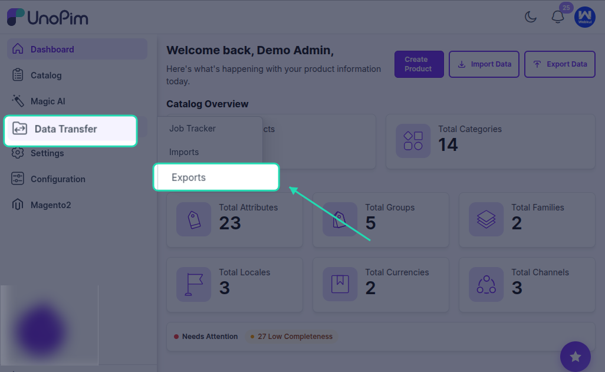
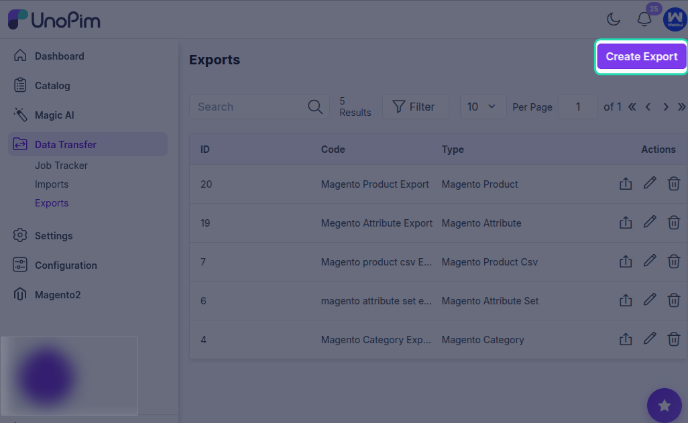
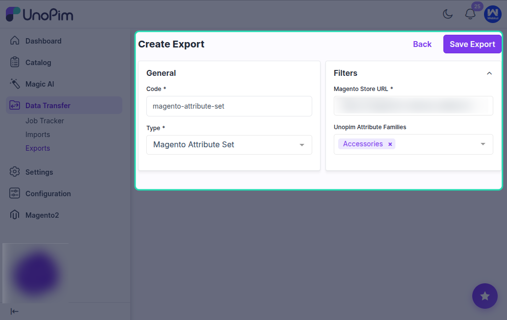

# Export Magento Attribute Set

The **Magento Attribute Set** export job allows you to export UnoPim attribute families to Magento 2 as attribute sets.

This export automatically handles attribute groups and assigned attributes so the same family structure can be created in Magento as it exists in UnoPim.

If custom attributes are added to a new group in UnoPim, that group is also exported to Magento together with the assigned attributes.

## What This Export Supports

This job helps keep UnoPim attribute families and Magento attribute sets synchronized by:

- Creating matching attribute sets in Magento
- Creating the same attribute groups found in UnoPim
- Assigning the correct attributes to those groups

## Important Note

You can export any newly created attribute family based on the selection made in the **Credentials** section.

Make sure the correct Magento connection is configured before creating the export job.

## How to Export Attribute Families

To export UnoPim attribute families to Magento:

1. Go to **Data Transfer > Exports > Create Export Profile**.

2. Select **Magento Attribute Set** as the job type.
3. Enter a unique code for the export job.
4. Use the available filters such as **Magento Store URL** and **UnoPim Attribute Families**.

5. Click **Save Export**.

After the profile is saved, you can run the export using that configuration.

## After Export Completion

Once the execution process is completed, you can review the exported attribute family status from the export job details.

This helps confirm whether the selected UnoPim attribute families were successfully exported to Magento 2.
