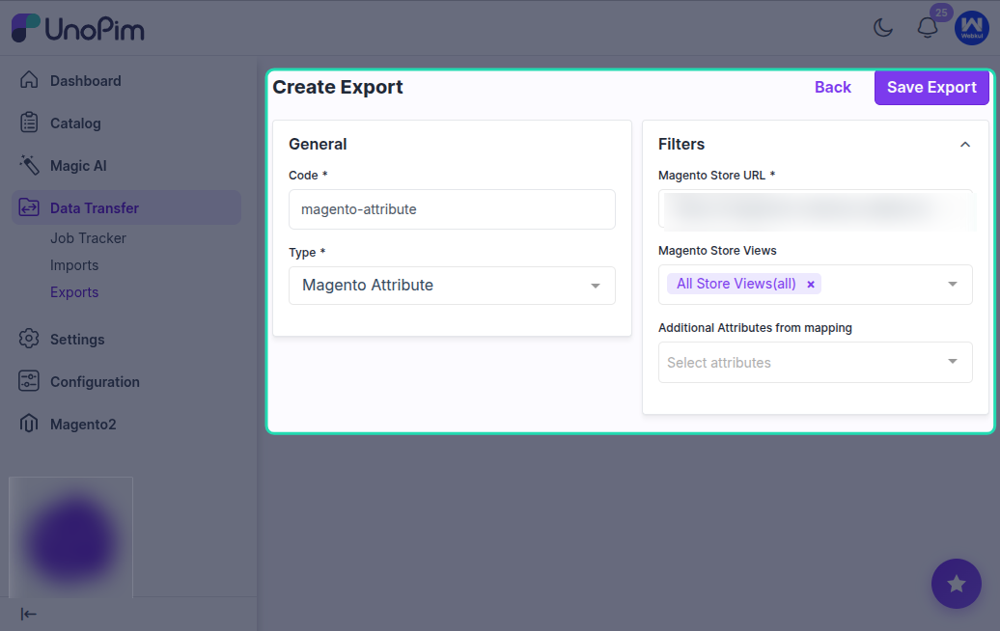

# Export Magento attribute

Use this export job when you want to export additional mapped attributes from UnoPim to Magento 2.

To begin, go to **Data Transfer > Exports > Create Export Profile**.

Then select **Magento Attribute** as the export type.

## Filters Available for Attribute Export

While creating the export job, you can use the following filters:

- **Magento Store URL**
- **Magento Store View**
- **Additional Attributes**

These filters help you control which mapped attributes should be exported and to which Magento store view the data should be sent.

## How to Create the Export Job

1. Create a new export profile.

2. Select **Magento Attribute** as the job type & enter a unique code for the export job.

4. Select the required filters such as **Magento Store URL**, **Magento Store View**, and **Additional Attributes**.

5. Click **Save Export**.

After saving the profile, you can run the attribute export based on the saved configuration.

## Result

Once the export is executed, the selected additional mapped attributes are exported from UnoPim to Magento 2 according to the filters defined in the export profile.
