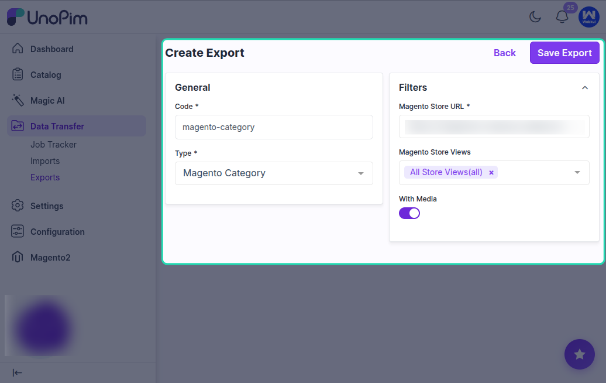

# Export Category

To export product-related data from UnoPim to Magento 2, you first need to create an export job profile.

Go to **Data Transfer > Exports > Create Export Profile** to create a new export job.

## Supported Magento 2 Export Job Types

The UnoPim Magento 2 Connector supports the following export job types:

- **Magento Category**
- **Magento Attribute**
- **Magento Attribute Set**
- **Magento Product** `(includes simple and configurable products)`

Use the export type that matches the data you want to send from UnoPim to Magento 2.

## Exporting Categories to Magento 2

To export categories from UnoPim to Magento, create a new export profile and select **Magento Category** as the job type.

After that, enter a unique code for the job profile and click **Save Export**.

Then click **Export Now** to start the category export process.

## Important Note

All categories, including multi-level subcategories, can be exported.

You can export any category available in your UnoPim catalog. However, **channel-based category export is not supported** for this Magento 2 connector.

## After Running the Export

Wait a few seconds for the export process to complete.

Once the job finishes, you can view:

- The number of categories exported from UnoPim to Magento 2
- The export job status, such as **Completed**

## View Exported Categories in Magento

After the export is completed, the categories available in UnoPim will also be available in the selected Magento 2 store, based on the export configuration.
