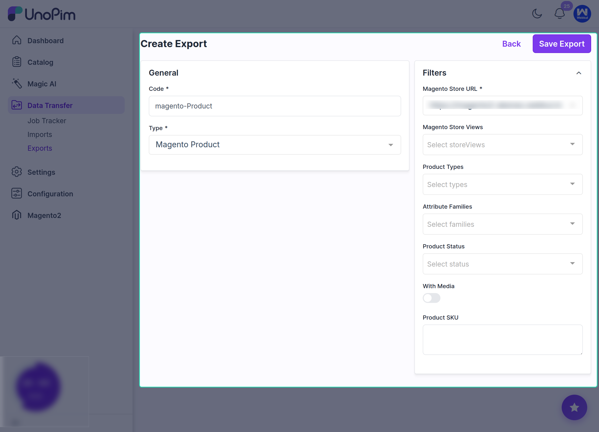

# Export Magento Product

Use the **Magento Product** export job to export products from UnoPim to Magento 2, including both **simple products** and **configurable products**.

## How to Create the Product Export Job

To export products, create a new export profile and select **Magento Product** as the job type.

Then:

1. Enter a unique code for the export job.

2. Select the Magento store view if you have multiple store views.
3. Apply the filters that match your export requirement.

4. Click **Save Export** to save the job profile.

## Available Product Export Filters

The Magento product export job supports filters such as:

- **Product Types**
- **Attribute Families**
- **Product Status**
- **With Media** toggle

Use these filters to export only the products that match your use case.

## Export Specific Products by SKU

If you want to export a specific product, enter its **SKU** in the product export filter.

This allows you to export only the selected product instead of sending the full product catalog.

After saving the export profile, click **Export Now** to start the product export process.

## After Export Completion

Once the execution process is completed, you can review the export details, including:

- **Product Types**
- **Attribute Families**
- **Product Status**
- **Media**
- **Exported Product SKU**
- **Job Status**

This helps confirm what was exported from UnoPim to Magento 2 and whether the job completed successfully.

## Download Log

After every job execution, you can review the export log using the **Download Log** option.

This is especially useful when:

- The job is stuck
- The job remains pending
- `0` records are created
- Some records are skipped
- No data is exported to Magento

The downloaded log helps you identify the issue in more detail and makes troubleshooting easier.
