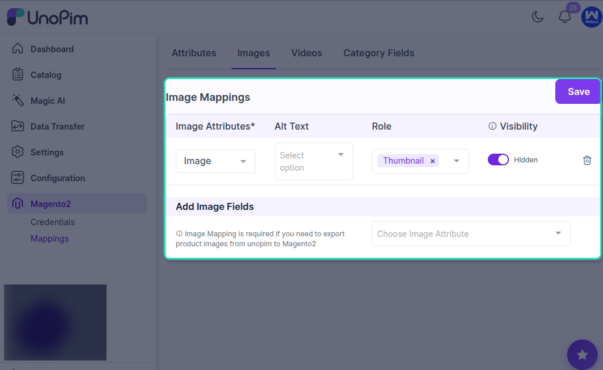

# Image Mappings

Image mapping allows you to decide which UnoPim image attributes should be exported to Magento 2 and how those images should be used on the product page.

This helps ensure that product gallery images, role-based images, and optional image-related values are sent correctly during export.

## Image Mapping Options

### Image Attributes `(Required)`

Select the UnoPim image attributes that should be exported to Magento 2.

The selected image attributes will be visible in Magento as **product gallery images**.

### Alt Text Attribute `(Optional)`

You can also map an attribute for image alt text.

If image labels or related text values are not being exported directly from UnoPim, map the attribute whose value you want Magento to display as the image text.

### Image Role `(Optional)`

You can define which images should be used for Magento’s main product image roles.

Map the image role based on how you want the exported image to appear in Magento, such as:

- **Base Image**
- **Small Image**
- **Swatch Image**
- **Thumbnail Image**

This helps Magento assign the correct image to the correct display area.

### Hide from Product Page `(Optional)`

Admins can enable or disable this option to control whether the mapped images should be hidden from the Magento product page.

Use this when certain exported images are needed for data sync but should not be displayed on the storefront product page.

## Best Practice

Always map at least one valid UnoPim image attribute so Magento receives product gallery images properly.

If you are using different image types for storefront display, make sure the correct role is assigned for base, small, swatch, and thumbnail usage.

## Result

Once the image mapping is saved, UnoPim will use these settings while exporting product images to Magento 2. This ensures the right images appear in the gallery and in the correct Magento image roles.
