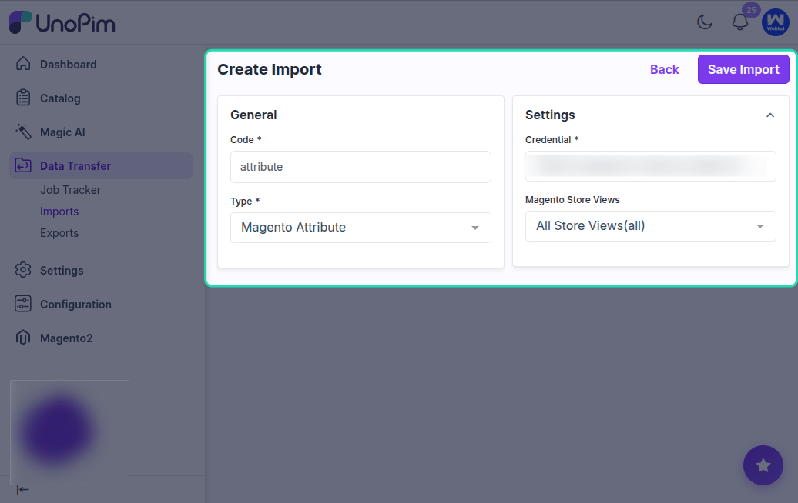
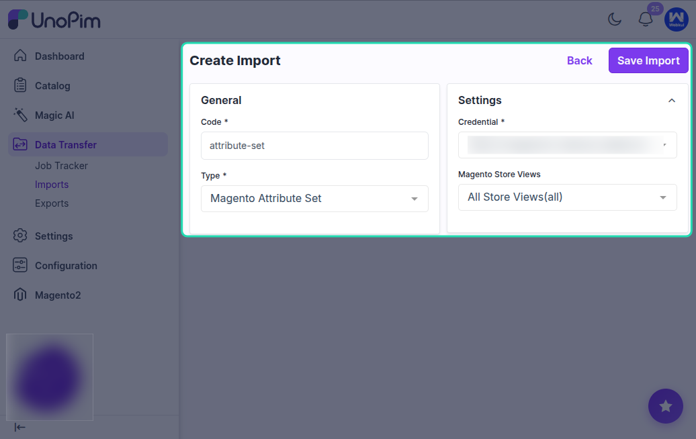
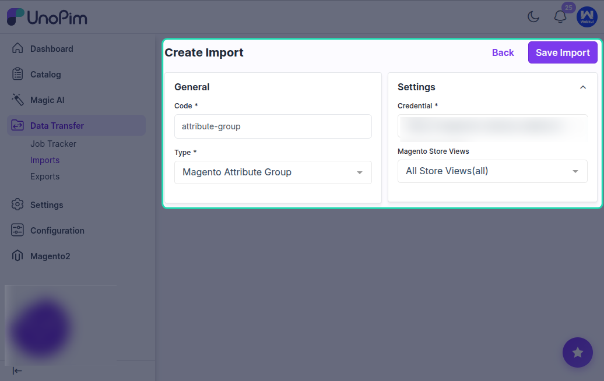
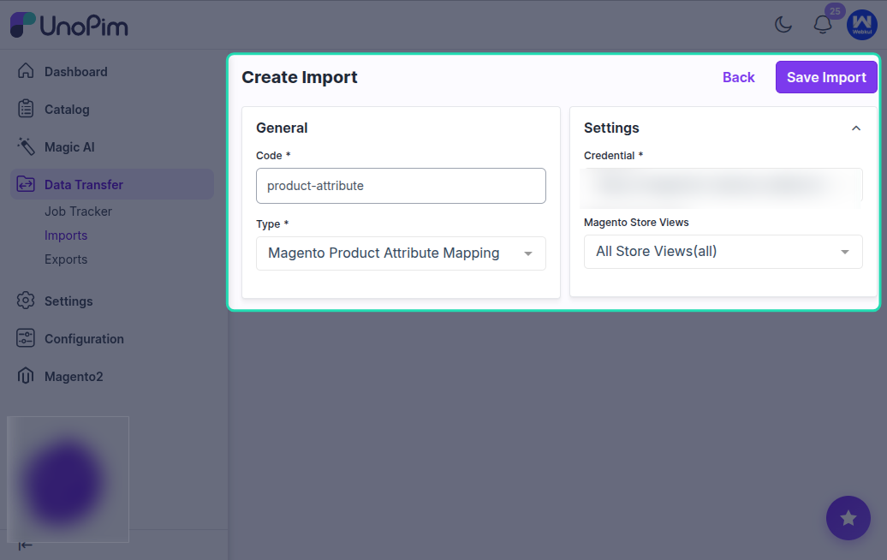

# Import Magento Attributes

The Magento 2 connector provides several import jobs for bringing attribute-related data from Magento 2 into UnoPim:

- **Magento Attribute Import** — imports product attributes from Magento into UnoPim.
- **Magento Attribute Set Import** — imports Magento attribute sets into UnoPim as attribute families.
- **Magento Attribute Group Import** — imports attribute groups from Magento attribute sets into UnoPim.
- **Magento Attribute Mapping Import** — imports the attribute mapping configuration from Magento into UnoPim.

These jobs help you avoid manually re-creating your entire Magento attribute structure inside UnoPim.

---

## Part 1: Import Magento Attributes

### What This Job Does

This job reads all product attributes from your Magento 2 store and creates the corresponding attributes in UnoPim. Attribute types are automatically resolved and attribute options are also imported for select and multiselect attributes.

### How to Create the Import Job

Go to **Data Transfer > Imports > Create Import Profile**.

Select **Magento Attribute Import** as the import type.

Enter a unique code and a recognizable name, then save.

### Available Filters

| Filter | Required | Description |
|---|---|---|
| **Credential** | Yes | Select the Magento 2 credential to import attributes from. |
| **Store Views** | No | Select a store view to import localized attribute labels. |

### What Gets Imported

- **Attribute code** — unique identifier.
- **Attribute type** — mapped to the closest UnoPim attribute type.
- **Attribute labels** — localized labels from the selected store view.
- **Attribute options** — all available options for select and multiselect attributes.

### Attribute Type Mapping

| Magento Type | UnoPim Type |
|---|---|
| `text` | Text |
| `textarea` | Textarea |
| `select` | Select |
| `multiselect` | Multiselect |
| `boolean` | Boolean |
| `price` | Price |
| `date` | Date |
| `media_image` | Image |

---

## Part 2: Import Magento Attribute Sets

### What This Job Does

This job imports Magento 2 attribute sets into UnoPim as **attribute families**. Each attribute set from Magento becomes a family in UnoPim, complete with its groups and attribute assignments.

### How to Create the Import Job

Select **Magento Attribute Set Import** as the import type when creating the job profile.

### Available Filters

| Filter | Required | Description |
|---|---|---|
| **Credential** | Yes | Select the Magento 2 credential. |
| **Store Views** | No | Select a store view to import localized group labels. |

### What Gets Imported

- **Attribute family name** — created in UnoPim from the Magento attribute set name.
- **Attribute groups** — each group inside the Magento attribute set is created as a group in the UnoPim family.
- **Attribute assignments** — attributes are assigned to their correct groups inside the family.
- If no matching attribute group is found for an attribute, it is automatically placed in an **Others** group.

---

## Part 3: Import Magento Attribute Groups

### What This Job Does

This job imports attribute groups from Magento 2 attribute sets into UnoPim. You can use this to sync attribute group structure separately from a full attribute set import.

### How to Create the Import Job

Select **Magento Attribute Group Import** as the import type when creating the job profile.

### Available Filters

| Filter | Required | Description |
|---|---|---|
| **Credential** | Yes | Select the Magento 2 credential. |
| **Store Views** | No | Select a store view for localized group names. |

### What Gets Imported

- **Group name** — the name of each attribute group.
- **Group assignments** — which attributes belong to each group.

---

## Part 4: Import Product Attribute Mapping

### What This Job Does

This job imports the attribute mapping configuration that links Magento product fields to UnoPim attributes. Running this job helps pre-populate the attribute mapping in UnoPim so you don't need to configure it manually from scratch.

### How to Create the Import Job

Select **Magento Product Attribute Mapping Import** as the import type when creating the job profile.

### Available Filters

| Filter | Required | Description |
|---|---|---|
| **Credential** | Yes | Select the Magento 2 credential. |
| **Store Views** | No | Select a store view. |

### What Gets Imported

- Mapping between Magento field codes and UnoPim attribute codes.
- This is used to pre-configure the **Attribute Mapping** tab in the connector.

---

## Recommended Import Order

For the best results when importing attribute structure from Magento into UnoPim:

1. **Import Attributes** first.
2. **Import Attribute Groups** second.
3. **Import Attribute Sets** third.
4. **Import Attribute Mapping** last (optional, to pre-populate mappings).

Following this order ensures that attributes exist before they are assigned to groups and families.
