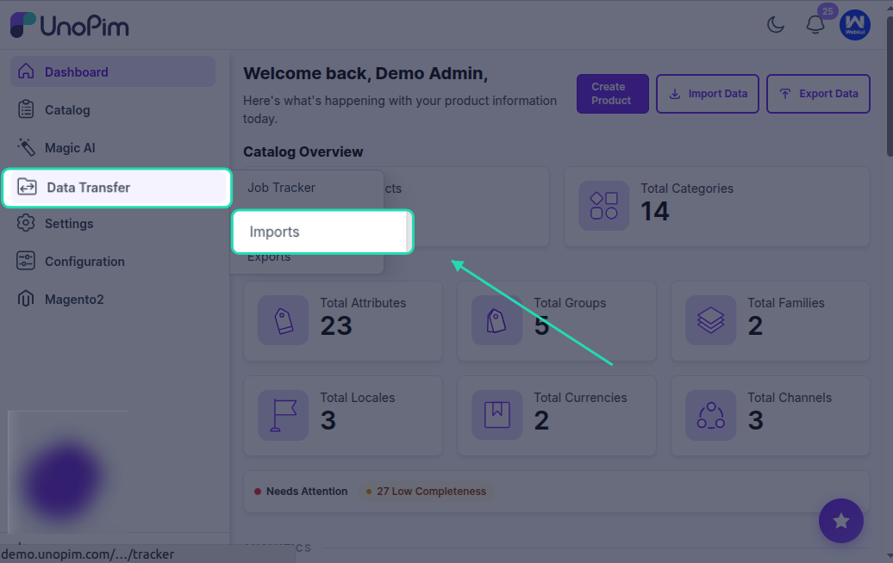
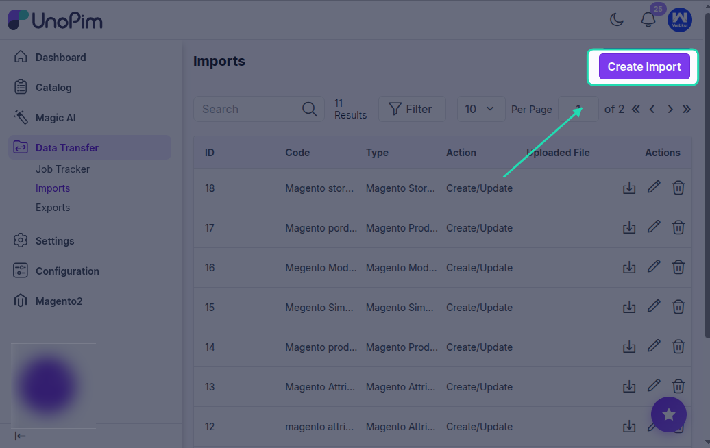
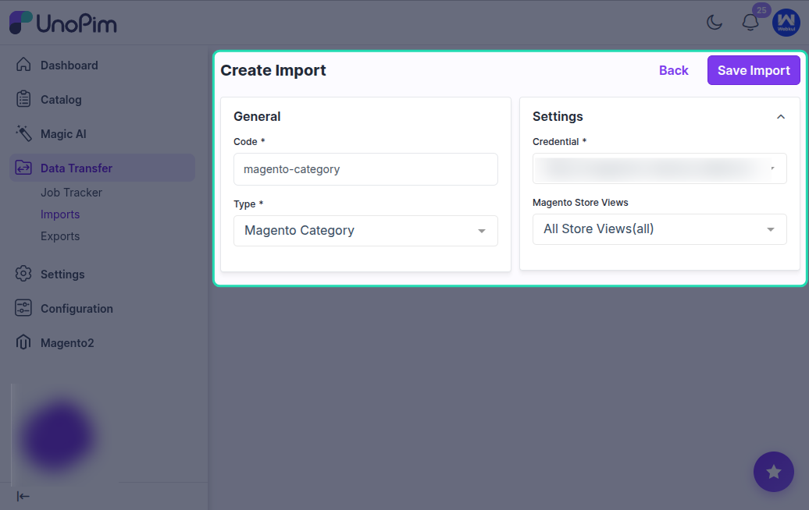
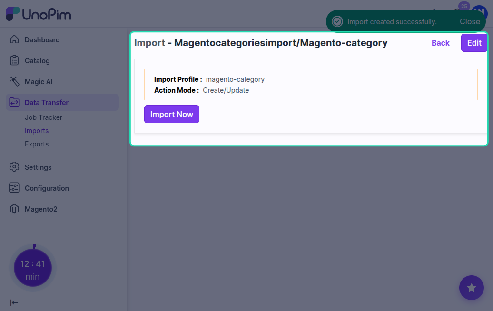
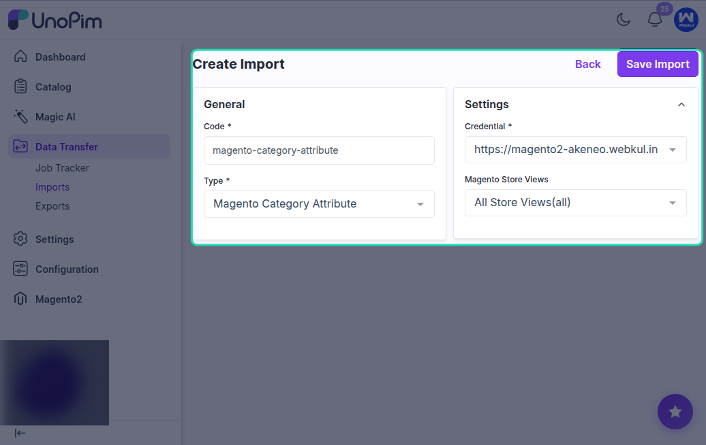
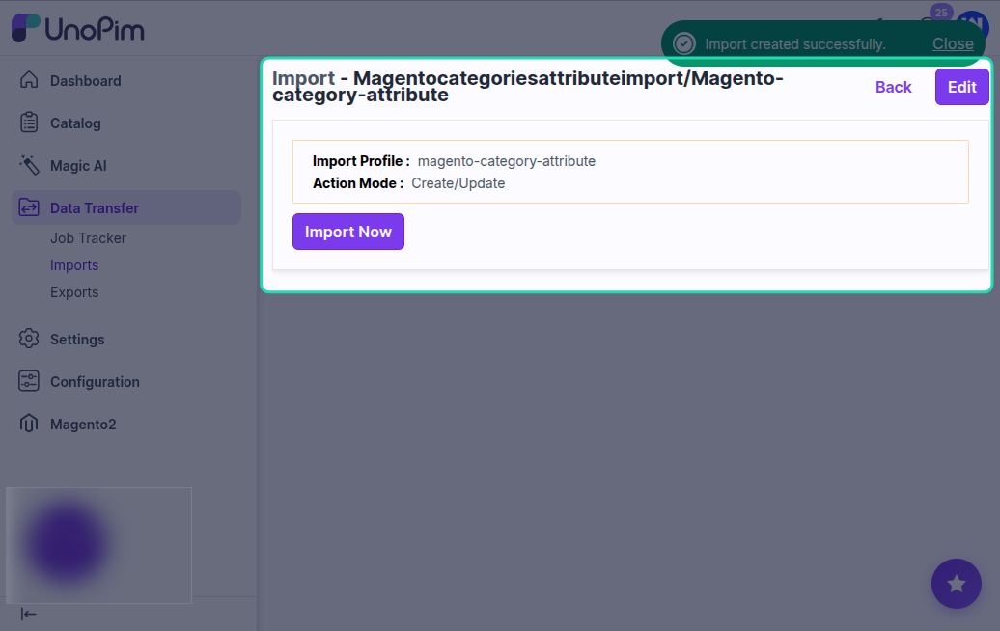

# Import Magento Category & Category Attribute

The Magento 2 connector provides two import jobs for bringing category-related data from your Magento 2 store into UnoPim:

- **Magento Category Import** - imports categories from Magento 2 into UnoPim.
- **Magento Category Attribute Import** - imports category attributes from Magento 2 into UnoPim.

These jobs are useful when you already have a well-structured category catalog in Magento and want to bring it into UnoPim without manual re-entry.

---

## Part 1: Import Magento Categories

### What This Job Does

This job reads the category tree from your Magento 2 store and creates the corresponding categories in UnoPim. It preserves the category hierarchy, localized names, and category attributes.

### How to Create the Import Job

Go to **Data Transfer > Imports > Create Import Profile**.

Select **Magento Category Import** as the import type.

Enter a unique code and a recognizable name for this job, then save it.

### Available Filters

| Filter | Required | Description |
|---|---|---|
| **Credential** | Yes | Select the Magento 2 store credential to import categories from. |
| **Store Views** | No | Select a Magento store view. This controls which locale-specific category names and data are imported. |

### What Gets Imported

- **Category name** - pulled from the selected store view.
- **Category hierarchy** - parent-child relationships are preserved in UnoPim.
- **URL key** - imported from Magento where available.
- **Enabled status** - active and inactive categories are imported.
- **Locale-specific values** - category names are imported using the store view mapping configured in your credentials.
- **Category attributes** - common and locale-specific category field values are imported.

### Running the Import

Click **Import Now** to start the category import process.

After the job completes, check the import summary to see:
- How many categories were created or updated.
- Any categories that were skipped or had errors.

### After the Import

Log in to UnoPim and go to the **Catalog > Categories** section.

You should see the Magento categories now available in UnoPim with their correct hierarchy and names.

---

## Part 2: Import Magento Category Attributes

### What This Job Does

This job imports the category attributes defined in your Magento 2 store into UnoPim as category fields. This allows UnoPim to store the same category-level data that Magento uses.

### How to Create the Import Job

Go to **Data Transfer > Imports > Create Import Profile**.

Select **Magento Category Attribute Import** as the import type.

Enter a unique code and a name for the job, then save it.

### Available Filters

| Filter | Required | Description |
|---|---|---|
| **Credential** | Yes | Select the Magento 2 store credential to import category attributes from. |
| **Store Views** | No | Select a Magento store view to determine which locale-specific labels are imported with the attributes. |

### What Gets Imported

- **Attribute code** - the unique code for each category attribute.
- **Attribute label** - the display name from the selected store view.
- **Attribute type** - resolved to the closest matching UnoPim field type.
- **Attribute options** - for select-type attributes, available options are also imported.

### Running the Import

Click **Import Now** to start the process.

Once complete, review the import summary for the number of category attributes created or updated.

### After the Import

Go to **Catalog > Category Fields** in UnoPim. You should see the category attributes from Magento available in UnoPim and ready to be used on your categories.

---

## Recommended Import Order

For the best results when setting up your UnoPim catalog from Magento:

1. Import **Category Attributes** first so UnoPim knows about the available category fields.
2. Import **Categories** second so category data can be stored against those fields correctly.
