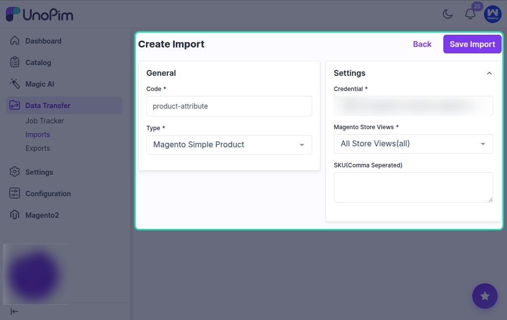
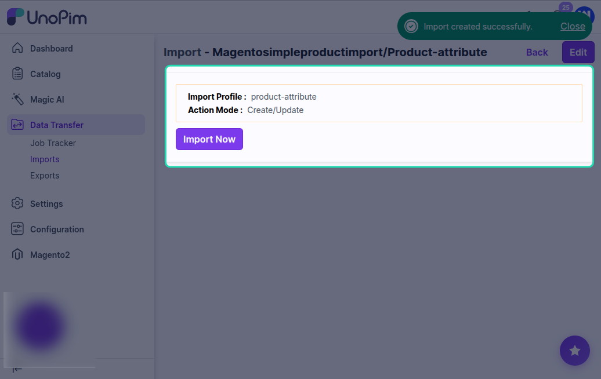
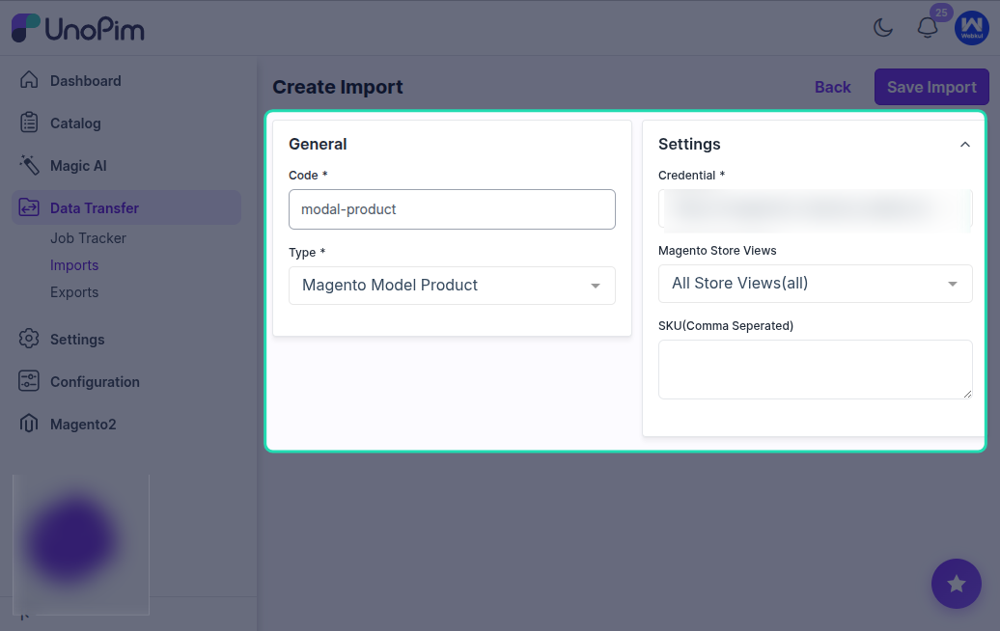
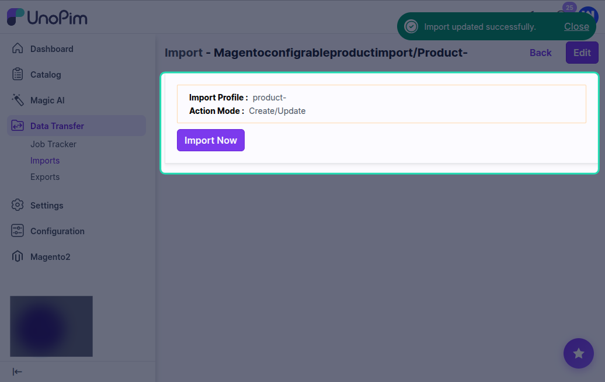
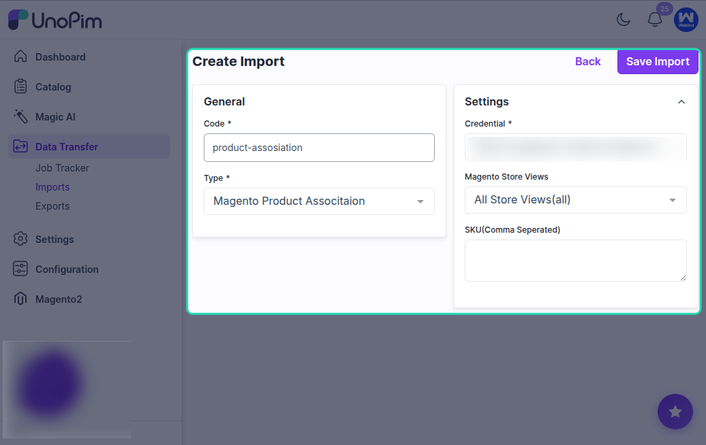
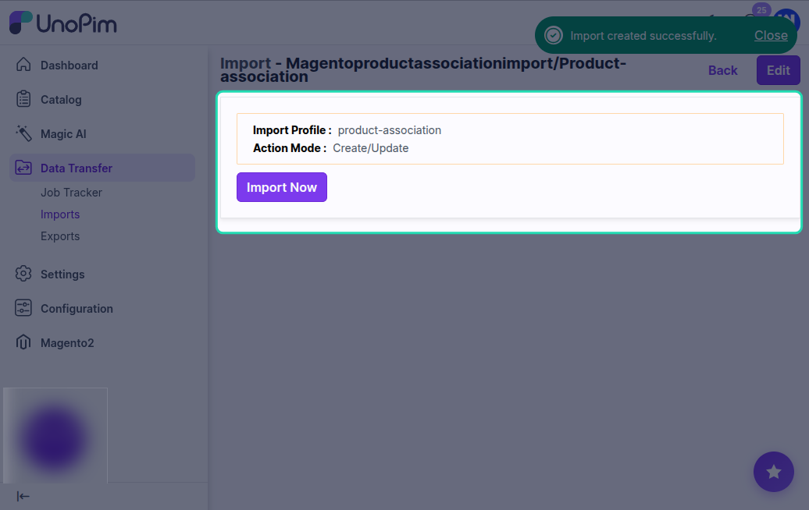

# Import Magento Product

The Magento 2 connector provides three import jobs for bringing product data from Magento 2 into UnoPim:

- **Magento Simple Product Import** - imports simple products and their attribute values.
- **Magento Configurable Product Import** - imports configurable products with their child variants.
- **Magento Product Association Import** - imports product-to-product relationships (related, up-sell, cross-sell).

These jobs are useful when you already have a populated Magento catalog and want to enrich it inside UnoPim - better descriptions, more locales, richer attributes - before pushing data back out.

---

## Part 1: Import Simple Products

### What This Job Does

This job reads simple products from your Magento 2 store and creates the corresponding products in UnoPim. Attribute values are written into UnoPim attributes via the mapping you configured in [Attribute Mapping](./attribute-mapping), and media is downloaded into UnoPim.

### How to Create the Import Job

Go to **Data Transfer > Imports > Create Import Profile**.

Select **Magento Simple Product Import** as the import type.

Enter a unique code and a recognizable name for this job, then save it.

### Available Filters

| Filter | Required | Description |
|---|---|---|
| **Credential** | Yes | Select the Magento 2 credential to import from. |
| **Store Views** | Yes | Select the Magento store view whose locale-specific values will be imported. |
| **SKU (Comma Separated)** | No | Restrict the import to a specific list of SKUs. Leave blank to import every simple product in the store view. |

### What Gets Imported

- **SKU** - product unique identifier in UnoPim.
- **Attribute family** - resolved from the Magento attribute set via the imported attribute set mapping.
- **Attribute values** - every attribute exposed by the API is written through the [Attribute Mapping](./attribute-mapping).
- **Categories** - the Magento categories the product belongs to (categories must already exist in UnoPim - run [Import Category](./import-category) first).
- **Status** - Enabled / Disabled.
- **Media** - images and gallery values are downloaded into UnoPim media (see [Image Mapping](./image-mapping) for which attributes receive what).

### Running the Import

Click **Import Now** to start the simple product import.

After the job completes, check the import summary to see how many products were created or updated and how many rows were skipped or failed.

### After the Import

Open **Catalog > Products** in UnoPim and you should see the imported simple products with their attributes, categories, and images.

---

## Part 2: Import Configurable Products

### What This Job Does

This job imports configurable products from Magento 2 into UnoPim. The configurable parent and each of its variants come in together - the connector preserves the variation axis (e.g. *color* + *size*) and links each child variant to the parent.

### How to Create the Import Job

Select **Magento Configurable Product Import** as the import type when creating the job profile.

### Available Filters

| Filter | Required | Description |
|---|---|---|
| **Credential** | Yes | Select the Magento 2 credential. |
| **Store Views** | No | Store view for locale-specific values. |
| **SKU (Comma Separated)** | No | Restrict to specific configurable product SKUs. |

### What Gets Imported

- The **configurable parent** is created as a UnoPim configurable product.
- Each **variant** comes in as a child of the parent - matched by SKU.
- The **variation axis** (the attributes the variants differ on) is preserved.
- All the same fields as the simple product import - attribute family, attribute values, categories, status, media.

### Pre-requisites

Run these imports first so the connector has the structure the products need:

1. [Magento Attribute Import](./import-attribute) - attributes exist.
2. [Magento Attribute Set Import](./import-attribute) - attribute families exist.
3. [Magento Category Import](./import-category) - categories exist.
4. **Magento Simple Product Import** - variants are imported as simple products first. The configurable import then links them under the parent.

### Running the Import

Click **Import Now** to start the configurable product import.

After completion, the import summary shows how many configurable parents and child variants were processed.

### After the Import

Open one of the configurable products in **Catalog > Products** - you should see the parent with its variation axis and every variant listed under it.

---

## Part 3: Import Product Associations

### What This Job Does

This job imports the **related**, **up-sell**, and **cross-sell** relationships between products from Magento 2 into UnoPim. The products themselves must already exist in UnoPim - this job only writes the link data.

### How to Create the Import Job

Select **Magento Product Association Import** as the import type when creating the job profile.

### Available Filters

| Filter | Required | Description |
|---|---|---|
| **Credential** | Yes | Select the Magento 2 credential. |
| **Store Views** | No | Store view to read associations from. |
| **SKU (Comma Separated)** | No | Restrict to specific product SKUs. |

### What Gets Imported

For each product, the connector reads:

- **Related products** - items shown alongside on the product page.
- **Up-sell products** - premium alternatives.
- **Cross-sell products** - checkout add-ons.

Each link is written against the matching UnoPim product. Targets that don't exist in UnoPim are skipped and reported in the import summary.

### Pre-requisites

Run **Magento Simple Product Import** and **Magento Configurable Product Import** first so every product the associations reference is already in UnoPim. Otherwise, links to missing products are dropped.

### Running the Import

Click **Import Now**. The summary lists how many associations were written and how many were skipped due to missing targets.

---

## Recommended Import Order

For a clean, complete catalog import from Magento 2 into UnoPim, run the jobs in this order:

1. [Magento Shop View Mapping](./shopview-mapping) - store view to channel / locale / currency mapping.
2. [Magento Attribute Import](./import-attribute) - attributes.
3. [Magento Attribute Group Import](./import-attribute) - attribute groups.
4. [Magento Attribute Set Import](./import-attribute) - attribute families.
5. [Magento Attribute Mapping Import](./import-attribute) - *(optional)* pre-populate the attribute mapping.
6. [Magento Category Attribute Import](./import-category) - category fields.
7. [Magento Category Import](./import-category) - categories.
8. **Magento Simple Product Import** - simple products.
9. **Magento Configurable Product Import** - configurable parents and their variants.
10. **Magento Product Association Import** - related / up-sell / cross-sell links.

## Download Log

After every job execution, use the **Download Log** option to inspect the run.

The downloaded log is especially useful when:

- The job is stuck or remains pending.
- `0` records are imported.
- Some rows are skipped.
- A particular SKU didn't make it across.

The log lists which row failed and why, so you can fix the source data or the [Attribute Mapping](./attribute-mapping) and re-run.
