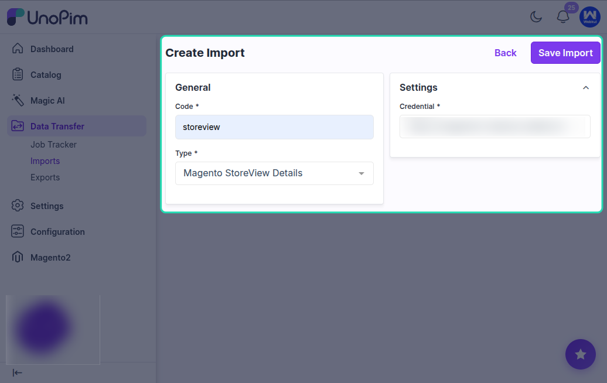
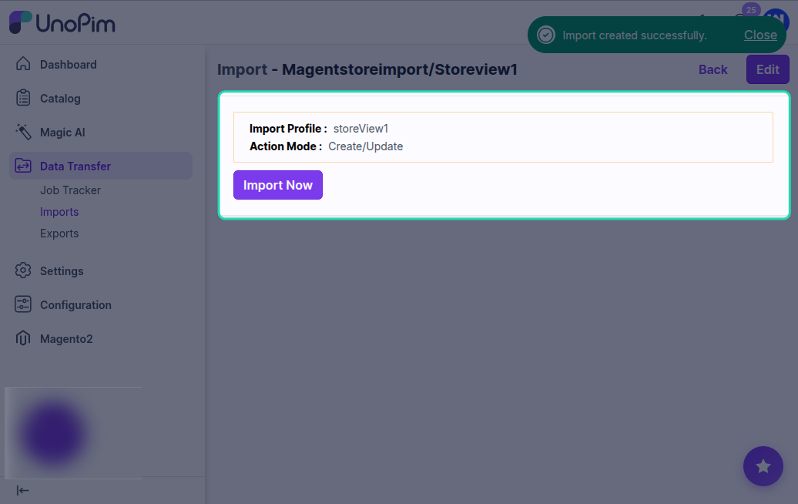

# Import Magento Store View Details

The **Magento Store** import job fetches the full structural details of every **website**, **store group**, and **store view** configured in your Magento 2 installation and saves them against the matching UnoPim credential.

This is a one-time setup step (run after creating a credential, and re-run whenever your Magento store structure changes) that lets the connector show accurate, up-to-date store view options everywhere they're needed — credential mapping, export filters, and import filters.

## How This Differs from Shop View Mapping

There are two related jobs — use both, in this order:

| Job | What it does |
|---|---|
| [Magento Shop View Mapping](./shopview-mapping) | Pulls just the **store view codes and labels** so you can map them to UnoPim channels / locales / currencies in the credential. |
| **Magento Store** *(this page)* | Pulls the full **website + store group + store view hierarchy** with all related details. |

If you only want to set up channel mapping, the [Shop View Mapping](./shopview-mapping) job is enough. Run **Magento Store** in addition when you also need:

- The list of **websites** (top-level Magento structure).
- The **store groups** that sit under each website.
- The full hierarchy showing which store view belongs to which group and website.

## How to Create the Import Job

Go to **Data Transfer > Imports > Create Import Profile**.

Select **Magento Store** as the import type.

Enter a unique code and a recognizable name for the job, then save it.

## Available Filters

| Filter | Required | Description |
|---|---|---|
| **Credential** | Yes | Select the Magento 2 credential you want to fetch the store structure for. |

There are no other filters — the job pulls the complete store hierarchy from the connected Magento instance.

## What Gets Imported

The job reads the following from Magento 2's `GET /V1/store/storeConfigs`, `GET /V1/store/storeViews`, `GET /V1/store/storeGroups`, and `GET /V1/store/websites` endpoints:

- **Websites** — every website configured in Magento with its code, name, and default group.
- **Store groups** — for each website, every store group with its code, name, and root category.
- **Store views** — for each store group, every store view with its code, label, locale, base currency, and active flag.

All of this is saved into the **extras** field on the Magento credential in UnoPim so the connector can render it back in filters and credential mapping without going back to Magento every time.

## Running the Import

Click **Import Now** to start the process.

The job runs quickly — usually a couple of seconds, since it's pulling configuration, not product data.

Once complete, check the job summary. The store hierarchy is now stored on the matching Magento credential.

## After the Import

Go to **Magento 2 Connector > Credentials > Edit Credential**.

The **Store View Mapping** section now shows every store view grouped under its store group and website. From here, configure the channel / locale / currency mapping for each store view — see [Magento Shop View Mapping → Map Store Views to UnoPim Channels](./shopview-mapping#next-step-map-store-views-to-unopim-channels).

## When to Re-Run This Job

Re-run the **Magento Store** import whenever:

- A new **store view**, **store group**, or **website** is added in Magento.
- An existing store view's **code**, **label**, **locale**, or **currency** changes.
- A store view is **disabled** or **deleted** in Magento.

After re-running, revisit the **Store View Mapping** in the credential and adjust the mapping to match the new structure.

## Best Practice

- Run this job **immediately after** creating a Magento credential — that way the credential's store view mapping UI is populated from the very first time you open it.
- Add a reminder to re-run it after any Magento configuration change. It's quick and idempotent — the worst case of re-running it is wasted seconds.
- Pair it with the [Shop View Mapping](./shopview-mapping) import; together they give the credential everything it needs to drive accurate, locale-aware imports and exports.
