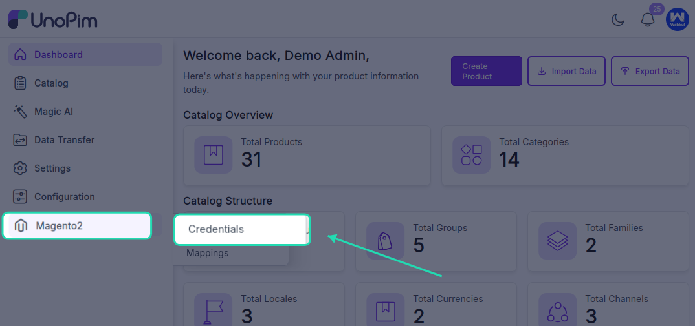
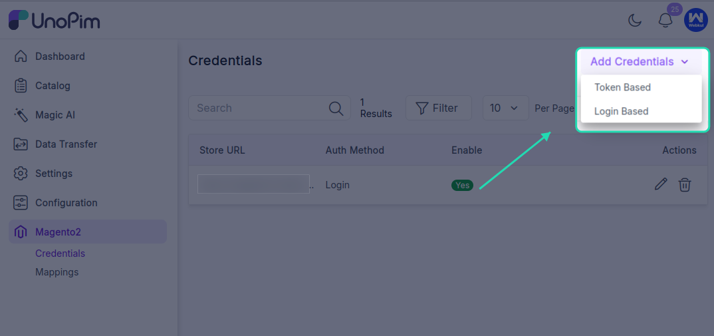
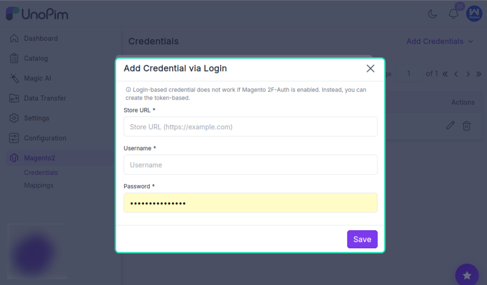

# Setup Credentials in UnoPim

Once the UnoPim Magento 2 Connector is installed successfully, the next step is to configure your Magento 2 credentials in UnoPim.

This connection allows UnoPim to communicate with your Magento 2 store for both import and export operations.

After the credentials are added correctly, UnoPim can use them to send catalog data to Magento 2 and, where supported, fetch data back from Magento into UnoPim.

## Important Note About Attribute Families

In Magento 2, new attribute sets are created based on existing attribute sets.

Because of this, if you plan to export UnoPim attribute families to Magento 2, you must select a Magento 2 attribute set while editing the credential.

This selected attribute set acts as the base reference when UnoPim creates or maps attribute families in Magento. If no custom value is selected, Magento’s default behavior will apply.

You can update this mapping later by clicking the **Edit Credential** option and selecting the Magento attribute set that best matches your export setup.

## Credential Types

UnoPim supports two ways to create Magento 2 credentials:

- **Token-Based Credentials**
- **Login-Based Credentials**

## Token-Based Credentials

Before creating token-based credentials in UnoPim, you first need to create and activate an integration in Magento 2.

This is the recommended method when you want a more secure and API-focused connection between Magento 2 and UnoPim.

### Step 1: Create an Integration in Magento 2

In the Magento admin panel, go to:

`System > Integrations > Add New Integration`

Click **Add Integration** to open the configuration page.

Enter the required details such as:

- **Name**
- **Password**

Use a name that helps you identify the connection easily, for example a name related to UnoPim or your store environment.

Then open the **API** section and choose the required resource access, either:

- **Custom**
- **All**

After that, click **Save** to create the integration record.

## Required Magento Permissions

If you are assigning integration access based on user roles, make sure the required Magento permissions are enabled.

Go to:

`Admin > System > User Roles > Edit User > Role Resources`

Enable the required permissions for the user, including:

- Catalog
- Inventory
- Products
- Categories
- Product Attachment
- Management
- Customers
- Stores
- Settings
- Currency
- Attributes
- Other Settings

These permissions are important because the connector may need access to products, categories, attributes, store configuration, and related catalog settings during synchronization.

## Activate the Integration

After saving, Magento shows a confirmation message that the integration has been saved.

Go back to the **Integrations** page, find the newly created integration, and click **Activate**.

Once activated, Magento redirects you to the integration page. Click **Allow** to confirm API access.

After this step, Magento generates the integration details, including:

- **Consumer Key**
- **Consumer Secret**
- **Access Token**
- **Access Token Secret**

Out of these values, the **Access Token** is the main value required in UnoPim for token-based credentials.

It is a good practice to copy and store the generated integration values safely before leaving the page.

## Important Command for Magento 2.4.4 and Above

If your Magento version is **2.4.4 or above**, run the following command in the Magento root directory before using token-based credentials:

```bash
bin/magento config:set oauth/consumer/enable_integration_as_bearer 1
```

If this has already been done, you can skip this step.

## Create Token-Based Credentials in UnoPim

After generating the integration token in Magento, log in to UnoPim and go to:

`Magento 2 Connector > Credentials`

Then:

1. Click **Create Token-Based Credentials**.
2. Enter the **Magento Shop URL**.
3. Enter the **Access Token**.
4. Click **Save**.

Once saved, the credential will be available for further connector configuration, job setup, and store view mapping.

## Login-Based Credentials

UnoPim also supports login-based credentials for Magento 2.

> **Note:** Login-based credentials do not work when Magento 2FA is enabled. In that case, either disable 2FA or use token-based credentials instead.

This method is useful when you want to connect UnoPim directly with an admin account instead of using an integration token.

## Create Login-Based Credentials in UnoPim

Go to:

`Magento 2 Connector > Credentials`



Then:

1. Click **Create Login-Based Credentials**.



2. Enter the following details:
   - **Magento Shop URL**
   - **Admin Username**
   - **Admin Password**
3. Click **Save**.



This creates login-based authentication for the connector and makes the credential available for the next configuration steps.

## Store View Mapping

If your Magento 2 store uses multiple store views, you also need to map them correctly inside UnoPim.

In the **Store View** section, map each Magento store view to the correct:

- **UnoPim Channel**
- **Locale**
- **Currency**

This mapping ensures that product data is sent to or read from the correct store view with the right channel, language, and currency setup.

It is especially important when you manage multiple Magento storefronts, multiple locales, or different currencies for different regions.

Once the store views are mapped correctly, the connector can use those mappings during export and import runs without requiring the same configuration again each time.
