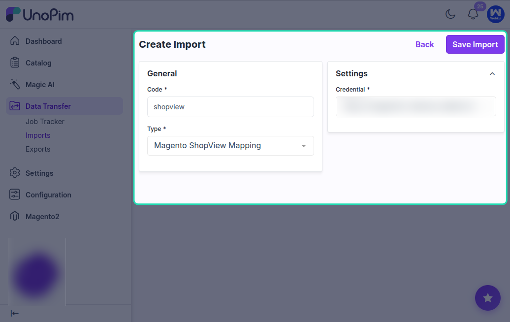
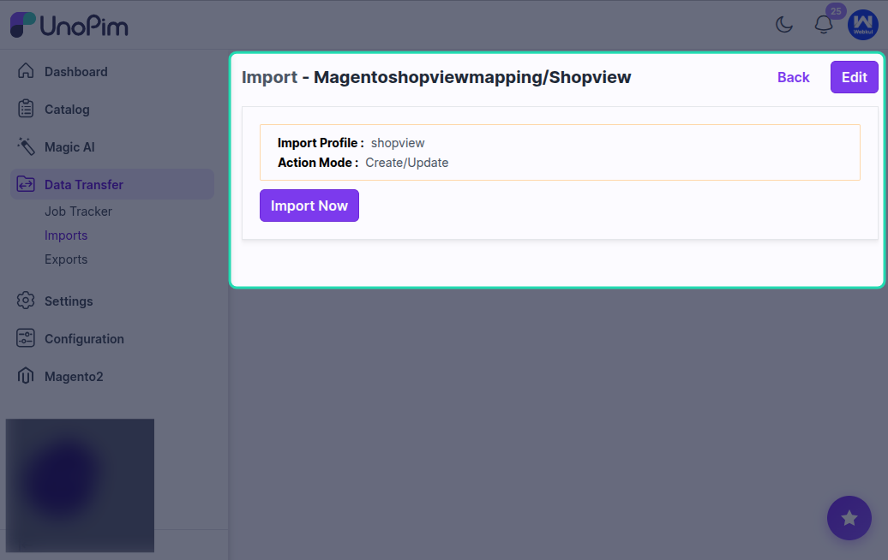

# Magento Shop View Mapping

The **Magento Shop View Mapping** import job pulls store view configuration data from your Magento 2 store and saves it as part of your credential in UnoPim.

This is a one-time setup step that makes it easier to map Magento store views to UnoPim channels, locales, and currencies - which is required for accurate product data export and import.

## What Is a Store View in Magento?

In Magento 2, a **store view** defines a specific language, currency, and storefront configuration within a store. A single Magento store can have multiple store views - for example:

- `en_US` for English (United States)
- `fr_FR` for French (France)
- `de_DE` for German (Germany)

Each store view can show a different language and currency to shoppers. When exporting from UnoPim, product data is sent to the correct store view based on the mapping you set up.

## Why This Matters

Without store view mapping, UnoPim cannot know which Magento store view corresponds to which UnoPim channel, locale, or currency.

Once this mapping is configured, all subsequent export and import jobs use it automatically - so you don't have to reconfigure it every time.

## How to Create the Import Job

Go to **Data Transfer > Imports > Create Import Profile**.

Select **Magento Shop View Mapping** as the import type.

Enter a unique code and a name for the job, then save it.

## Available Filters

| Filter | Required | Description |
|---|---|---|
| **Credential** | Yes | Select the Magento 2 store credential you want to fetch store views for. |

## What Gets Imported

This job reads the following from Magento 2:

- All available **store views** with their codes and labels.
- The associated **store groups** and **websites**.

The data is saved to the credential's extras so it can be used when you configure the store view mapping manually in the credential settings.

## Running the Import

Click **Import Now** to start the process.

Once complete, check the job summary. The store view data is now stored in your Magento credential in UnoPim.

## Next Step: Map Store Views to UnoPim Channels

After running this import, go to:

`Magento 2 Connector > Credentials > Edit Credential`

In the **Store View Mapping** section, you will see the store views fetched from Magento. For each store view, select the corresponding:

- **UnoPim Channel**
- **Locale**
- **Currency**

For example:
| Magento Store View | UnoPim Channel | Locale | Currency |
|---|---|---|---|
| `en_US` | `ecommerce` | `en_US` | `USD` |
| `fr_FR` | `ecommerce` | `fr_FR` | `EUR` |

Once this mapping is saved, all export and import jobs that use this credential will automatically apply the correct store view, locale, and currency for product data.

## Best Practice

Run the **Shop View Mapping** import as early as possible in your setup - ideally right after creating your Magento credentials. Completing this step before running product exports ensures that localized product data is sent to the correct Magento store views.

If your Magento store is restructured or new store views are added, re-run this import job and update the mapping accordingly.
