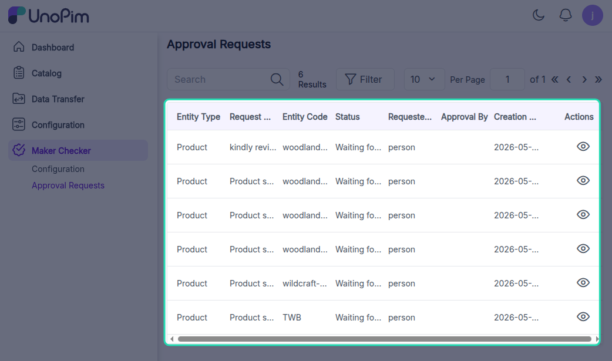
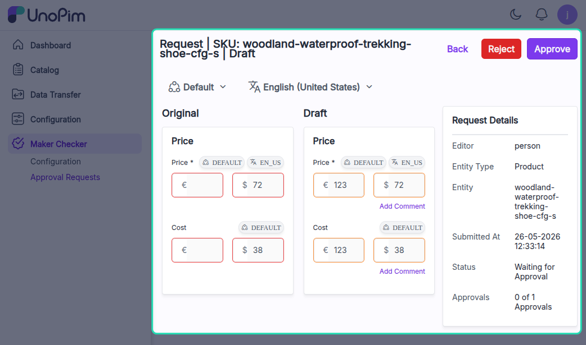
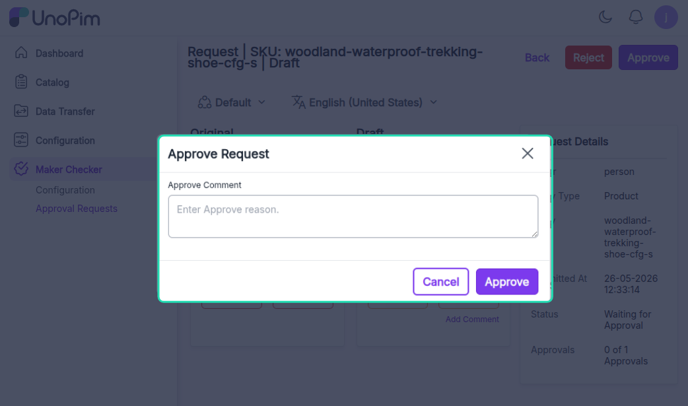
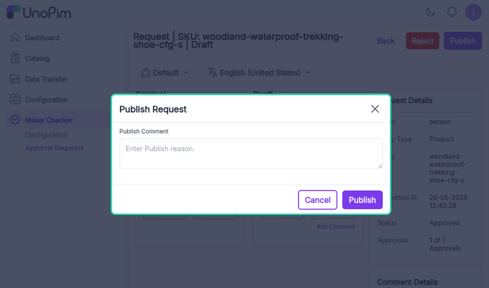

# Dedicated Approval Section

A dedicated Approval Requests section is available for users to review and take action on product and asset requests, allowing them to approve or reject as needed.

## Approval Request Fields

**Entity Type:** This field mentions whether the approval request is for a "Product" or "Asset".

**Request Title:** This field shows the comment added by maker at the time of sending approval request.

**Entity Code:** This field shows the SKU for the product or asset file name.

**Status:** This field shows whether the request has been Approved, Rejected or Waiting for Approval.

**Requested By:** This field mentions the user name who has created the approval request.

**Approval By:** This field mentions the checker name who approves or rejects the approval requests.

**Creation Date:** This field shows the date and time when the approval requests are generated.

**Actions:** This tab needs to be clicked by checkers to view and take actions on approval requests.

## Approval by Checker

The checker user, with the necessary permissions, can review any request, approve or reject it, and add comments for the maker's reference.

The product request is approved by the checker user, along with comments, as shown in the image above.

Now, the approved product is being published by a user with the required permissions.

The request page also displays completed approval levels along with the comments added by the checkers.

## Comparing Changes

On the request page, the checker user can compare changes made to live products or assets, with a side-by-side view of the maker's modifications.

Moreover, checker users can view the completed approval levels and associated comments within the request.
