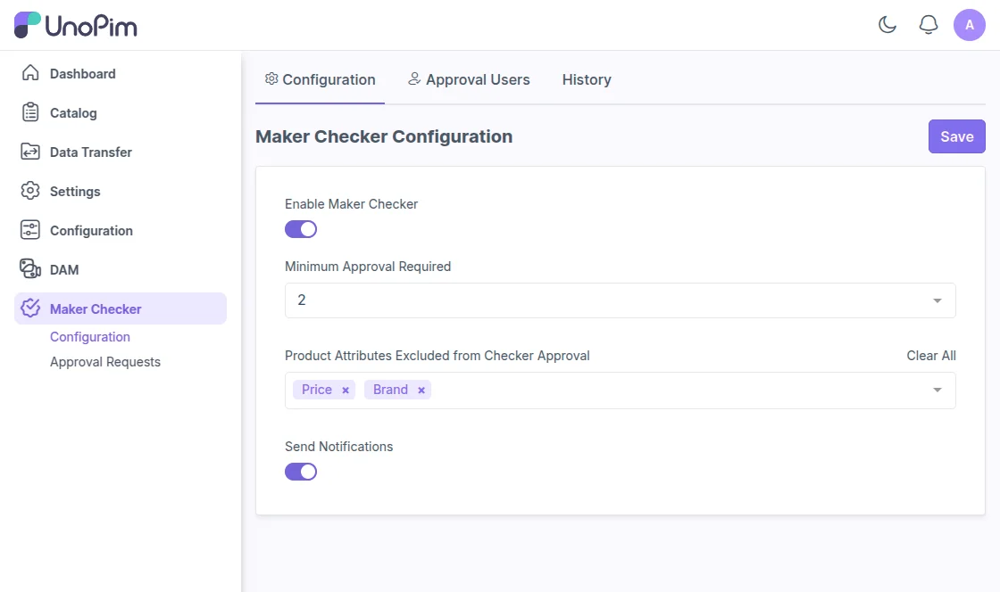
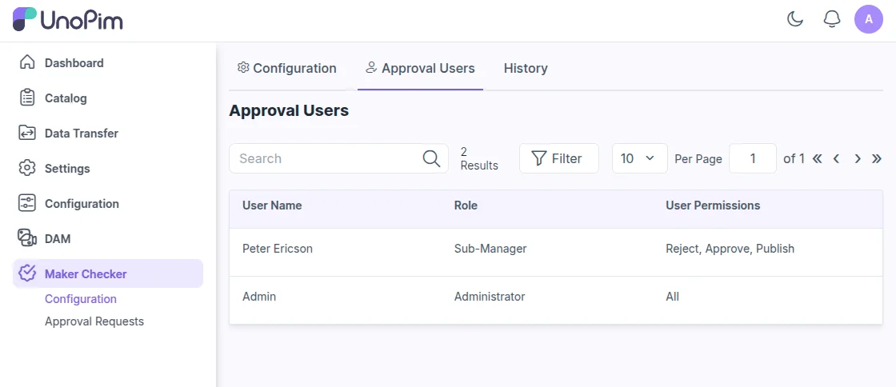
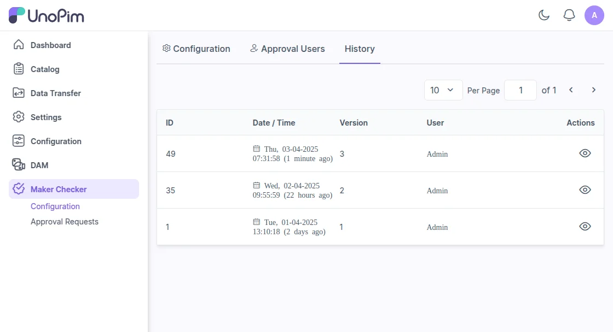
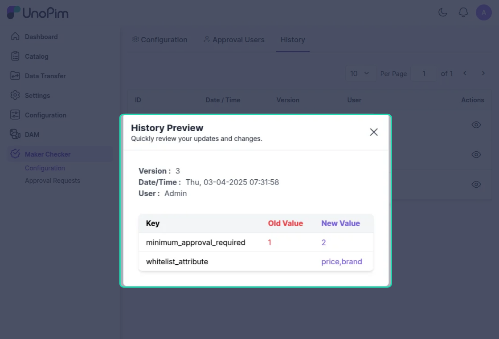

# Checker End

## Checker Configuration Options

**Setting Minimum Approval Level**

User having permission can set the minimum approval level required for products and assets using the drop down option.

**Excluding Product Attributes**

Users can also exclude specific product attributes from the approval process by the checker.

**Send Notifications**

After enabling the 'Send Notifications' option, alerts are automatically sent for approvals, rejections, publishing, and comments.

This keeps everyone instantly informed and reduces the need for manual follow-ups.

## Approval Users

On the 'Approval Users' tab, you can view a list of users managing product and asset approvals. The list also shows their assigned roles and permissions.

## History and Audit Trail

Under the 'History' tab, users can view logs of changes made to the approval settings for checkers.

Users can also click the action button next to each history log to preview detailed changes made to the settings.

