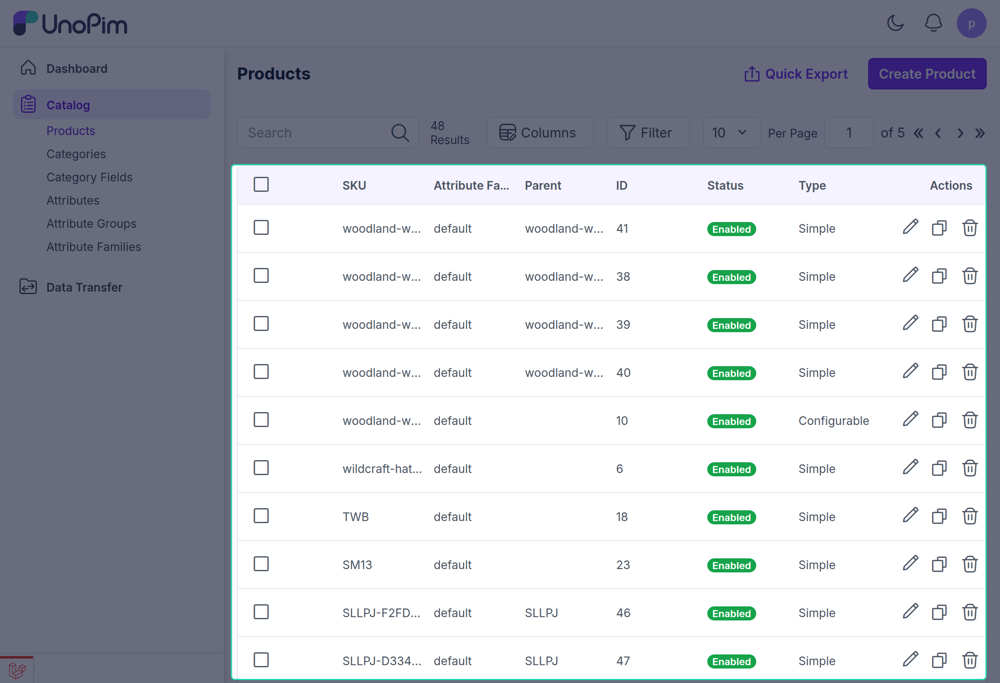
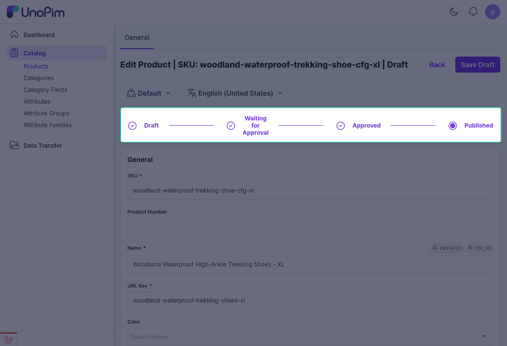
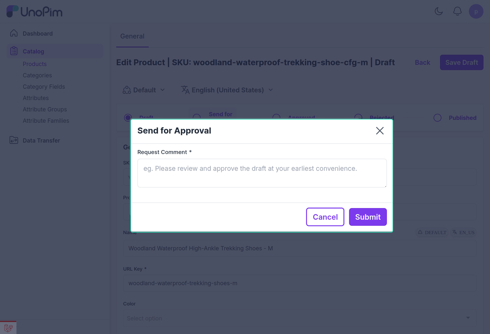
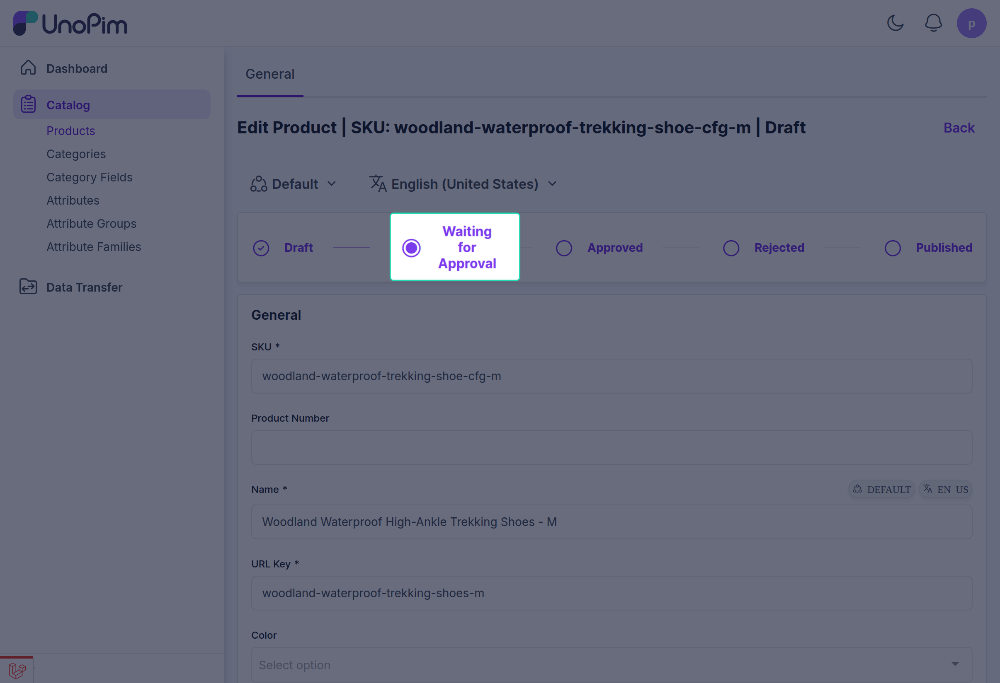
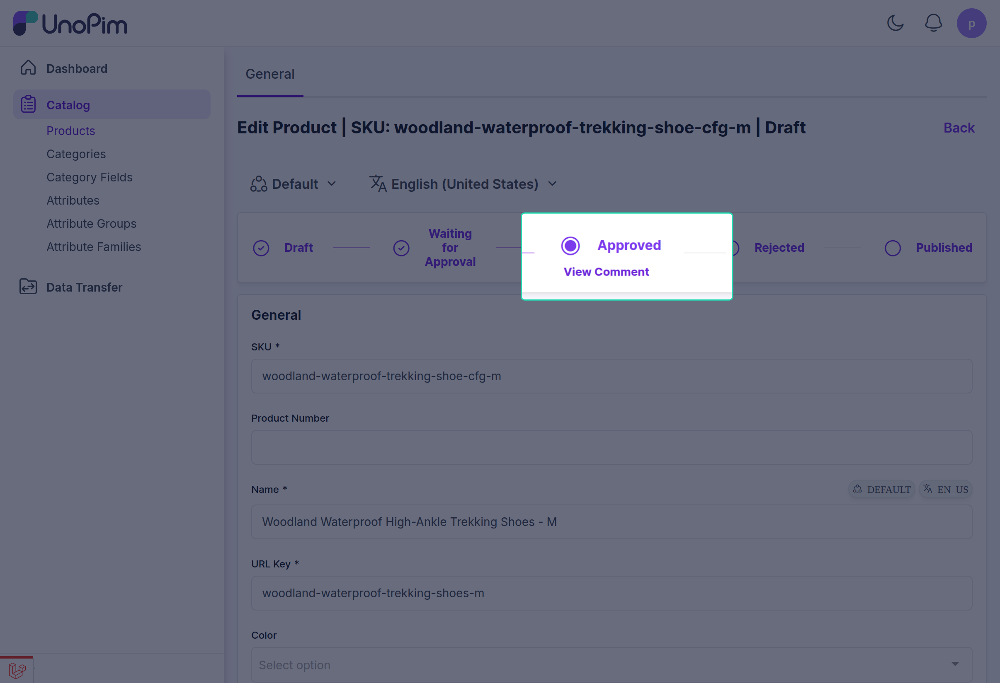
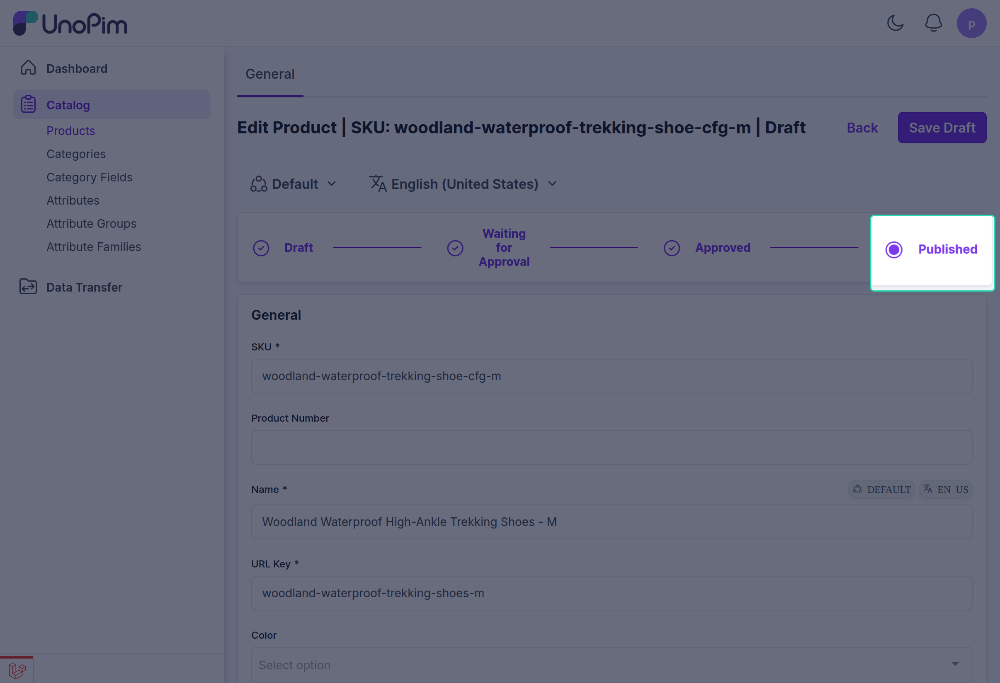

# Maker End

When creating a new product, the maker user must submit it for approval by the checker.

## Visual Grid to Track Approval Stages

The product details are added in draft and the maker will click on the "Send for Approval" option from the visual tracking grid.

The maker then enters the request title, comments, and clicks the "Submit for Approval" button to send the request to the checker.

Once the approval request is sent to the checker, it will appear under the "Waiting for Approval" section in the visual tracking grid for the product.

When the product gets approved and published by the checker, the maker can track its status, and it will appear as "Published" in the visual tracking grid for the product.

## Asset Approval Process

Similar to products, assets must also be approved. The Maker adds asset details and clicks "Send for Approval", and enters comments.

Once the asset is sent for approval, the maker can see the asset status change to "Waiting for Approval".

Finally, when the asset is published by the checker, it is reflected in the visual tracking grid, and the asset status updates to "Published".

