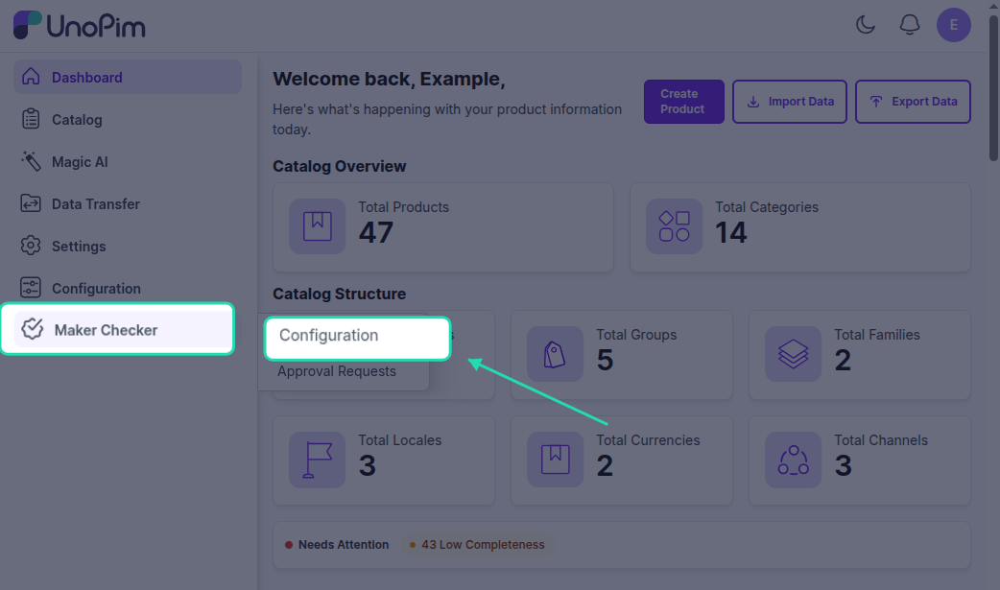
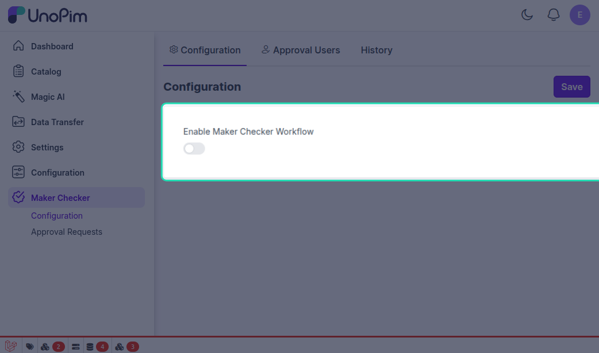
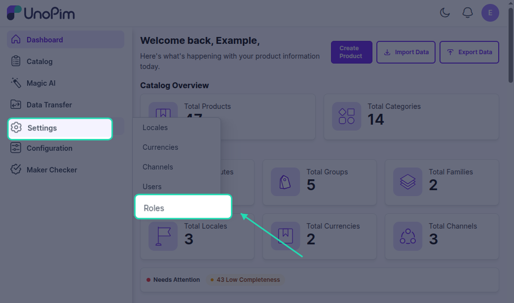
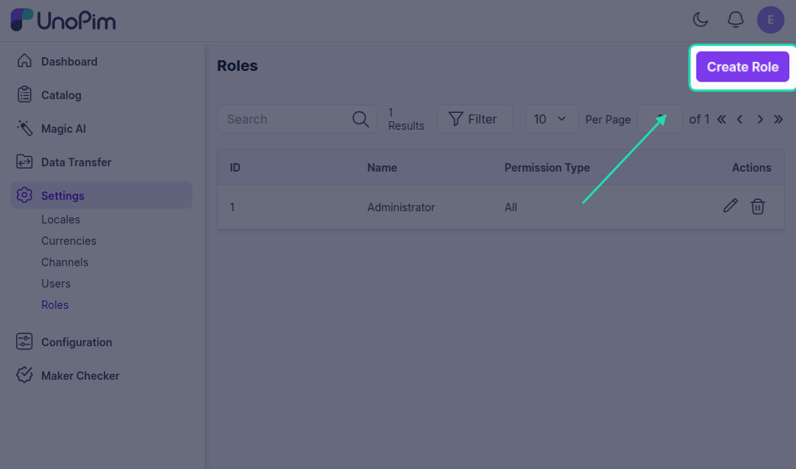
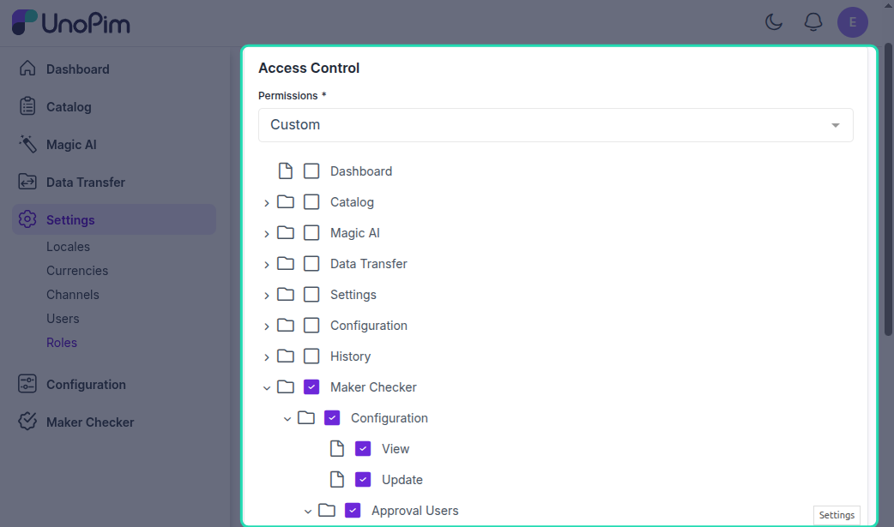
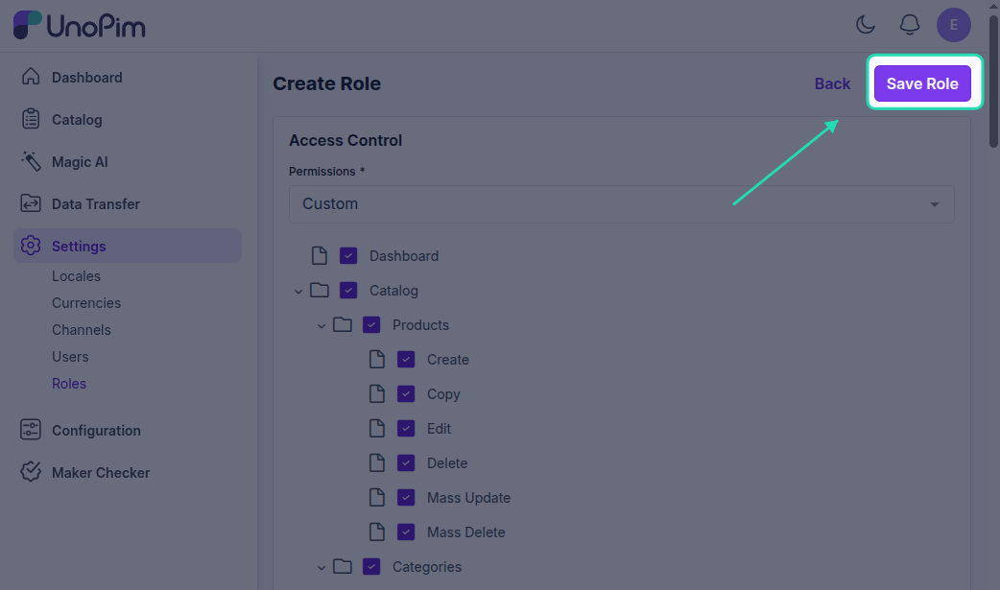
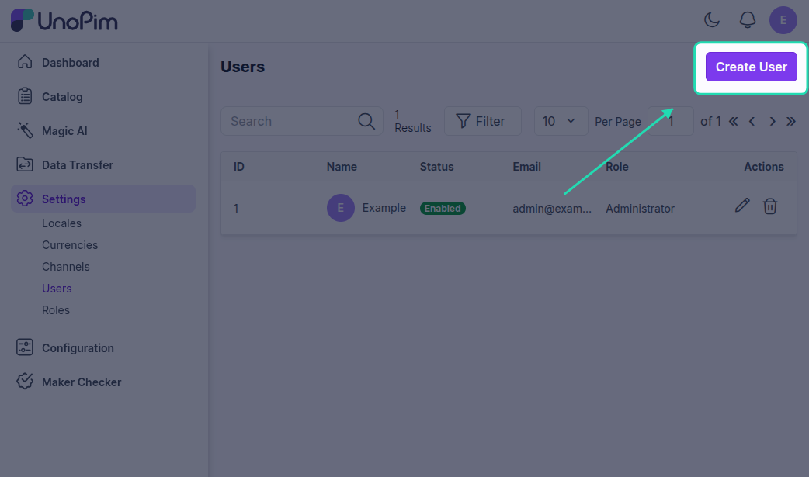
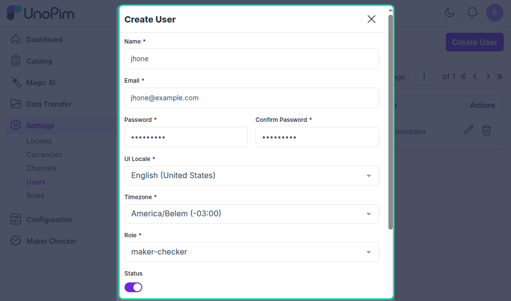

# Maker Checker Workflow

After installing the UnoPim Maker Checker Workflow extension, users with the required permissions can manage the product and asset approval process.

## Enable Maker Checker Module

Navigate to the left-side menu and select **Maker Checker > Maker Checker Configuration**.

Here, you can enable the module to activate the approval workflow in UnoPim.

## Access Control List | Workflow for Maker Checker

Admin can create roles for the Maker-Checker process in UnoPim by navigating to **Settings > Roles > Create Role**.

We have a **Maker Checker** section, where you can define role-based permissions for configurations, approval users, and approval requests as shown below:

## Assigning Roles

Then users can be assigned these roles with related permission for checker or maker accordingly.

