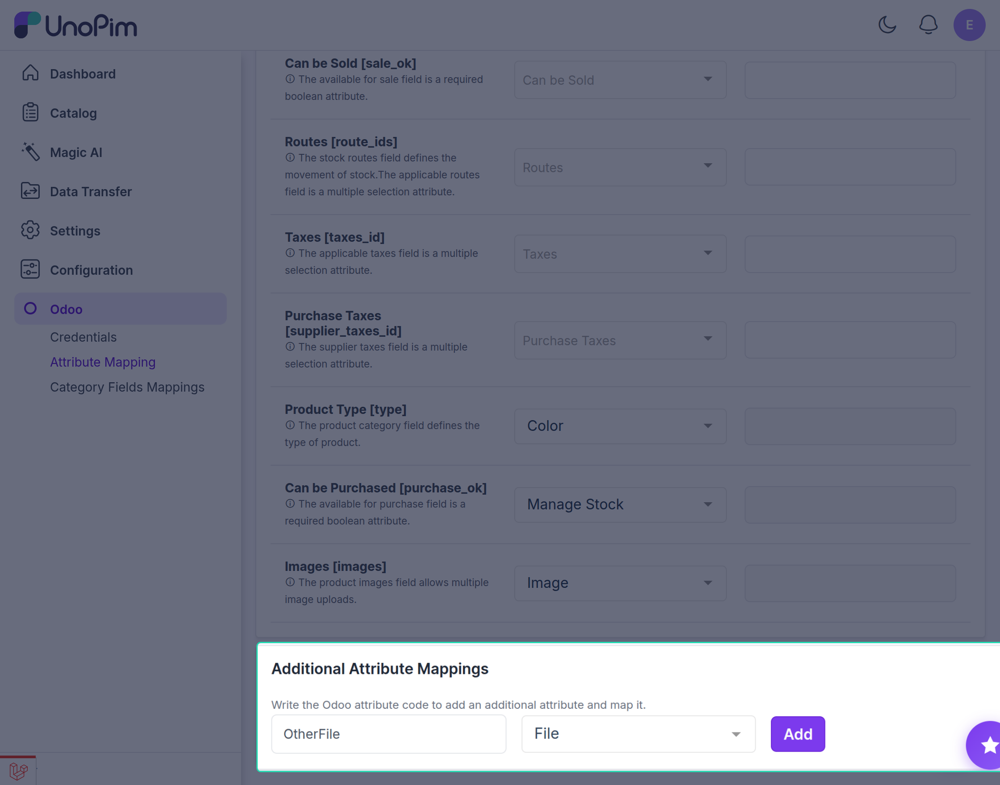
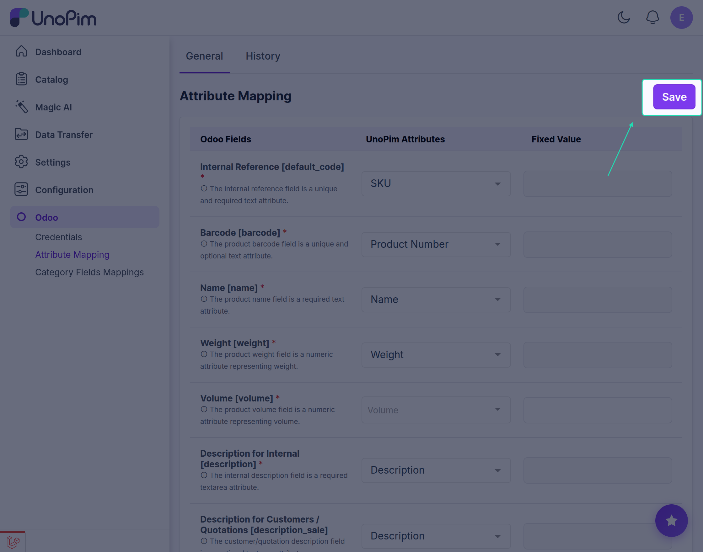

# UnoPim - Map More Standard Fields

Adding Additional Product Fields for Odoo Export

## Overview

In case you want to send more product information, you can add more product fields here and then map them with UnoPim attributes.

## Steps to Add More Fields

1. Enter an Odoo field code in the input field

2. Click the **Add Field** button

3. The new mapping field will appear above

## Save Configuration

After mapping everything you need, save your configuration to apply the changes.

