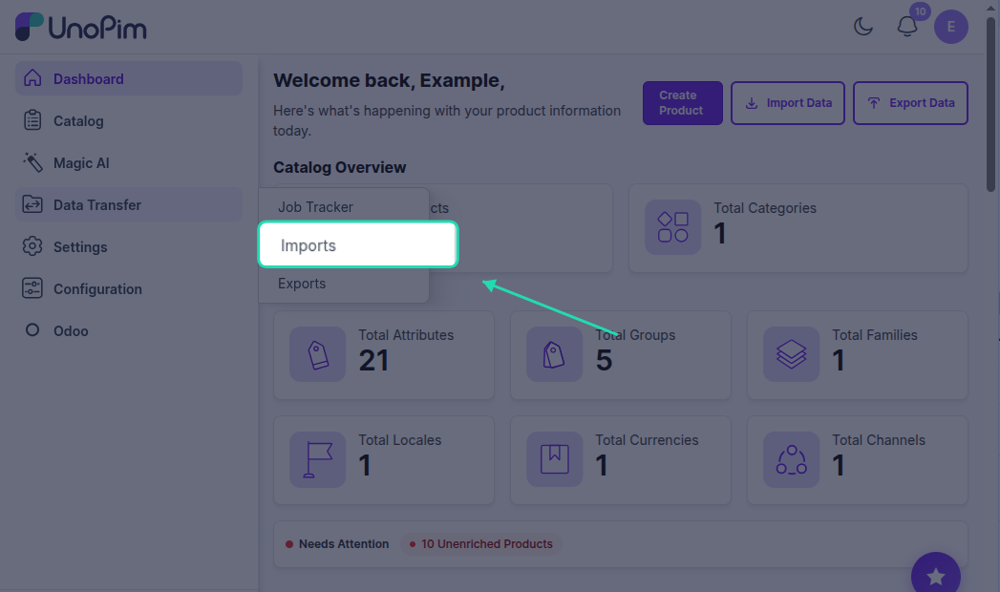
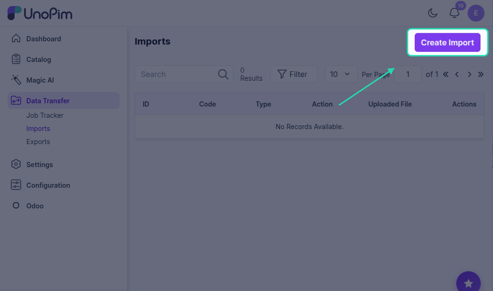
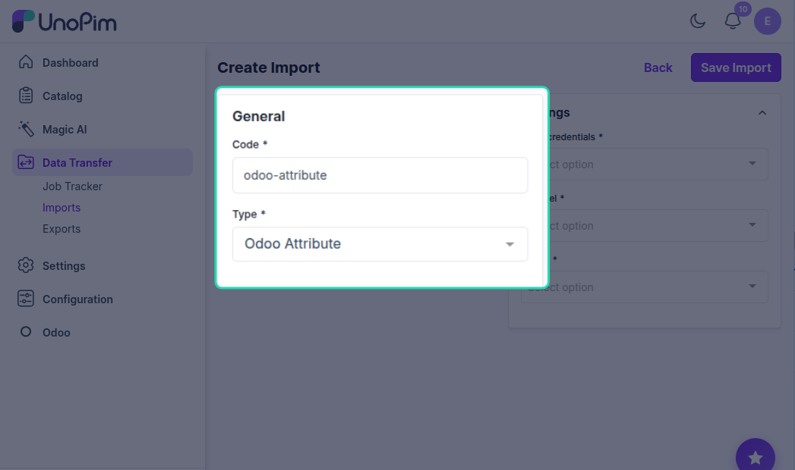
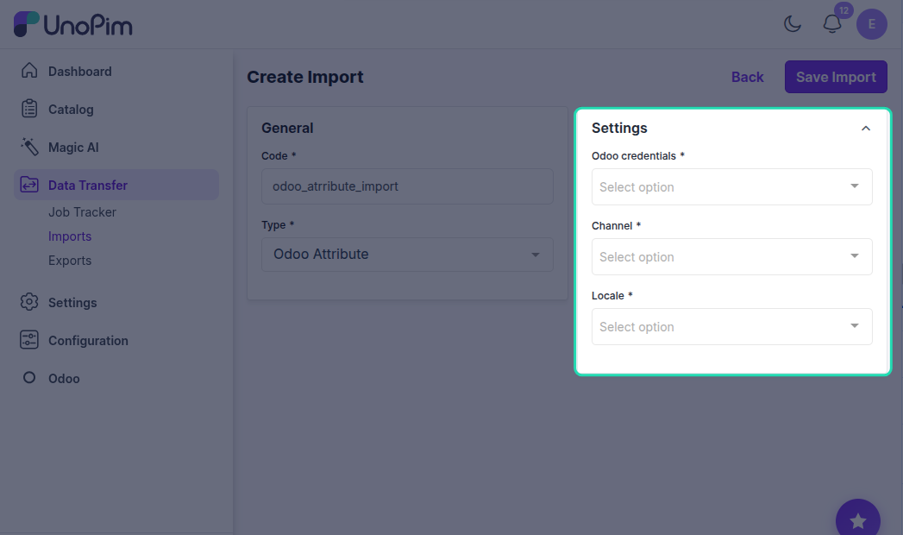
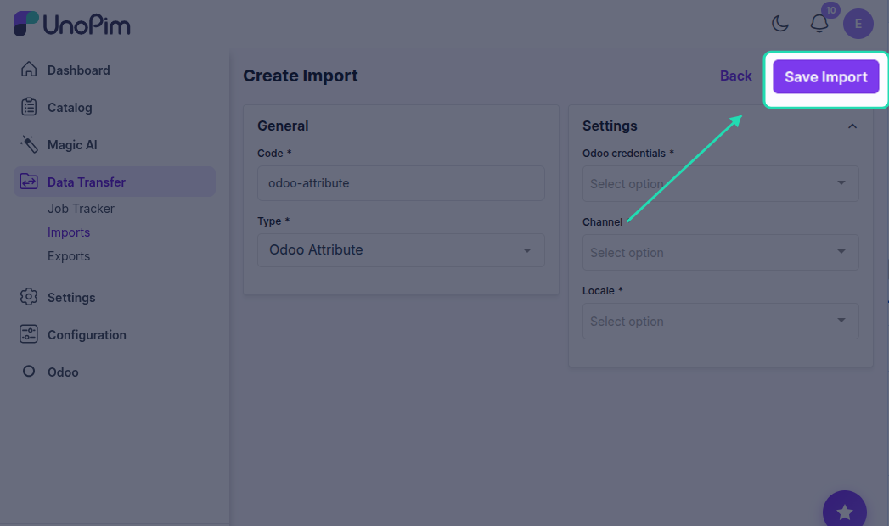
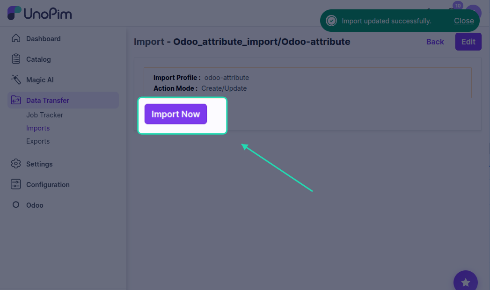
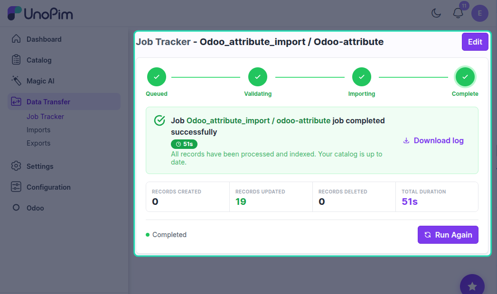

# UnoPim - Odoo Import Attribute

Importing Attributes from Odoo

## Overview

This import job will import all the attributes and attribute options from Odoo to UnoPim.

## Prerequisites

Before importing attributes from Odoo, ensure that you have configured your Odoo credentials in UnoPim.

## Step 1: Go to Data Transfer

Navigate to the **Data Transfer** section from the main menu in UnoPim.

## Step 2: Go to Imports

Click on **Imports** to view the available import options.

## Step 3: Create Import

Click on **Create Import** to create a new import profile.

## Step 4: Enter Code & select type

In the **General** section, enter a unique code for your import profile. This code will help you identify the import profile.

**Example:** attribute_import_odoo_001

Next, select **Odoo Attribute** as the import type to import all attributes and attribute options from Odoo to UnoPim.

## Step 6: Configure Settings

In the **Settings** section, configure the following required fields:

### Odoo Credentials

Click on the **Odoo credentials** dropdown and select the specific Odoo credentials or connection you want to import from. This is a required field.

### Channel

Click on the **Channel** dropdown and select the appropriate channel or store view from your Odoo setup. This is a required field.

### Locale

Click on the **Locale** dropdown and select the language or regional settings for importing attribute data. This is a required field.

## Step 7: Save Import

Click the **Save Import** button to save your import profile configuration.

## Step 8: Import Now

Once the import profile is saved, click the **Import Now** button to start the import process and import all Odoo attributes and attribute options to UnoPim.

## Step 9: Monitor Progress

In the execution process, you can check the progress of the import job and view any errors in the log.

