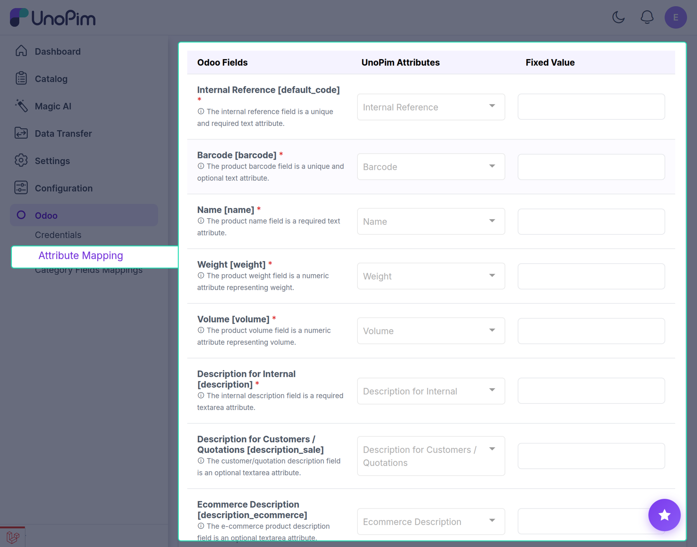

# UnoPim - Attribute Mapping

Product Attribute Mapping Between UnoPim and Odoo

---

## Overview

When products are exported to Odoo, you can decide which product information should be included in the product database. First, you need to do the mapping of Odoo product fields with UnoPim attributes.

---

## Mapping Basics

### Fixed Value

In case you want to set any default value for a product field, you can enter it in the Fixed Value. So that all the exported products will have the same product field value.

---

## Default Mappable Product Fields

The following product fields can be mapped between UnoPim and Odoo by default:

### Internal Reference 
The internal reference field is a unique and required text attribute.

### Barcode 
The product barcode field is a unique and optional text attribute.

### Name 
The product name field is a required text attribute.

### Weight 
The product weight field is a numeric attribute representing weight.

### Volume 
The product volume field is a numeric attribute representing volume.

### Description for Internal 
The internal description field is a required textarea attribute.

### Description for Customers / Quotations
The customer/quotation description field is an optional textarea attribute.

### Ecommerce Description 
The e-commerce product description field is an optional textarea attribute.

### Description for Vendors 
The vendor description field is an optional textarea attribute.

### Description for Delivery Orders 
The delivery order notes field is an optional text attribute.

### Description for Receptions 
The reception notes field is an optional text attribute.

### Description for Internal Transfers / Pickings 
The internal transfer/picking notes field is an optional text attribute.

### Cost 
The cost price field is a required price attribute.

### Sale Price 
The retail price field is a required price attribute.

### Can be Sold 
The available for sale field is a required boolean attribute.

### Routes 
The stock routes field defines the movement of stock. The applicable routes field is a multiple selection attribute.

### Taxes 
The applicable taxes field is a multiple selection attribute.

### Purchase Taxes 
The supplier taxes field is a multiple selection attribute.

### Product Type 
The product category field defines the type of product.

### Can be Purchased 
The available for purchase field is a required boolean attribute.

### Images 
The product images field allows multiple image uploads.
