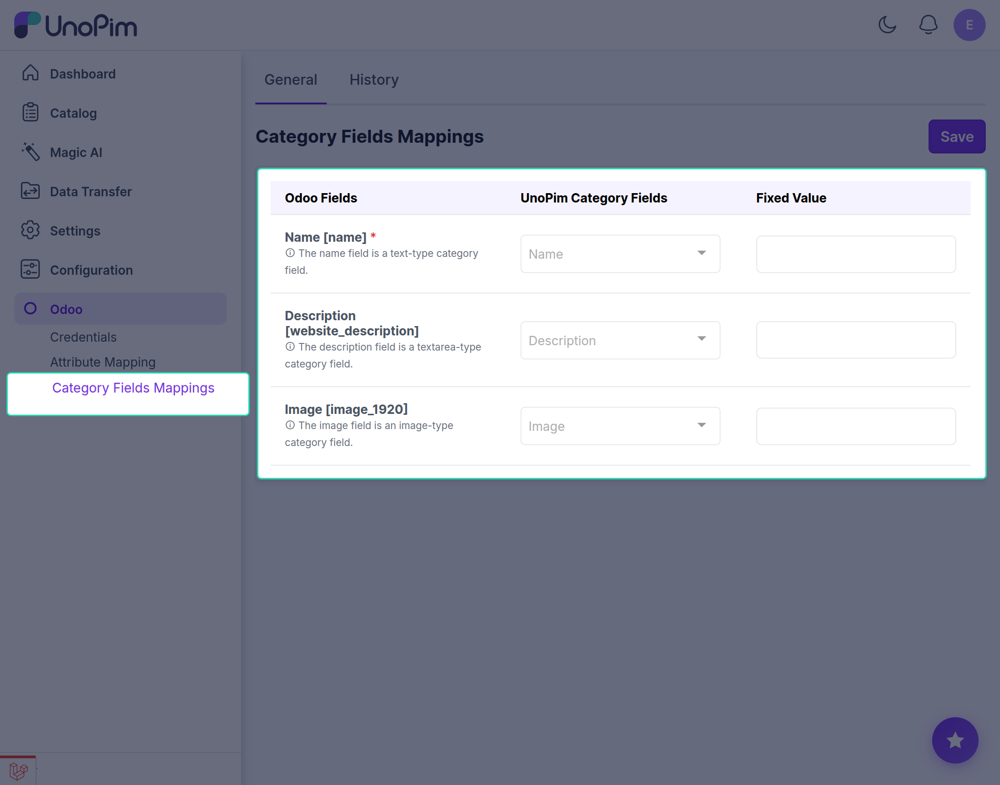

# UnoPim - Category Fields Mappings

Manual Mapping of Category Fields Between UnoPim and Odoo

## Overview

Here, you can create a mapping manually for categories. This allows you to connect UnoPim category fields with Odoo category fields for seamless data transfer when exporting categories.

## Understanding Category Field Mappings

Category field mappings define how your UnoPim category information is transferred to Odoo. The mapping interface consists of three main columns:

### Odoo Fields

The Odoo category fields available for mapping. These are the destination fields where your UnoPim data will be exported to.

### UnoPim Category Fields

The UnoPim category attributes that you want to map to Odoo fields. Select the corresponding UnoPim field for each Odoo field.

### Fixed Value

Optional default values that can be assigned to Odoo fields. If set, all exported categories will have this value for the respective field, regardless of the UnoPim data.

## Default Category Field Mappings

### Name 

**Odoo Field:** Name 

**Type:** Text-type category field

**Description:** The category name field is a required text attribute that identifies the category in Odoo.

**Mapping:** Map this to your UnoPim category name field

### Description 

**Odoo Field:** Description 

**Type:** Textarea-type category field

**Description:** The description field is a textarea-type category field used to provide detailed information about the category.

**Mapping:** Map this to your UnoPim category description field

### Image 

**Odoo Field:** Image 

**Type:** Image-type category field

**Description:** The image field is an image-type category field used to store category images or logos.

**Mapping:** Map this to your UnoPim category image field

---

## How to Create Manual Mappings

### Step 1: Select Odoo Field

Choose an Odoo category field from the "Odoo Fields" column that you want to map.

### Step 2: Select UnoPim Category Field

Click on the dropdown under "UnoPim Category Fields" and select the corresponding UnoPim category field to map to the selected Odoo field.

### Step 3: Set Fixed Value (Optional)

If you want to assign a default value to an Odoo field, enter it in the "Fixed Value" column. This value will be used for all exported categories.

### Step 4: Add More Mappings

Repeat steps 1-3 for additional category fields you want to map.

### Step 5: Save Configuration

Once you have configured all your category field mappings, click the **Save** button to save your configuration and apply the changes.

---

## Best Practices

- Ensure all required Odoo fields are mapped
- Use fixed values only when you want consistent data across all categories
- Test your mappings before exporting large amounts of data
- Review your mappings periodically to ensure they align with your business requirements

