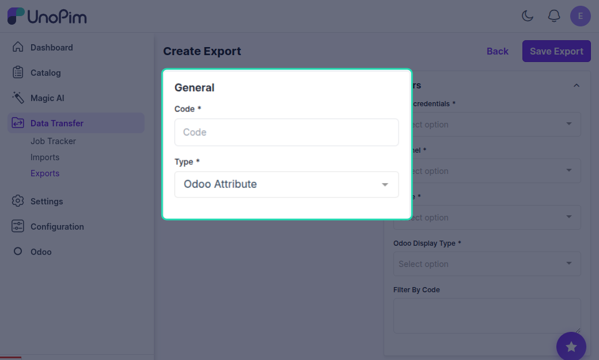
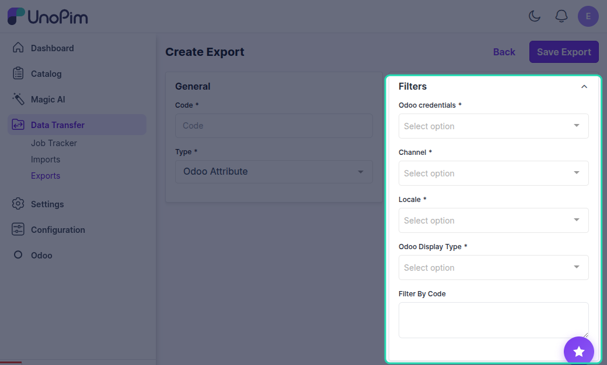
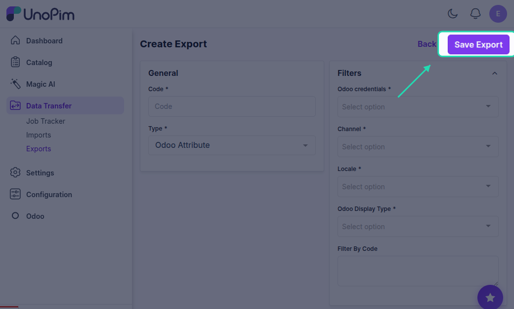
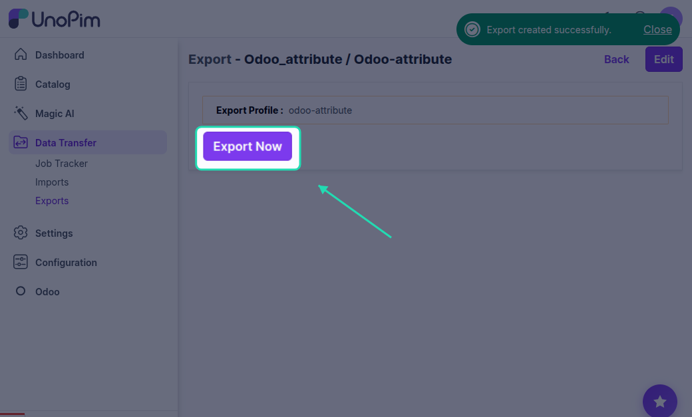
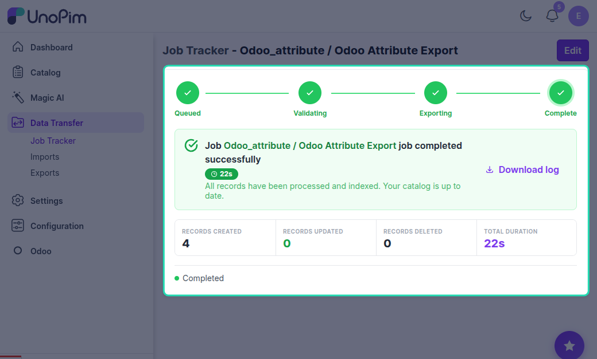

# UnoPim - Export Jobs

Exporting Catalog Information to Odoo

## Overview

In this module, you will find the following types of export jobs for exporting catalog information to Odoo.

## Odoo Export Attribute

Once you select this job, you can export all the UnoPim attributes and options to Odoo.

## How to Export Attributes to Odoo

Follow these steps to export your UnoPim attributes to Odoo:

### Step 1: Go to Data Transfer

Navigate to the **Data Transfer** section from the main menu.

### Step 2: Select Exports

Click on **Exports** to view the available export options.

## Step 3: click on Create Export 
Click on the **Create Export** button to start configuring your export job.

### Step 4: Select Type

Select **Odoo Export Attribute** as the export type to export all UnoPim attributes and options to Odoo.

### Step 5: Filter Fields

Apply the desired filters to specify which attributes to export:

- **Odoo Credentials** - Choose the specific Odoo instance or credentials you're exporting to
- **Channel** - Export attributes associated with a specific sales or eCommerce channel
- **Locales** - Select the language/localized data you want to include
- **Display Type** - Filter attributes based on how they are displayed (Radio, Select, Color, Pills, Multi-checkbox)
- **Filter by Code** - Export only specific attributes using their unique codes

### Step 6: Save Export

Click the **Save** button to save your export configuration with the selected filters and settings.

### Step 7: Export Now

Click the **Export Now** button to execute the export job and transfer the filtered attributes to Odoo.

