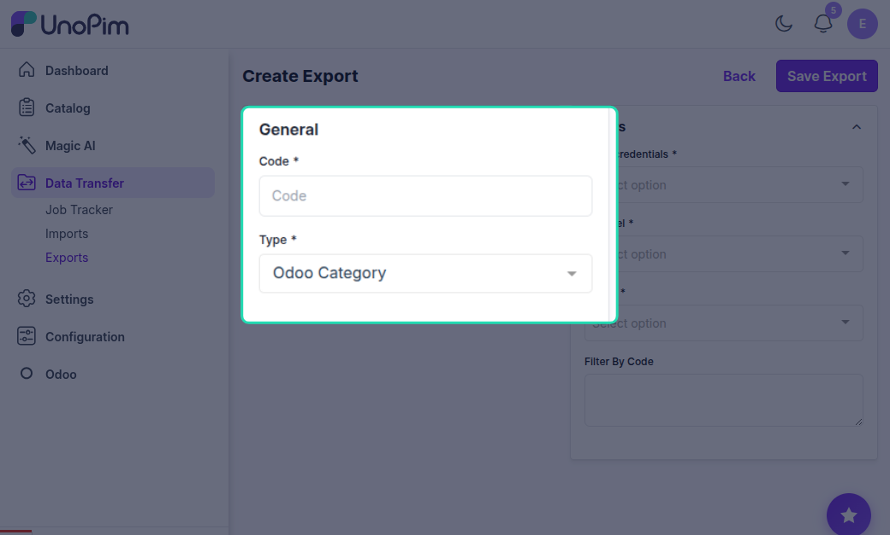
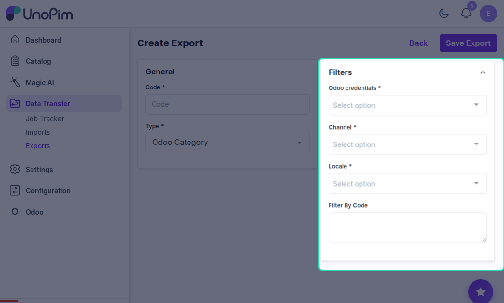
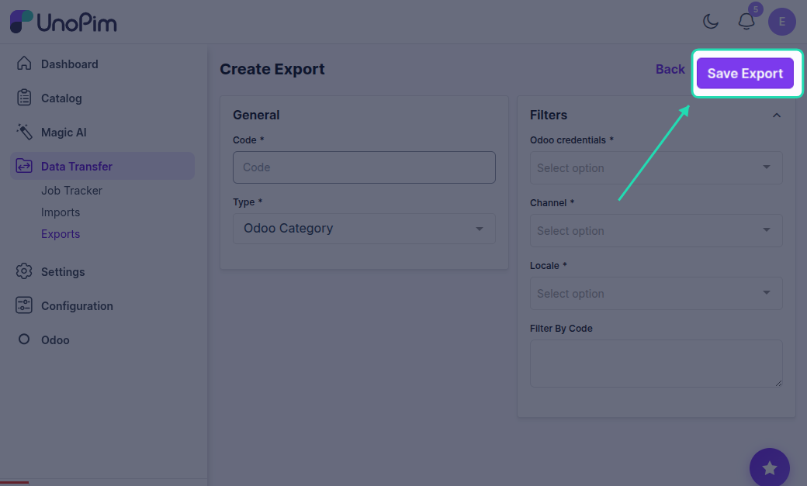
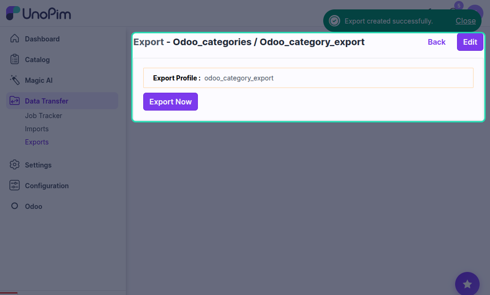
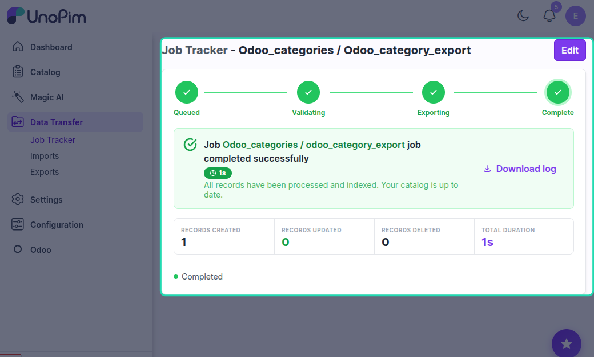

# UnoPim - Odoo Export Category

Exporting Categories to Odoo

## Overview

Using this job, you can export all the categories to Odoo.

## How to Export Categories to Odoo

The steps to export categories are similar to attribute export:

### Step 1: Go to Data Transfer

Navigate to the **Data Transfer** section from the main menu.

### Step 2: Select Exports

Click on **Exports** to view the available export options.

### Step 3: Select Type

Select **Odoo Category** as the export type to export all UnoPim categories to Odoo.

### Step 4: Filter Fields

Apply the desired filters to specify which categories to export:

- **Odoo Credentials** - Choose the specific Odoo instance or credentials you're exporting to
- **Channel** - Export categories associated with a specific sales or eCommerce channel
- **Locales** - Select the language/localized data you want to include
- **Filter by Code** - Export only specific categories using their unique codes

### Step 5: Save Export

Click the **Save** button to save your export configuration with the selected filters and settings.

### Step 6: Export Now

Click the **Export Now** button to execute the export job and transfer the filtered categories to Odoo.

