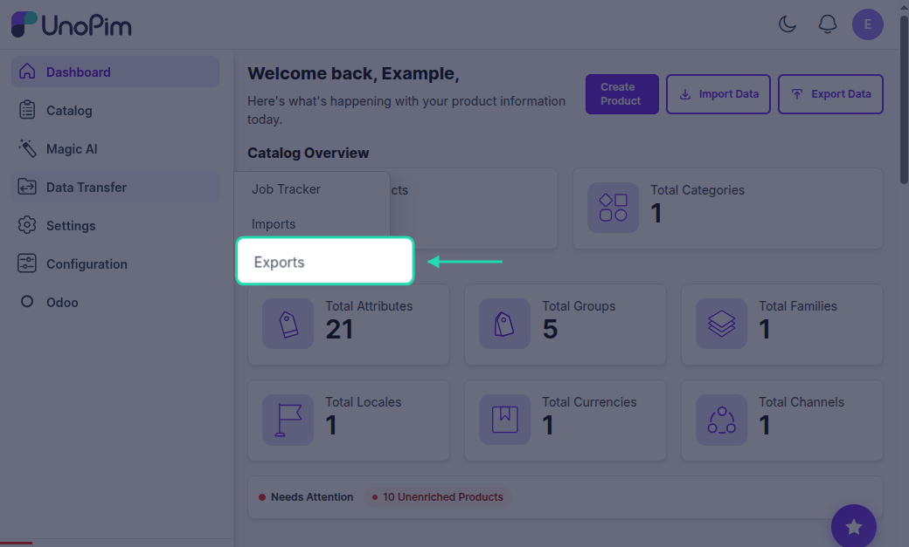
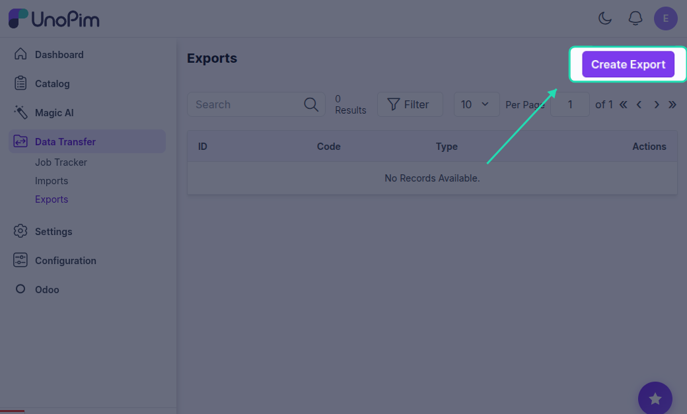
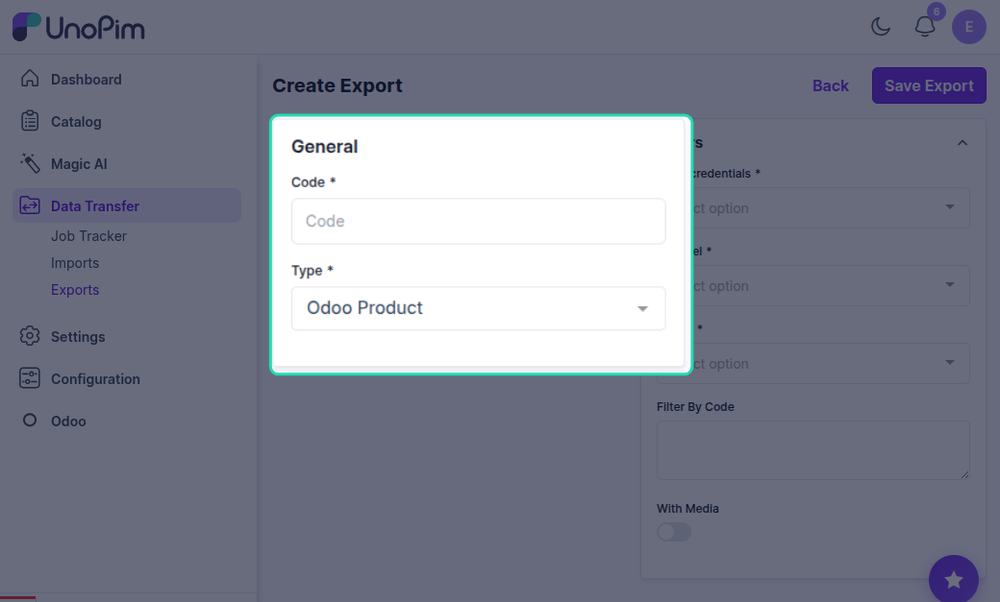
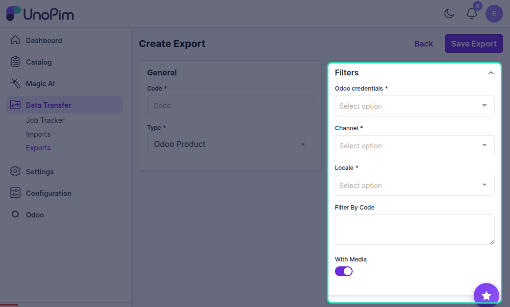
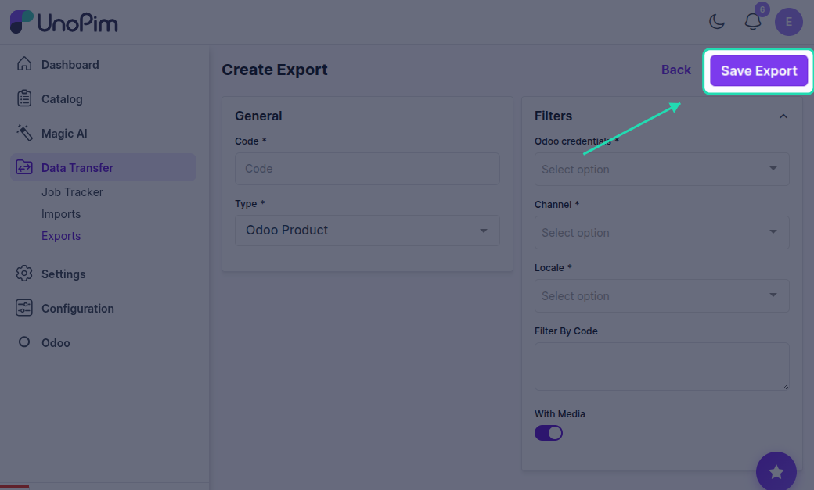
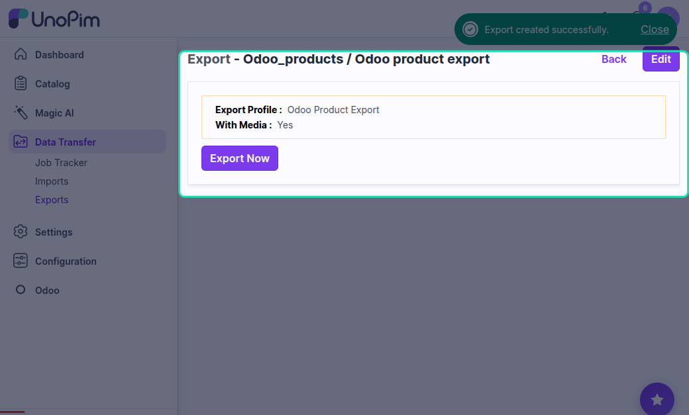
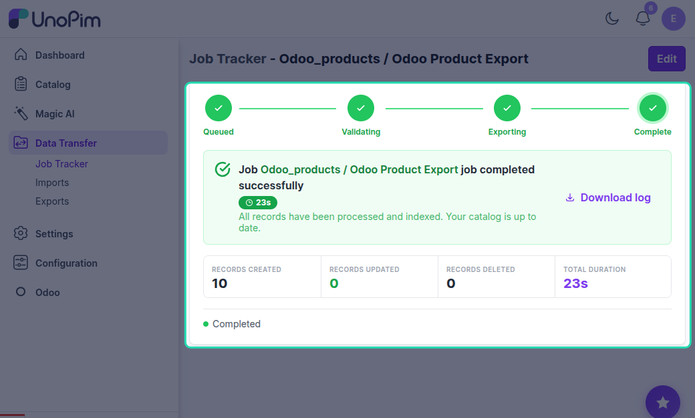
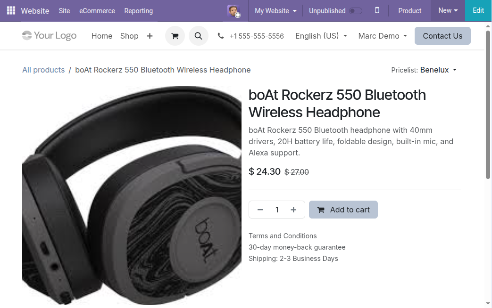

# UnoPim - Odoo Product Export

Exporting Products to Odoo

## Overview

Once you have created the products in Odoo, you can now export them to the Odoo store.

## Prerequisites

Before exporting the product, you need to export the attribute and category from UnoPim to Odoo.

## How to Create Export Profile

### Step 1: Go to Exports

Navigate to **Exports** section.

### Step 2: Create Export

Click on **Create Export**.

### Step 3: Enter Code and Label & select Type

Enter a unique code and label for your export profile and select **Odoo Product Export** as the export type.

### Step 4: Filter Products

You can decide which products you want to export to Odoo by using various filters.

# Available Filters

### Credentials

Choose the specific Odoo credentials or connection you want to use for the export.

### Channel

Select the appropriate channel or store view that matches your Odoo setup.

### Locales

Export product data in specific languages or regional settings.

### Filter by Code

Export only selected products by entering their product codes.

### With Media

Choose whether or not to include product images and other media assets in the export.

### Filter Products by SKU

If you want to export only some specific products, you can enter their SKU in the Identifier section, separated by a comma.

### Step 5: Save Product Export

Once you have saved the information for the export profile, proceed to export.

### Step 6: Export Now

Click the **Export Now** button to start the export process.

### Step 7: Monitor Progress

In the execution process, you can check the progress of the export job and view any errors in the log.

## Export Results

After the export is complete, you can view the exported products in Odoo. You can also view and edit any information as you require, and then publish the product.

Check out the Odoo e-commerce storefront view. A customer can see:
- Product name
- Product images
- Price
- Buy now details
- Other product information

## Exporting Products with Variations

### Overview

For exporting products that have variations, you need to run the Odoo product export job.

In product management systems like UnoPim, many products are not just single items-they come in multiple variations such as:
- Size
- Color
- Material

These are called product variations or variants.

### How to Export Product Variations

To export products with variations from UnoPim to Odoo, you need to run the **Odoo Product Export Job**.

This job is responsible for transferring all product data, including variations, from UnoPim to your Odoo store.

