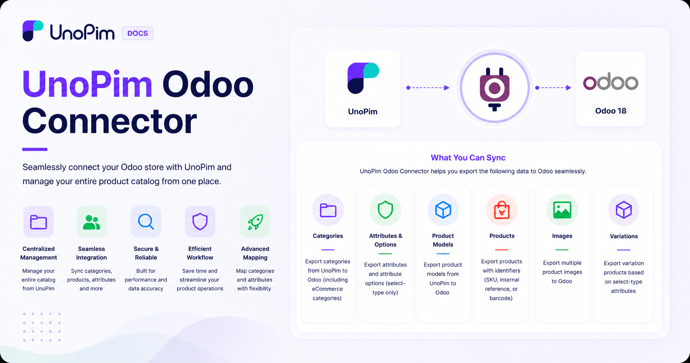

# UnoPim Odoo Connector

The **UnoPim Odoo Connector** bridges your **Odoo store** and **UnoPim** — letting you manage your entire product catalog from one place and push it directly to Odoo whenever you're ready.

Instead of updating products in two systems separately, you handle everything in UnoPim — categories, products, attributes, images, and variations — and the connector takes care of getting it all into Odoo accurately and efficiently.

 

  

  

## What Can It Do?

The connector works in two directions:

- **Export** — push your product data from UnoPim into Odoo
- **Import** — pull existing data from Odoo back into UnoPim

## Features

### Export

Everything you build in UnoPim can be exported to Odoo:

- **Categories** — export all categories, or only the ones linked to a specific channel. Categories can also be exported directly to **Odoo eCommerce categories**.
- **Attributes and Options** — export product attributes along with all their selectable options.
- **Product Models and Products** — export your full product catalog, including product models and individual products.
- **Product Images** — export multiple images per product.
- **Targeted Export** — need to export just one product? Use its **SKU**, **internal reference**, or **barcode** to export a specific item without running a full catalog export.
- **Update Existing Products** — re-run an export job at any time to push the latest changes to products already in Odoo.

### Mapping & Configuration

Before exporting, you can set up mappings to make sure data lands in the right fields in Odoo:

- Map UnoPim categories to their corresponding Odoo categories.
- Map both standard and custom attributes to Odoo fields.
- Set **default values** for attribute mappings — useful when a field is required in Odoo but not always filled in UnoPim.
- Map additional standard attributes as needed.

### Import

You can also bring data from Odoo into UnoPim using the following import job types:

- Categories
- Attributes
- Product Models
- Products

### Advanced Filtering

When running a product export, you can filter exactly what gets exported using:

| Filter | What it does |
|---|---|
| **Odoo Credentials** | Select which Odoo store to export to |
| **Channel** | Export only products from a specific channel |
| **Locale** | Export product data in a specific language |
| **Code** | Target a specific export job profile |
| **Media** | Choose whether to include or exclude product images |

## Compatibility

| Requirement | Version |
|---|---|
| **Odoo** | Version 19.x |
| **UnoPim** | Version 1.0.0 or later |

> **Please Note:**
> - The UnoPim Odoo Connector is compatible with **Odoo version 17, 18, and 19**.
> - Currently, only **select-type attributes** from UnoPim are supported for export to Odoo as variation attributes.

